<div align="center">

# 🏁 Chapter 01 · Getting Started


### *Your Android Journey Begins Here*


</div>

---

> [!NOTE]
> *"Every app on your phone was built by someone who once knew nothing about coding. Today, that someone is you."*

<div align="center">

[](../README.md)
[](./02-development-setup.md)

</div>

<br>

## 👋 Welcome to Your Journey

<div align="center">

Look at your phone for a second.

Every single app on that screen — Maps, Instagram, Spotify, WhatsApp —  
was built by a developer who **once started exactly where you are right now**.

</div>

<br>

<table>
<tr>
<td align="center" width="25%">

📱  
**2.5 Billion**

Active Android devices worldwide

</td>
<td align="center" width="25%">

🛒  
**3.5 Million**

Apps on Google Play Store

</td>
<td align="center" width="25%">

💰  
**$108 Billion**

Android app market value

</td>
<td align="center" width="25%">

👩‍💻  
**You**

The next Android developer

</td>
</tr>
</table>

<br>

> [!IMPORTANT]
> This chapter won't have a single line of code.  
> **It's more important than that.**  
> We're installing the most powerful software of all: **your mindset.**

---

<br>

## 🧠 Part 1 · The Android Developer Mindset

<div align="center">

Most beginners think the hardest part of becoming a developer  
is learning to code.

**They're wrong.**

</div>

<br>

The hardest part is **what happens in your head** when you hit your first wall —  
and trust us, you will hit walls. Everyone does.

The good news? The mindset that gets you through those walls  
is completely **learnable**. Let's build it now.

---

<br>

### 💭 Reframe Everything

<br>

<table>
<tr>
<td width="50%" bgcolor="#ffebee" valign="top">

### ❌ What Beginners Think:

<br>

- *"I'm not smart enough for this"*
- *"This error means I broke something"*
- *"Other people learn faster than me"*
- *"I need to understand everything now"*
- *"If I Google it, I'm cheating"*
- *"Real developers don't get stuck"*

</td>
<td width="50%" bgcolor="#e8f5e9" valign="top">

### ✅ What Developers Actually Know:

<br>

- *"I don't understand this **yet**"*
- *"This error is a clue — I'm getting closer"*
- *"I'm comparing my day 1 to their day 1000"*
- *"Understanding comes from doing, not reading"*
- *"Google is a developer's most-used tool"*
- *"Real developers get stuck every single day"*

</td>
</tr>
</table>

<br>

> [!TIP]
> The word **"yet"** is a superpower. It transforms a wall into a door.  
> *"I can't do this"* → *"I can't do this **yet**"*

---

<br>

### 🔄 The Developer Learning Loop

```mermaid
graph LR
    A[🤔 Get Confused] --> B[🔍 Investigate]
    B --> C[💡 Understand]
    C --> D[🔨 Build]
    D --> E[❌ Hit Error]
    E --> A
    
    D --> F[✅ It Works!]
    F --> G[🚀 Level Up]
    G --> A

    style A fill:#fa709a
    style B fill:#fee140
    style C fill:#43e97b
    style D fill:#4facfe
    style E fill:#f093fb
    style F fill:#43e97b
    style G fill:#667eea
```

<br>

<div align="center">



</div>

<br>

> [!NOTE]
> Notice how **confusion is the starting point** — not a sign that something is wrong.  
> Every loop makes you a better developer. Embrace the cycle.

---

<br>

### 💪 The Stages You'll Go Through

<br>

<details>
<summary><b>🗺️ Your Complete Learning Journey Map</b></summary>

<br>

**Stage 1 — The Excitement (Week 1)**
```
"This is amazing! I'm going to build everything!"
```
Everything is new and shiny. Motivation is at 100%.  
Enjoy this stage, but don't count on it lasting forever.

---

**Stage 2 — The Confusion (Week 2-3)**
```
"Wait... what is a ViewModel? And why does my app crash?"
```
Reality sets in. This is normal and necessary.  
**This is where most beginners quit** — and where champions are made.

---

**Stage 3 — The Click (Week 4-6)**
```
"Ohhhh! NOW I understand why we need Composables!"
```
Things start connecting. Small wins appear.  
Each "click" moment fuels the next one.

---

**Stage 4 — The Flow (Week 7+)**
```
"I know how to approach this problem."
```
You start thinking like a developer.  
Problems feel like puzzles, not walls.

---

**Stage 5 — The Builder (Week 12+)**
```
"I built that. And I can build the next thing."
```
You have apps. You have a portfolio.  
You are an Android developer.

</details>

---

<br>

### 🏆 The One Rule

<br>

<div align="center">

## **Consistency > Intensity**

</div>

<br>

<table>
<tr>
<td width="50%" align="center" bgcolor="#ffebee">

### ❌ The Trap:

**"I'll study 8 hours this Sunday"**

- Burns you out
- Poor retention
- Unsustainable
- Leads to quitting

</td>
<td width="50%" align="center" bgcolor="#e8f5e9">

### ✅ The Secret:

**"30 minutes every day"**

- Builds momentum
- Sleep consolidates learning
- Creates habit
- Leads to mastery

</td>
</tr>
</table>

<br>

> [!IMPORTANT]
> **The math:** 30 min/day × 365 days = **182 hours of focused practice**.  
> That's enough to go from zero to **professional Android developer**.

---

<br>

## 📅 Part 2 · Your Learning Strategy

<div align="center">

### *How to Learn Android (The Right Way)*

Having a strategy is the difference between  
spinning in circles and making real progress.

</div>

---

<br>

### 🎯 The 3-Step Daily Practice

```mermaid
graph LR
    A[📖 Learn<br/>10-15 min] --> B[💻 Code Along<br/>15-20 min]
    B --> C[🎯 Build<br/>10-15 min]
    
    style A fill:#4facfe
    style B fill:#43e97b
    style C fill:#fa709a
```

<br>

<div align="center">



</div>

<br>

<details>
<summary><b>📖 Step 1: Learn (10-15 minutes)</b></summary>

<br>

Read one concept at a time. Don't rush.

**How to do it:**
- Read slowly, not to finish, but to understand
- Highlight what confuses you
- Don't move forward until the current concept makes sense
- It's okay to re-read the same section

**What NOT to do:**
- Don't read three chapters in one sitting
- Don't skip the theory to get to the code
- Don't move on just because you "read" it

> The goal is **understanding**, not page count.

</details>

<details>
<summary><b>💻 Step 2: Code Along (15-20 minutes)</b></summary>

<br>

Type every example yourself. Don't copy-paste.

**Why typing matters:**
- Your fingers learn the syntax
- You notice things you'd miss just reading
- Errors teach you as much as working code
- Muscle memory is real for developers

**Pro tip:** When you get an error, celebrate it.  
An error means you're running code. That means you're coding.

```kotlin
// Type this yourself. Don't copy-paste.
fun main() {
    println("Hello, Android World!")
}
```

</details>

<details>
<summary><b>🎯 Step 3: Build (10-15 minutes)</b></summary>

<br>

Modify the example. Break it. Fix it. Make it yours.

**Ideas to try:**
- Change the text, colors, or numbers
- Add a new feature from what you just learned
- Try to break it on purpose — then fix it
- Ask "what if I...?" and try it

> This is where real learning happens.  
> The chapter teaches you the ingredients — you cook the meal.

</details>

---

<br>

### 📚 The Active vs Passive Learning Trap

<br>

<table>
<tr>
<td width="50%" bgcolor="#ffebee" valign="top">

### ❌ Passive Learning (Feels productive, isn't):

- Watching tutorials without coding
- Reading documentation without trying it
- Taking notes without building
- Rewatching the same video because "you forgot"
- Planning what to learn next

**The feeling:** *"I watched 6 hours of tutorials!"*  
**The reality:** Can't build anything without the video.

</td>
<td width="50%" bgcolor="#e8f5e9" valign="top">

### ✅ Active Learning (Harder, but works):

- Typing every code example yourself
- Modifying examples to see what breaks
- Building mini-projects after each concept
- Explaining concepts out loud
- Struggling with problems before searching

**The feeling:** *"I only got through 2 chapters..."*  
**The reality:** Can build those concepts from scratch.

</td>
</tr>
</table>

---

<br>

### 🔍 When You're Stuck: The 20-Minute Rule

<br>

<details>
<summary><b>🆘 What to Do When Nothing Works</b></summary>

<br>

Getting stuck is **part of the process**. Here's your protocol:

**⏱️ First 5 minutes — Read the error**
```
Don't panic. Read the error message carefully.
It's usually telling you exactly what's wrong.
```

**⏱️ Minutes 5-10 — Investigate yourself**
```
- Re-read the relevant section
- Check your code against the example
- Look for typos (they cause 80% of beginner bugs)
```

**⏱️ Minutes 10-20 — Search**
```
- Google the exact error message
- Check Stack Overflow
- Search in the official Android docs
```

**⏱️ After 20 minutes — Ask for help**
```
- Ask in the community Discord
- Describe what you tried
- Share your code
- Someone will help!
```

> **The rule:** Never spend more than 20 minutes stuck in silence.  
> Asking for help is a skill, not a weakness.

</details>

---

<br>

### 🧠 Learning Techniques That Actually Work

<br>

<details>
<summary><b>🍅 The Pomodoro Technique</b></summary>

<br>

```
🍅 25 minutes — Pure focused work
    (No phone, no social media, no distractions)

⏸️  5 minutes  — Real break
    (Stand up, stretch, drink water)

Repeat 4 times, then:

🧘 15-30 minutes — Longer break
    (Walk, eat, relax fully)
```

**Why it works:**
- Your brain focuses better in short bursts
- Breaks prevent mental fatigue
- The timer creates urgency
- It's sustainable for hours

**Apps to try:** Forest, Be Focused, any timer

</details>

<details>
<summary><b>💬 The Rubber Duck Method</b></summary>

<br>

Get a rubber duck (or any object). When stuck, explain your code to it, out loud, line by line.

```kotlin
// "Okay duck, this line creates a variable called userName.
//  It's a String, which means it holds text.
//  I'm setting it to 'Alice'..."

val userName: String = "Alice"

// "Now this line prints it to the screen...
//  Wait. I forgot the closing parenthesis. THAT'S the bug!"
```

**Why it works:**  
The act of explaining forces you to confront exactly what you don't understand. You'll often find the answer mid-sentence.

</details>

<details>
<summary><b>📓 The Learning Journal</b></summary>

<br>

Keep a simple daily log. It takes 5 minutes and pays back enormously.

```markdown
## Day 3 — [Date]

### What I learned today:
- Variables in Kotlin use `val` (constant) or `var` (changeable)
- Kotlin is smarter than Java — less code, same result

### What I built:
- A simple greeting app that shows my name

### What confused me:
- Why do we need `fun` before a function name?
  (Looked it up: it's just Kotlin's keyword for functions)

### Tomorrow:
- Learn about if/else in Kotlin
- Try to add a button to my greeting app

### Mood: 😅 Confused but excited!
```

**In 3 months, you'll read your Day 3 entry and laugh.**  
That's the best progress report you can have.

</details>

---

<br>

## ⚙️ Part 3 · Study Environment Setup

<div align="center">

### *Your Workspace Is Your Launchpad*

A great environment doesn't make you a better developer overnight.  
But a bad one will slow you down every single day.

</div>

---

<br>

### 🖥️ Your Physical Space

<br>

<table>
<tr>
<td width="50%" valign="top">

### ✅ Ideal Setup:

- **Dedicated spot** — Same place every day
- **Clean desk** — Less visual clutter = more focus
- **Good lighting** — Prevent eye strain
- **Water bottle** — Stay hydrated
- **Notebook + pen** — For sketching ideas
- **Comfortable chair** — You'll be here a while
- **Phone in another room** — Your biggest enemy

</td>
<td width="50%" valign="top">

### 💡 Nice to Have:

- Second monitor (very helpful for coding)
- Mechanical keyboard
- Ergonomic mouse
- External webcam for study sessions
- Physical Android device for testing
- Standing desk or laptop stand

</td>
</tr>
</table>

---

<br>

### 🎧 The Sound Environment

<br>

<details>
<summary><b>🎵 What to Listen to While Coding</b></summary>

<br>

**🏆 Best for focus:**

| Genre | Why It Works | Example |
|:---|:---|:---|
| **Lofi Hip Hop** | Calm rhythm, no distracting lyrics | Lofi Girl on YouTube |
| **Game Soundtracks** | Designed for long focus sessions | Minecraft, Zelda, Stardew Valley |
| **Ambient / Nature** | Masks distractions, stays neutral | Rain sounds, forest sounds |
| **Instrumental** | Brain engages with music but stays free | Post-rock, jazz instrumentals |
| **White/Brown Noise** | Blocks everything else | mynoise.net |

**❌ Avoid while coding:**
- Songs with lyrics in your language (splits attention)
- Podcasts (too much language processing)
- TV in the background
- Anything you'll sing along to

</details>

---

<br>

### 📱 Phone Strategy

```mermaid
graph TB
    A[📱 Your Phone During Study] --> B{Where is it?}
    
    B -->|Another room| C[🏆 Perfect Focus]
    B -->|Face down, silent| D[✅ Good Focus]
    B -->|In pocket| E[⚠️ Risky]
    B -->|On desk, face up| F[❌ Poor Focus]
    
    style C fill:#43e97b
    style D fill:#4facfe
    style E fill:#fee140
    style F fill:#fa709a
```

<br>

<div align="center">



</div>

<br>

> [!WARNING]
> Studies show that having your phone **visible on your desk** — even face down, even off —  
> reduces your cognitive capacity. It doesn't even need to ring.  
> Put it in another room during study sessions.

---

<br>

### 🛠️ Digital Tools to Install Now

<br>

<details>
<summary><b>📥 Essential Tools (Install Today)</b></summary>

<br>

**1. Android Studio** *(The IDE — most important)*
- 🔗 [developer.android.com/studio](https://developer.android.com/studio)
- Free, official, industry standard
- We'll set this up fully in Chapter 02

**2. Git** *(Version control — your time machine)*
- 🔗 [git-scm.com](https://git-scm.com)
- Saves every version of your code
- Essential for every developer

**3. GitHub Account** *(Cloud backup + portfolio)*
- 🔗 [github.com](https://github.com)
- Where developers store and share code
- Future employers will look here

**4. A note-taking app**
- Obsidian, Notion, or Apple Notes
- Or a physical notebook — equally valid

</details>

<details>
<summary><b>🤖 AI Tools (Your Coding Accelerators)</b></summary>

<br>

Used the right way, AI tools can **10x your learning speed**.

| Tool | Best For | Link |
|:---|:---|:---|
| **ChatGPT** | Explaining errors, concepts | chat.openai.com |
| **Claude** | Longer explanations, code review | claude.ai |
| **Gemini** | Android-specific questions (Google's AI) | gemini.google.com |

<br>

**✅ Use AI to:**
- Understand error messages
- Get a concept explained differently
- Generate practice exercises
- Review your code for improvements

**❌ Don't use AI to:**
- Write your code for you without understanding it
- Skip figuring things out yourself
- Get the answer before you try

> [!IMPORTANT]
> **The Golden Rule:** Try for 20 minutes first. Then ask AI.  
> If you ask immediately, you steal the learning from yourself.

</details>

---

<br>

### 📅 Build Your Study Schedule

<br>

<details>
<summary><b>🗓️ Find Your 30 Minutes</b></summary>

<br>

**Common slots that work:**

```
🌅 6:00 - 6:30 AM  — Before the world wakes up
                      (Quiet, no interruptions)

🍳 7:30 - 8:00 AM  — During breakfast
                      (Replace scrolling with learning)

🚇 Commute         — On public transport
                      (Read chapters, no coding)

☕ 12:00 - 12:30 PM — Lunch break
                      (Skip the social feed)

🌆 6:30 - 7:00 PM  — After work
                      (Before dinner, before TV)

🌙 9:00 - 9:30 PM  — Before bed
                      (Relaxing coding sessions)
```

**Pick ONE slot. Put it in your calendar. Protect it.**

</details>

<details>
<summary><b>📊 Your 16-Week Game Plan</b></summary>

<br>

```
Phase 1 — Weeks 1-4: Foundations
├── Kotlin basics
├── Android Studio
├── First UI elements
└── Mini Goal: Build 3 simple apps

Phase 2 — Weeks 5-8: Real Apps
├── Lists and navigation
├── Local database
├── APIs and networking
└── Mini Goal: Build a weather app

Phase 3 — Weeks 9-12: Advanced
├── Firebase authentication
├── Cloud database
├── Camera and notifications
└── Mini Goal: Build a chat app

Phase 4 — Weeks 13-16: Launch
├── Real-world project
├── Testing and polish
├── Portfolio setup
└── Final Goal: Published on Google Play! 🎉
```

</details>

---

<br>

## 🎯 Mission · Chapter 01

<div align="center">

### 🚀 Your First Assignments

*(No code yet — but these are more important)*

</div>

<br>

### Core Tasks:

- [ ] 📝 **Write your "Why"** — In a notebook, answer: *Why do I want to build Android apps?*
- [ ] 📅 **Block your calendar** — Add a 30-minute daily slot, starting tomorrow
- [ ] 🎧 **Create focus playlist** — Lofi, game music, or whatever helps you focus
- [ ] 📱 **Phone strategy** — Decide exactly where your phone goes during study time
- [ ] 🌐 **Create GitHub account** — [github.com](https://github.com) (you'll need it in Chapter 02)
- [ ] 💬 **Say Hello** — Introduce yourself in the course community

<br>

<details>
<summary><b>⭐ Bonus Challenges</b></summary>

<br>

- [ ] 📸 Take a photo of your study space — share it with **#AndroidHeroSetup**
- [ ] 📓 Set up your Learning Journal (physical or digital)
- [ ] 🦆 Get your rubber duck debugging companion
- [ ] 📱 Look at 3 apps you love and think: *"What would it take to build this?"*
- [ ] 🗺️ Write down 1 app idea you want to build someday
- [ ] 👀 Briefly explore [developer.android.com](https://developer.android.com) — don't study it yet, just look around

</details>

---

<br>

## 💬 Your "Why" Exercise

<br>

<details>
<summary><b>📝 Fill This Out — It's More Important Than It Looks</b></summary>

<br>

Answer these honestly. Write them down physically:

**1. Why do I want to learn Android development?**
```
My reason: ________________________________
```

**2. What app do I dream of building?**
```
My app idea: ________________________________
```

**3. How will my life change if I succeed?**
```
My vision: ________________________________
```

**4. What will I regret if I quit?**
```
My fear: ________________________________
```

**5. Who can I tell about this commitment?**
```
My accountability partner: ________________________________
```

<br>

> **Put this somewhere visible.**  
> On day 25, when you hit a wall and want to quit,  
> you'll read this and remember why you started.

</details>

---

<br>

<div align="center">

## 🏆 Achievement Unlocked

### **The Journey Begins** 🏁

<br>

**You now have:**
- The right developer mindset
- A daily learning strategy
- A study environment ready
- A clear game plan
- Your "Why" written down

<br>

*You haven't written a single line of Kotlin yet.*  
**And you're already ahead of 90% of people who "want to learn Android."**

<br>


</div>

---

<br>

<div align="center">

### 🎓 Remember This

> *"The best Android apps were built one line of code at a time,  
> by developers who once didn't know what Kotlin was.  
> You're already on your way."*

</div>

---

<br>

<div align="center">

[](./02-development-setup.md)

</div>

<br>
