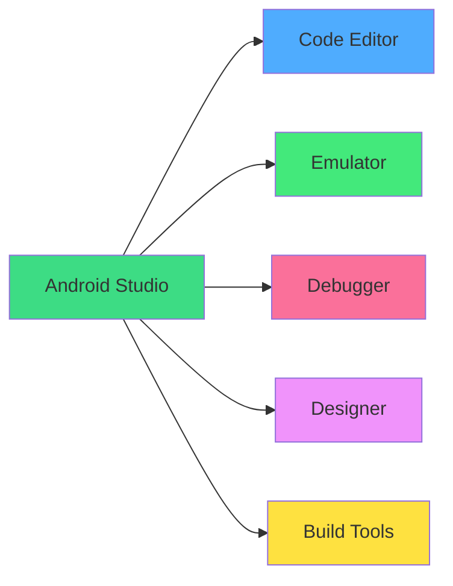
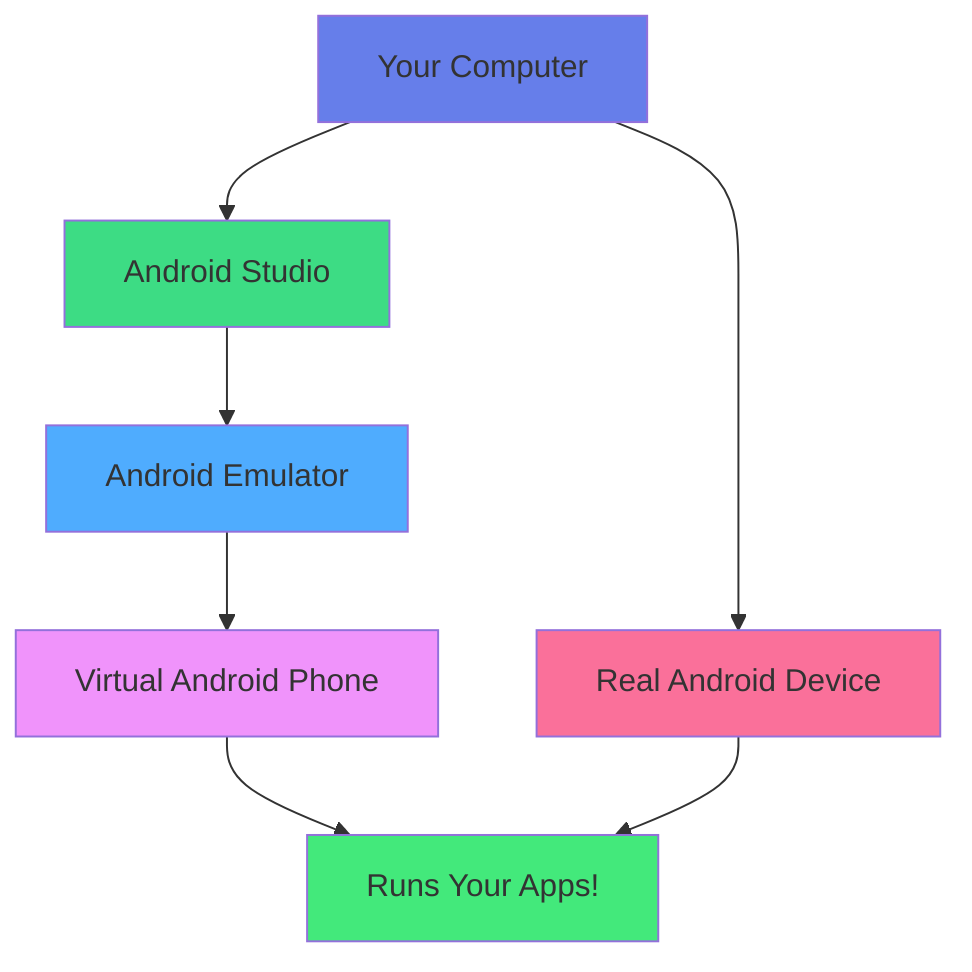

<div align="center">

# 🛠️ Chapter 02 · Development Setup


### *Android Studio · Emulator · Your First "Hello World"*


</div>

---

> [!NOTE]
> *"A craftsman is only as good as their tools — and today, you get the best ones in the business."*

<div align="center">

[](./01-getting-started.md)
[](./03-kotlin-basics.md)

</div>

<br>

## 🎯 What We're Building Today

<div align="center">

By the end of this chapter, you will have:

</div>

<br>

<table>
<tr>
<td align="center" width="25%">

🖥️  
**Android Studio**

Installed & configured

</td>
<td align="center" width="25%">

📱  
**Emulator**

A virtual Android phone running on your computer

</td>
<td align="center" width="25%">

📂  
**First Project**

Your very first Android app created

</td>
<td align="center" width="25%">

🚀  
**Running App**

"Hello World" live on screen

</td>
</tr>
</table>

<br>

> [!IMPORTANT]
> This chapter is **100% hands-on**. Follow every step in order.  
> Don't skip anything — each step builds on the last one.

---

<br>

## 🖥️ Part 1 · Installing Android Studio

<div align="center">

### *Your New Home as an Android Developer*

**Android Studio** is the official IDE (Integrated Development Environment) for Android.  
Think of it as your workshop — everything you need, in one place.

</div>

<br>

<div align="center">



</div>

<br>

### 📋 Before You Install — System Check

<br>

> [!WARNING]
> Check your system meets the minimum requirements **before** downloading.  
> A failed installation wastes hours!

<br>

<table>
<tr>
<th width="20%">Requirement</th>
<th width="35%">Windows</th>
<th width="35%">macOS</th>
<th width="10%">Linux</th>
</tr>
<tr>
<td><b>OS Version</b></td>
<td>Windows 10/11 (64-bit)</td>
<td>macOS 10.14+</td>
<td>Ubuntu 18.04+</td>
</tr>
<tr>
<td><b>RAM</b></td>
<td>8 GB min · 16 GB recommended</td>
<td>8 GB min · 16 GB recommended</td>
<td>8 GB min</td>
</tr>
<tr>
<td><b>Disk Space</b></td>
<td>8 GB (SSD preferred)</td>
<td>8 GB (SSD preferred)</td>
<td>8 GB</td>
</tr>
<tr>
<td><b>Screen</b></td>
<td>1280×800 min</td>
<td>1280×800 min</td>
<td>1280×800 min</td>
</tr>
</table>

<br>

> [!TIP]
> **Only 8GB RAM?** You can still run Android Studio — just close other apps while coding.  
> **No SSD?** Expect slower build times but it will still work.

---

<br>

### 📥 Step-by-Step Installation

<br>

<details>
<summary><b>💻 Windows Installation (Click to expand)</b></summary>

<br>

**Step 1 — Download**
1. Go to 🔗 [developer.android.com/studio](https://developer.android.com/studio)
2. Click the big green **"Download Android Studio"** button
3. Accept the terms and conditions
4. The `.exe` file will download (~1GB, takes a few minutes)

**Step 2 — Run the installer**
1. Double-click the downloaded `.exe` file
2. Click **Next** on the welcome screen
3. ✅ Make sure both boxes are checked:
   - `Android Studio`
   - `Android Virtual Device`
4. Choose install location (default is fine)
5. Click **Install** and wait (~5-10 minutes)

**Step 3 — First launch setup**

When Android Studio opens for the first time:
1. Select **"Do not import settings"**
2. Choose **Standard** installation type
3. Select your preferred UI theme (we recommend **Darcula** — dark mode!)
4. Click **Next** → **Finish**
5. Wait for components to download (~2-5 GB, this takes a while ☕)

```
✅ Installation complete when you see:
"Android Studio is ready to use!"
```

</details>

<details>
<summary><b>🍎 macOS Installation (Click to expand)</b></summary>

<br>

**Step 1 — Download**
1. Go to 🔗 [developer.android.com/studio](https://developer.android.com/studio)
2. Click **"Download Android Studio"**
3. Choose the version for your chip:
   - **Apple Silicon (M1/M2/M3):** Download the ARM version
   - **Intel Mac:** Download the Intel version
4. The `.dmg` file downloads (~1GB)

**Step 2 — Install**
1. Open the downloaded `.dmg` file
2. Drag **Android Studio** into your **Applications** folder
3. Eject the disk image

**Step 3 — First launch**
1. Open **Applications** → **Android Studio**
2. macOS may warn "App downloaded from internet" → Click **Open**
3. Select **"Do not import settings"**
4. Follow the setup wizard:
   - Theme: **Darcula** (recommended)
   - Type: **Standard**
5. Enter your Mac password when asked (to install components)
6. Wait for SDK download ☕

**Bonus — Add to terminal:**
```bash
# Add this to ~/.zshrc or ~/.bash_profile
export PATH="/Applications/Android Studio.app/Contents/jre/Contents/Home/bin:$PATH"
```

</details>

<details>
<summary><b>🐧 Linux Installation (Click to expand)</b></summary>

<br>

**Step 1 — Download**
1. Go to 🔗 [developer.android.com/studio](https://developer.android.com/studio)
2. Download the `.tar.gz` package

**Step 2 — Extract and install**
```bash
# Extract the archive
tar -xzf android-studio-*.tar.gz

# Move to /opt
sudo mv android-studio /opt/

# Run the setup script
/opt/android-studio/bin/studio.sh
```

**Step 3 — Create desktop shortcut**
```bash
# In Android Studio: Tools → Create Desktop Entry
# Or manually create a .desktop file
```

**Step 4 — Install dependencies**
```bash
# Ubuntu/Debian
sudo apt-get install libc6:i386 libncurses5:i386 libstdc++6:i386 lib32z1 libbz2-1.0:i386

# Fedora
sudo dnf install zlib.i686 ncurses-libs.i686 bzip2-libs.i686
```

</details>

---

<br>

### 🎨 Configuring Android Studio (First-Time Setup)

<br>

<details>
<summary><b>⚙️ Recommended Settings for Beginners</b></summary>

<br>

After installation, open **File → Settings** (Windows/Linux) or **Android Studio → Preferences** (Mac):

**🎨 Appearance:**
```
Appearance & Behavior → Appearance
Theme: Darcula (dark mode — easier on eyes)
Font Size: 14
```

**✏️ Editor Font:**
```
Editor → Font
Font: JetBrains Mono (already installed!)
Size: 14
Line height: 1.4
Enable ligatures: ✅
```

**🔤 Code Style:**
```
Editor → Code Style → Kotlin
Tab size: 4
Indent: 4
```

**💾 Auto-save:**
```
Appearance & Behavior → System Settings
Save files automatically: ✅ Every 30 seconds
```

**🔌 Essential Plugins (already included):**
- Kotlin ✅
- Android ✅
- Git ✅

</details>

---

<br>

## 📱 Part 2 · Setting Up the Emulator

<div align="center">

### *Your Virtual Android Phone*

An **emulator** is a simulated Android device that runs on your computer.  
No physical phone needed — you can test your apps instantly!

</div>

<br>

<div align="center">



</div>

<br>

> [!TIP]
> **Emulator or Real Device?**  
> Both work great. The emulator is perfect for beginners — no cables needed!  
> We'll show you both options in this chapter.

---

<br>

### 📲 Creating Your First Virtual Device

<br>

<details>
<summary><b>📱 Create Android Emulator — Step by Step</b></summary>

<br>

**Step 1 — Open Device Manager**

In Android Studio, find the Device Manager:
```
Option A: Click the phone icon 📱 in the toolbar (top right)
Option B: Tools → Device Manager
Option C: View → Tool Windows → Device Manager
```

**Step 2 — Create Virtual Device**
1. Click **"Create Virtual Device"** (or the **+** button)
2. Select **Phone** category

**Step 3 — Choose Hardware**

We recommend for beginners:
```
📱 Pixel 6  ←  Great choice!
   • Screen: 6.4"
   • Resolution: 1080x2340
   • RAM: 8 GB
   • Modern specs = realistic testing
```

Click **Next**

**Step 4 — Choose System Image (Android Version)**

Download the recommended version:
```
Recommended tab → Select "API 34" (Android 14)
                   If not downloaded, click ⬇️ Download
```

> [!WARNING]
> The system image download is ~1-2 GB. Make sure you have a good internet connection!

**Step 5 — Configure and Finish**
```
AVD Name: Pixel 6 API 34   ← You can rename it
Startup orientation: Portrait
✅ Enable Device Frame
```

Click **Finish** — your virtual device is ready! 🎉

</details>

---

<br>

### ▶️ Launching the Emulator

<br>

<details>
<summary><b>🚀 Start Your Virtual Android Phone</b></summary>

<br>

**Method 1 — From Device Manager:**
1. Open **Device Manager**
2. Find your virtual device
3. Click the ▶️ **Play button**
4. Wait 30-60 seconds for it to boot

**Method 2 — From toolbar:**
1. Click the device selector dropdown (top toolbar)
2. Select your virtual device
3. Click ▶️ **Run**

**What you'll see:**
```
1. Black screen with Android logo     ← Normal, wait...
2. Android boot animation             ← Almost there...
3. Android lock screen                ← It's alive! 🎉
4. Android home screen                ← Ready!
```

**⚠️ Emulator running slow?**

```
Fix 1: Enable Hardware Acceleration
  → Your CPU needs virtualization enabled in BIOS
  → Windows: Control Panel → Turn Windows features on
  → Enable "Hyper-V" or "Windows Hypervisor Platform"

Fix 2: Give it more RAM
  → Device Manager → Edit → Advanced Settings
  → RAM: 2048 MB minimum

Fix 3: Close other apps
  → The emulator uses a lot of RAM
  → Close Chrome, Spotify, etc. while using it
```

</details>

---

<br>

## 📂 Part 3 · Your First Android Project

<div align="center">

### *The Moment You've Been Waiting For*

Let's create your first Android app!  
It won't do much — but it will be **yours**.

</div>

---

<br>

### 🆕 Creating a New Project

<br>

<details>
<summary><b>📂 Step-by-Step: Create Your First Project</b></summary>

<br>

**Step 1 — Open the New Project wizard**
```
Option A: Welcome Screen → "New Project"
Option B: File → New → New Project
```

**Step 2 — Choose a template**

You'll see many templates. For now:
```
📋 Select: "Empty Activity"
           ↑ This is the simplest starting point
           ↑ We'll understand what "Activity" means in Chapter 05
```

Click **Next**

**Step 3 — Configure your project**

This is important — fill in carefully:

```
Name:            My First App
                 ← What users see on Google Play
                 ← Keep it simple for now

Package name:    com.yourname.myfirstapp
                 ← A unique ID for your app
                 ← Like a web domain, but reversed
                 ← Change "yourname" to your actual name!

Save location:   Choose a folder you'll remember
                 Recommendation: Documents/AndroidProjects/MyFirstApp

Language:        Kotlin  ← IMPORTANT: Must be Kotlin!

Minimum SDK:     API 24: Android 7.0 (Nougat)
                 ← This means your app works on 97% of devices
```

> [!IMPORTANT]
> **Package name matters!** Use something real like `com.mariagomez.myfirstapp`.  
> You can't easily change it later. Avoid spaces and capital letters.

Click **Finish** and wait 1-3 minutes while Android Studio sets everything up.

</details>

---

<br>

### 🗺️ Understanding Your Project

<div align="center">

When Android Studio finishes, you'll see something that looks complex.  
**Don't panic.** Let's map it out.

</div>

<br>

<details>
<summary><b>🗂️ The Anatomy of an Android Project</b></summary>

<br>

```
📁 MyFirstApp/
│
├── 📁 app/
│   ├── 📁 src/
│   │   └── 📁 main/
│   │       ├── 📁 java/com.yourname.myfirstapp/
│   │       │   └── 📄 MainActivity.kt     ← Your first screen (code)
│   │       │
│   │       ├── 📁 res/                    ← Resources
│   │       │   ├── 📁 layout/             ← Screen designs
│   │       │   ├── 📁 drawable/           ← Images & icons
│   │       │   ├── 📁 values/             ← Colors, strings, styles
│   │       │   └── 📁 mipmap/             ← App icon
│   │       │
│   │       └── 📄 AndroidManifest.xml    ← App ID card
│   │
│   └── 📄 build.gradle.kts               ← App settings
│
└── 📄 build.gradle.kts                   ← Project settings
```

**What to focus on right now:**

| File | What It Is | Worry About It? |
|:---|:---|:---:|
| `MainActivity.kt` | Your main screen code | ✅ Yes — Chapter 03 |
| `AndroidManifest.xml` | App configuration | ⏳ Later |
| `res/values/` | Colors, text, styles | ⏳ Later |
| `build.gradle` | Dependencies & settings | ⏳ Later |

> [!TIP]
> **You don't need to understand everything today.**  
> Focus on `MainActivity.kt` — that's where the action is!

</details>

---

<br>

### 🔍 Your First Lines of Code

<br>

Open `MainActivity.kt`. You'll see something like this:

<br>

<details>
<summary><b>📄 Understanding MainActivity.kt</b></summary>

<br>

```kotlin
package com.yourname.myfirstapp          // 1️⃣ Your app's address

import android.os.Bundle                  // 2️⃣ Tools we're borrowing
import androidx.activity.ComponentActivity
import androidx.activity.compose.setContent
import androidx.compose.material3.Text
import androidx.compose.runtime.Composable

class MainActivity : ComponentActivity() {  // 3️⃣ Your main screen
    override fun onCreate(savedInstanceState: Bundle?) {
        super.onCreate(savedInstanceState)
        setContent {
            MyFirstAppTheme {             // 4️⃣ Apply your theme
                Greeting("Android")      // 5️⃣ Show a greeting!
            }
        }
    }
}

@Composable                              // 6️⃣ This creates a UI element
fun Greeting(name: String) {
    Text(
        text = "Hello $name!"           // 7️⃣ Shows "Hello Android!"
    )
}
```

**Plain English explanation:**

| # | Code | What It Does |
|:---:|:---|:---|
| 1️⃣ | `package` | Gives your app a unique address |
| 2️⃣ | `import` | Borrows pre-built tools from Android |
| 3️⃣ | `class MainActivity` | Creates your app's main screen |
| 4️⃣ | `setContent` | Says "show this on screen" |
| 5️⃣ | `Greeting("Android")` | Calls the greeting function |
| 6️⃣ | `@Composable` | Marks a UI-building function |
| 7️⃣ | `Text(...)` | Shows text on screen |

> **Don't worry about memorizing this!**  
> In Chapter 03 we'll learn Kotlin from scratch.  
> For now, just appreciate what these lines do.

</details>

---

<br>

## 🚀 Part 4 · Running Your App

<div align="center">

### *The Most Satisfying Moment in Every Developer's Journey*

Time to see your app come alive. This never gets old — even after years of development.

</div>

---

<br>

### ▶️ Option A — Run on Emulator

<br>

<details>
<summary><b>📱 Run on Virtual Device</b></summary>

<br>

**Step 1 — Select your device**

In the toolbar at the top, find the device selector:
```
[▾ Pixel 6 API 34 ▾]  ←  Click this dropdown
```

If you don't see your emulator, start it first from Device Manager.

**Step 2 — Press Run**

```
Option A: Click the green ▶️ button in the toolbar
Option B: Press Shift+F10 (Windows/Linux)
Option C: Press Control+R (Mac)
Option D: Run → Run 'app' from the menu
```

**Step 3 — Wait for the build**

Android Studio compiles your app:
```
⚙️  Gradle: Executing tasks...       ← Building...
📦  BUILD SUCCESSFUL                 ← Done!
📱  Installing app on emulator...    ← Loading...
🚀  Launching activity...           ← Almost!
```

**Step 4 — See your app!**

```
╔══════════════════╗
║   My First App   ║
╠══════════════════╣
║                  ║
║  Hello Android!  ║  ← YOUR FIRST ANDROID APP! 🎉
║                  ║
╚══════════════════╝
```

**🎉 CONGRATULATIONS!** You just ran your first Android app!

</details>

---

<br>

### ▶️ Option B — Run on Real Device

<br>

<details>
<summary><b>📲 Run on Your Physical Android Phone</b></summary>

<br>

Using your real phone is faster and more satisfying. Here's how:

**Step 1 — Enable Developer Options on your phone**

```
1. Open Settings on your phone
2. Scroll down to "About phone"
3. Find "Build number"
4. Tap it 7 times rapidly
5. You'll see: "You are now a developer!" 🎉
```

**Step 2 — Enable USB Debugging**

```
1. Go back to Settings
2. Find "Developer options" (now visible!)
3. Enable "USB debugging" toggle
4. Confirm the warning dialog
```

**Step 3 — Connect to your computer**

```
1. Use a USB cable (data cable, not charge-only!)
2. Your phone will ask: "Allow USB debugging?"
3. Tap "Allow" (optionally check "Always allow from this computer")
```

**Step 4 — Select your device in Android Studio**

```
[▾  Your Phone Name ▾]  ← It appears automatically!
```

**Step 5 — Run!**

```
Press ▶️ or Shift+F10
Your app installs and opens on your phone!
```

> [!TIP]
> **Phone not appearing?**  
> - Try a different USB cable (many cables are charge-only!)  
> - Install the USB driver for your phone brand  
> - Toggle USB debugging off and on again

</details>

---

<br>

### ✏️ Make Your First Change

<div align="center">

Don't just run the template — **make it yours**.

</div>

<br>

<details>
<summary><b>✏️ Customize Your First App</b></summary>

<br>

Open `MainActivity.kt` and find this line:

```kotlin
// BEFORE:
Greeting("Android")
```

Change it to your name:

```kotlin
// AFTER:
Greeting("Maria")    // ← Put YOUR name here!
```

Now find the `Greeting` function and modify the text:

```kotlin
// BEFORE:
fun Greeting(name: String) {
    Text(
        text = "Hello $name!"
    )
}
```

```kotlin
// AFTER:
fun Greeting(name: String) {
    Text(
        text = "Hello $name! I'm an Android developer now! 🚀"
    )
}
```

**Run the app again** (▶️)

```
╔══════════════════════════════════════╗
║             My First App             ║
╠══════════════════════════════════════╣
║                                      ║
║  Hello Maria! I'm an Android         ║
║  developer now! 🚀                   ║
║                                      ║
╚══════════════════════════════════════╝
```

**You just wrote your first Kotlin code!** ✨

> [!TIP]
> Notice how quickly the change appeared?  
> That's the power of **instant feedback** — write code, see results immediately.  
> This loop is what makes development so satisfying.

</details>

---

<br>

## 🧭 Part 5 · Android Studio Tour

<div align="center">

### *Know Your Workshop*

Let's get comfortable with the interface.  
You'll spend thousands of hours here — might as well feel at home.

</div>

<br>

<details>
<summary><b>🗺️ The Android Studio Interface Map</b></summary>

<br>

```
┌─────────────────────────────────────────────────────────┐
│  MENU BAR: File · Edit · View · Run · Tools · Help      │
├──────┬──────────────────────────────────┬───────────────┤
│      │                                  │               │
│  P   │      CODE EDITOR                 │  DEVICE       │
│  R   │                                  │  MANAGER      │
│  O   │  MainActivity.kt                 │               │
│  J   │                                  │  📱 Pixel 6   │
│  E   │  fun Greeting(name: String) {    │               │
│  C   │      Text("Hello $name!")        │               │
│  T   │  }                               │               │
│      │                                  │               │
├──────┤                                  │               │
│  F   │                                  │               │
│  I   │                                  │               │
│  L   │                                  │               │
│  E   │                                  │               │
│  S   │                                  │               │
├──────┴──────────────────────────────────┴───────────────┤
│  BUILD OUTPUT / LOGCAT / TERMINAL                        │
└─────────────────────────────────────────────────────────┘
```

**Key Areas:**

| Area | Purpose | Shortcut |
|:---|:---|:---:|
| **Project Panel** (left) | Browse all your files | `Alt+1` |
| **Code Editor** (center) | Write your code | (main area) |
| **Device Manager** (right) | Manage emulators | `Shift+F6` |
| **Logcat** (bottom) | See app logs & errors | `Alt+6` |
| **Terminal** (bottom) | Run commands | `Alt+F12` |
| **Build Output** (bottom) | See build status | `Alt+0` |

</details>

---

<br>

### ⌨️ Essential Shortcuts

<br>

<details>
<summary><b>⌨️ Shortcuts That Will Save Your Life</b></summary>

<br>

<div align="center">

| Action | Windows/Linux | macOS |
|:---|:---:|:---:|
| **Run app** | `Shift+F10` | `Ctrl+R` |
| **Stop app** | `Ctrl+F2` | `Cmd+F2` |
| **Search everywhere** | `Double Shift` | `Double Shift` |
| **Find in file** | `Ctrl+F` | `Cmd+F` |
| **Auto-format code** | `Ctrl+Alt+L` | `Cmd+Option+L` |
| **Quick fix / suggestion** | `Alt+Enter` | `Option+Enter` |
| **Comment/uncomment** | `Ctrl+/` | `Cmd+/` |
| **Duplicate line** | `Ctrl+D` | `Cmd+D` |
| **Delete line** | `Ctrl+Y` | `Cmd+Backspace` |
| **Build project** | `Ctrl+F9` | `Cmd+F9` |
| **Open Logcat** | `Alt+6` | `Cmd+6` |
| **Zoom in/out** | `Ctrl+Plus/Minus` | `Cmd+Plus/Minus` |

</div>

> [!TIP]
> Don't try to memorize all of these now.  
> Learn **Run** (`Shift+F10`) and **Auto-format** (`Ctrl+Alt+L`) first.  
> The rest will come naturally over time.

</details>

---

<br>

## 🐛 Part 6 · When Things Go Wrong

<div align="center">

### *Troubleshooting Is a Core Developer Skill*

Something will break at some point. That's normal.  
Here's how to handle the most common issues.

</div>

<br>

<details>
<summary><b>❌ "Gradle sync failed"</b></summary>

<br>

**Symptom:** Red error banner at top: *"Gradle sync failed"*

**Most common causes & fixes:**

```
Cause 1: No internet connection
Fix: Connect to internet, then File → Sync Project with Gradle Files

Cause 2: Gradle version mismatch
Fix: Click the blue "upgrade" link in the error message

Cause 3: Corrupt cache
Fix: File → Invalidate Caches → Invalidate and Restart
```

> [!TIP]
> **"Invalidate Caches and Restart"** fixes about 70% of mysterious Android Studio problems.  
> It's the developer equivalent of "turn it off and on again." 😄

</details>

<details>
<summary><b>❌ Emulator won't start or is very slow</b></summary>

<br>

**Fix 1 — Enable hardware acceleration:**
```
Windows:
1. Open "Turn Windows features on or off"
2. Enable "Windows Hypervisor Platform" ✅
3. Enable "Virtual Machine Platform" ✅
4. Restart your computer
```

```
macOS:
Hardware acceleration is automatic on Apple Silicon (M1/M2/M3)
Intel Macs: Usually works out of the box
```

**Fix 2 — Increase emulator RAM:**
```
Device Manager → Edit (pencil icon) → Show Advanced Settings
RAM: Set to 2048 MB or higher
```

**Fix 3 — Use a smaller emulator:**
```
Instead of Pixel 6 (large), try:
→ Pixel 4 (smaller, lighter, faster)
→ Use API 30 instead of API 34 (smaller download)
```

**Fix 4 — Use your real phone instead:**
```
Real devices are always faster than emulators.
If emulator is painful → connect your phone!
```

</details>

<details>
<summary><b>❌ App crashes immediately</b></summary>

<br>

**Step 1 — Read Logcat**
```
Bottom panel → Logcat tab
Look for red text with "FATAL EXCEPTION" or "ERROR"
The error message usually tells you exactly what's wrong
```

**Step 2 — Common beginner crashes:**

```kotlin
// ❌ NullPointerException
// Cause: Using something that doesn't exist yet
// Example: Accessing a variable before assigning it

// ❌ IllegalStateException  
// Cause: Calling something at the wrong time
// Example: Showing a dialog after app closes

// ❌ ClassCastException
// Cause: Treating one thing as a different type
// Example: Treating a String as a Number
```

**Step 3 — Copy error → Ask AI:**
```
Copy the error from Logcat
Paste into ChatGPT or Claude:
"I'm a beginner learning Android. I got this error: [paste error].
Here's my code: [paste code]. What's wrong and how do I fix it?"
```

</details>

<details>
<summary><b>❌ "Device not found" — phone not showing up</b></summary>

<br>

```
Checklist:
☐ USB debugging enabled on phone?
☐ Using a DATA cable (not charge-only)?
☐ Allowed USB debugging on the phone prompt?
☐ Tried a different USB port on your computer?
☐ Installed phone brand USB drivers? (Windows especially)
☐ Tried toggling USB debugging off and back on?
☐ Restarted Android Studio?
☐ Restarted your phone?
```

**Driver downloads:**
- Samsung: [Samsung USB Driver](https://developer.samsung.com/android-usb-driver.html)
- Google Pixel: Usually auto-installs
- Other brands: Search "[Brand] USB driver for Android development"

</details>

---

<br>

## 🎯 Mission · Chapter 02

<div align="center">

### 🚀 Confirm Your Workshop Is Ready

</div>

<br>

### Core Tasks:

- [ ] 🖥️ **Install Android Studio** — Download, install, and complete setup wizard
- [ ] 📱 **Create virtual device** — Pixel 6, API 34 (or similar)
- [ ] ▶️ **Start the emulator** — See the Android home screen running
- [ ] 📂 **Create your first project** — "My First App" with Kotlin
- [ ] 🚀 **Run the app** — See "Hello Android!" on screen
- [ ] ✏️ **Make it yours** — Change the greeting to your name
- [ ] 🗺️ **Explore the IDE** — Find Project panel, Logcat, Device Manager

<br>

<details>
<summary><b>⭐ Bonus Challenges</b></summary>

<br>

- [ ] 📲 Run the app on your **real Android phone**
- [ ] ⌨️ Learn and use 3 keyboard shortcuts
- [ ] 🎨 Change the Android Studio theme to your preference
- [ ] 🔍 Find where the app icon files are stored in the project
- [ ] 📝 Open Logcat and observe what logs appear when the app starts
- [ ] 🌐 Browse [developer.android.com](https://developer.android.com) for 10 minutes — just explore!
- [ ] 💾 Push your project to GitHub (if you set it up in Chapter 01)

</details>

---

<br>

## 📸 You Did It!

<div align="center">

Take a screenshot of your app running.

Not for social media (unless you want to — **#AndroidHeroDay2**) —  
but for **you**. In 3 months, you'll look at this screenshot and smile.

That tiny "Hello [YourName]!" on a phone screen?  
That's the seed of every great app you'll ever build.

</div>

---

<br>

<div align="center">

## 🏆 Achievement Unlocked

### **Workshop Master** 🛠️

<br>

**Your developer toolkit is ready:**

- ✅ Android Studio installed & configured
- ✅ Emulator running like a virtual phone
- ✅ First project created
- ✅ First app running on screen
- ✅ First Kotlin code written

<br>

*Your screen shows "Hello [YourName]!"*  
**That's not just text. That's your first step into a new world.**

<br>


</div>

---

<br>

<div align="center">

### 🎓 Remember This

> *"Every expert Android developer you admire  
> once stared at this same 'Hello World' screen  
> with the exact same mix of confusion and excitement.  
> The difference is they kept going.  
> So will you."*

</div>

---

<br>

<div align="center">

### 🔜 What's Next?

In **Chapter 03**, we start learning **Kotlin** — the language behind your apps.

You'll learn:
- Variables & data types
- Functions
- Logic & conditions
- And build your first real calculator!

</div>

<br>

<div align="center">

[](./03-kotlin-basics.md)

</div>

<br>
