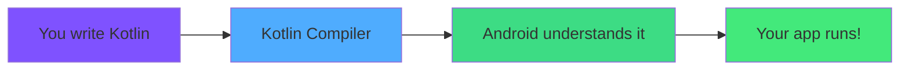
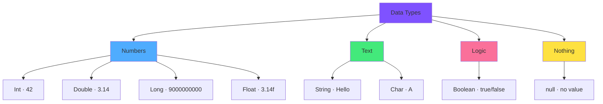
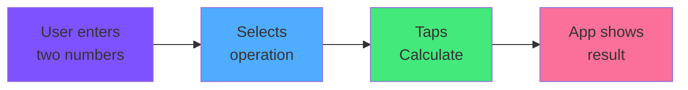

<div align="center">

# 🎨 Chapter 03 · Kotlin Basics


### *Your First Programming Language*


</div>

---

> [!NOTE]
> *"Kotlin is not just a language. It's the clearest, most elegant way to tell Android exactly what to do."*

<div align="center">

[](./02-development-setup.md)
[](./04-kotlin-collections.md)

</div>

<br>

## 🎯 What We're Learning Today

<div align="center">

By the end of this chapter, you will be able to:

</div>

<br>

<table>
<tr>
<td align="center" width="25%">

📦  
**Variables**

Store and manage data

</td>
<td align="center" width="25%">

🏷️  
**Data Types**

Understand what kind of data you're working with

</td>
<td align="center" width="25%">

⚙️  
**Functions**

Create reusable blocks of code

</td>
<td align="center" width="25%">

🧮  
**Calculator App**

Your first real Android project

</td>
</tr>
</table>

<br>

> [!IMPORTANT]
> **Practice as you read.** Open Android Studio, create a new Kotlin file, and type every example yourself.  
> Reading without coding is like reading a recipe without cooking — you won't learn the taste.

---

<br>

## 🌟 Why Kotlin?

<div align="center">

Before we write a single line, let's understand **what** we're learning and **why**.

</div>

<br>

<div align="center">



</div>

<br>

<table>
<tr>
<td width="50%" bgcolor="#f3e5f5" valign="top">

### 💜 Kotlin Is:

- **Official** Android language (since 2019)
- **Modern** — designed for productivity
- **Safe** — prevents common crashes
- **Concise** — less code, same result
- **Fun** — seriously, it's enjoyable to write

</td>
<td width="50%" bgcolor="#e8f5e9" valign="top">

### 🔥 Kotlin vs Java:

```kotlin
// ✅ Kotlin — clean, modern
data class User(val name: String, val age: Int)

// ❌ Java — the old way (same result!)
public class User {
    private String name;
    private int age;
    public User(String name, int age) {
        this.name = name;
        this.age = age;
    }
    // ...getters, setters, toString...
}
```

</td>
</tr>
</table>

<br>

> [!TIP]
> If you've seen Java Android tutorials online, **forget them**.  
> Kotlin is simpler, safer, and it's the future. You're learning the right thing.

---

<br>

## 🛝 The Kotlin Playground

<div align="center">

### *Practice Without Android Studio*

Before jumping into Android, let's learn Kotlin in a simpler environment.

</div>

<br>

> [!TIP]
> Open 🔗 [play.kotlinlang.org](https://play.kotlinlang.org) in your browser.  
> This is the **Kotlin Playground** — run Kotlin code instantly, no setup needed!  
> Perfect for practicing the basics in this chapter.

<br>

```kotlin
// Your first Kotlin program — type this in the Playground!
fun main() {
    println("Hello, Kotlin! 🚀")
}
```

```
Output:
Hello, Kotlin! 🚀
```

**Press ▶️ Run. You're now a Kotlin programmer.** Welcome to the club.

---

<br>

## 📦 Part 1 · Variables

<div align="center">

### *Giving Names to Things*

A **variable** is a named container that holds information.  
Every app you'll ever build stores information in variables.

</div>

<br>

> [!TIP]
> Think of a variable like a **labeled box** 📦  
> The label is the name. The content is the value.

---

<br>

### 🔑 The Two Keywords: `val` vs `var`

<br>

This is **the most important distinction in Kotlin**. Learn it well.

<br>

<table>
<tr>
<td width="50%" align="center" bgcolor="#e3f2fd">

### 🔒 `val` — Value (Constant)

```kotlin
val appName = "My First App"
val pi = 3.14159
val maxUsers = 100
```

**Cannot be changed after creation.**

Like writing in **permanent marker**.

```kotlin
val city = "Madrid"
city = "Barcelona"  // ❌ ERROR!
// Val cannot be reassigned
```

**Use when:** The value won't change

</td>
<td width="50%" align="center" bgcolor="#fff9c4">

### 🔓 `var` — Variable (Mutable)

```kotlin
var score = 0
var userName = "Guest"
var isLoggedIn = false
```

**Can be changed at any time.**

Like writing in **pencil**.

```kotlin
var score = 0
score = 10   // ✅ Works!
score = 25   // ✅ Works again!
```

**Use when:** The value will change

</td>
</tr>
</table>

<br>

> [!IMPORTANT]
> **Golden Rule:** Always use `val` first.  
> Only switch to `var` if you *need* to change the value.  
> This prevents bugs and makes your code safer.

---

<br>

### 🏷️ Naming Variables

<br>

<details>
<summary><b>📝 Rules & Conventions for Variable Names</b></summary>

<br>

**Kotlin uses `camelCase` — capitalize every word except the first:**

```kotlin
// ✅ Good names — clear and descriptive
val userName = "Alice"
val totalPrice = 29.99
val isUserLoggedIn = true
var numberOfAttempts = 0
var currentScore = 0

// ❌ Bad names — confusing and unprofessional
val x = "Alice"        // What is x?
val data = 29.99       // What data?
val flag = true        // What flag?
var n = 0              // n what?
var temp = 0           // Temporary what?
```

**Rules you MUST follow:**
```kotlin
// ✅ Can start with letter or underscore
val userName = "Alice"
val _privateData = 42

// ❌ Cannot start with a number
val 1stUser = "Alice"   // ERROR!

// ❌ Cannot use spaces
val user name = "Alice" // ERROR!

// ❌ Cannot use special characters (except _)
val user-name = "Alice" // ERROR!
val user@name = "Alice" // ERROR!
```

**Kotlin reserved words you can't use as names:**
```kotlin
// These are Kotlin keywords — can't use as variable names:
val, var, fun, if, else, when, for, while, class, 
object, return, true, false, null, in, is, as...
```

</details>

---

<br>

## 🏷️ Part 2 · Data Types

<div align="center">

### *What Kind of Information?*

Every variable holds a specific **type** of data.  
Kotlin is smart — it usually figures out the type automatically.

</div>

<br>

<div align="center">



</div>

---

<br>

### 🔢 Number Types

<br>

<details>
<summary><b>🔢 Int, Double, Long, Float — When to Use Each</b></summary>

<br>

```kotlin
// Int — whole numbers (-2 billion to +2 billion)
val age: Int = 25
val score: Int = 0
val year: Int = 2024
val negativeTemp: Int = -15

// Double — decimal numbers (high precision)
val price: Double = 19.99
val pi: Double = 3.14159265358979
val weight: Double = 73.5
val percentage: Double = 0.85

// Long — huge whole numbers (use when Int isn't enough)
val worldPopulation: Long = 8_000_000_000L    // The L tells Kotlin it's a Long
val distanceToSun: Long = 149_597_870_700L

// Float — decimal numbers (less precise, less memory)
val temperature: Float = 36.6f    // The f tells Kotlin it's a Float

// ✨ Kotlin is smart — usually you don't need to write the type!
val age = 25        // Kotlin sees 25 → automatically Int
val price = 19.99   // Kotlin sees 19.99 → automatically Double
```

**Arithmetic operations:**
```kotlin
val a = 10
val b = 3

println(a + b)    // 13  (Addition)
println(a - b)    // 7   (Subtraction)
println(a * b)    // 30  (Multiplication)
println(a / b)    // 3   (Integer division — no decimals!)
println(a % b)    // 1   (Modulo — the remainder)

// For decimal division, use Double:
val x = 10.0
val y = 3.0
println(x / y)    // 3.3333333333333335
```

**Useful number operations:**
```kotlin
import kotlin.math.*

println(sqrt(16.0))     // 4.0   (Square root)
println(abs(-42))       // 42    (Absolute value)
println(max(10, 20))    // 20    (Maximum)
println(min(10, 20))    // 10    (Minimum)
println(2.0.pow(10))    // 1024.0 (Power)
println(PI)             // 3.141592653589793
```

</details>

---

<br>

### 📝 String Type

<br>

<details>
<summary><b>📝 Working with Text — Strings</b></summary>

<br>

```kotlin
// Creating Strings
val firstName = "María"
val lastName = "García"
val greeting = "Hello, World!"
val empty = ""

// String concatenation (joining strings)
val fullName = firstName + " " + lastName
println(fullName)    // María García

// ✨ String Templates — the Kotlin way (much better!)
val name = "María"
val age = 28
val message = "My name is $name and I am $age years old."
println(message)    // My name is María and I am 28 years old.

// For expressions, use ${ }
val price = 9.99
println("Price with tax: ${price * 1.21}€")
// Price with tax: 12.0879€

// Multiline strings
val poem = """
    Roses are red,
    Violets are blue,
    Kotlin is awesome,
    And so are you!
""".trimIndent()
```

**String methods — your Swiss Army knife:**
```kotlin
val text = "  Hello, Android!  "

// Length
println(text.length)                // 20

// Clean up
println(text.trim())                // "Hello, Android!"
println(text.uppercase())           // "  HELLO, ANDROID!  "
println(text.lowercase())           // "  hello, android!  "

// Find & check
println(text.contains("Android"))   // true
println(text.startsWith("  Hello")) // true
println(text.isEmpty())             // false

// Transform
println(text.replace("Android", "Kotlin"))  // "  Hello, Kotlin!  "
println(text.trim().split(", "))    // [Hello, Android!]

// Extract
println(text.trim().substring(0, 5)) // "Hello"
println(text.trim().first())         // 'H'
println(text.trim().last())          // '!'

// Check if it's a number
println("42".toIntOrNull())          // 42
println("abc".toIntOrNull())         // null (not a number)
```

</details>

---

<br>

### ✅ Boolean Type

<br>

<details>
<summary><b>✅ True or False — Booleans</b></summary>

<br>

```kotlin
// Boolean — only two possible values: true or false
val isLoggedIn = true
val hasPermission = false
val isPremiumUser = true
val isGameOver = false

// Boolean expressions — these evaluate to true or false
val age = 20
val isAdult = age >= 18           // true
val isTeenager = age in 13..17    // false
val canVote = age >= 18           // true

// Logical operators
val hasTicket = true
val isMember = false

val canEnter = hasTicket || isMember    // true  (OR — at least one)
val vipAccess = hasTicket && isMember   // false (AND — both required)
val isBlocked = !isLoggedIn             // false (NOT — reverses it)

// Combining conditions
val score = 85
val hasPassed = score >= 60 && score <= 100
println("Passed: $hasPassed")    // Passed: true
```

</details>

---

<br>

### 🚫 Null Safety — Kotlin's Superpower

<br>

<details>
<summary><b>🛡️ Why Kotlin is Safer Than Other Languages</b></summary>

<br>

One of the **most common app crashes** in Android is the `NullPointerException` — trying to use something that doesn't exist (is `null`).

Kotlin prevents this by design.

```kotlin
// ❌ In Java, this crashes with NullPointerException:
String name = null;
System.out.println(name.length()); // 💥 CRASH!

// ✅ In Kotlin, this doesn't even compile:
val name: String = null   // ERROR! String cannot be null

// ✅ To allow null, add ? to the type:
val name: String? = null  // ✅ OK — the ? means "this might be null"

// Now Kotlin forces you to handle the null case:
val nameLength = name?.length    // Safe — returns null if name is null
println(nameLength)              // null (doesn't crash!)

// Elvis operator — provide a default if null
val displayName = name ?: "Guest"
println(displayName)             // "Guest"

// Only run if not null
name?.let {
    println("Name is: $it")     // Only runs if name != null
}
```

**Real-world example:**
```kotlin
// User input might be empty
val userInput: String? = getUserInput()  // might return null

val result = userInput?.toIntOrNull() ?: 0
// If userInput is null → result is 0
// If userInput is "abc" → toIntOrNull() returns null → result is 0
// If userInput is "42" → result is 42
```

> [!IMPORTANT]
> Null safety is one of Kotlin's biggest advantages over Java.  
> This single feature prevents thousands of app crashes.

</details>

---

<br>

## ⚙️ Part 3 · Functions

<div align="center">

### *Reusable Blocks of Code*

A **function** is a named block of code that performs a specific task.  
Write it once. Use it everywhere.

</div>

<br>

> [!TIP]
> Think of a function like a **recipe** 🍳  
> The function name is the recipe title.  
> The parameters are the ingredients.  
> The return value is the finished dish.

---

<br>

### 🔧 Creating Functions

<br>

<details>
<summary><b>⚙️ Function Anatomy — Every Part Explained</b></summary>

<br>

```kotlin
//    ┌─ keyword  ┌─ name    ┌─ parameters          ┌─ return type
//    ↓           ↓          ↓                       ↓
     fun         greet      (name: String)          : String {
         return "Hello, $name!"     // ← what the function gives back
     }                              //   (must match return type)
```

**The simplest function — no inputs, no output:**
```kotlin
fun sayHello() {
    println("Hello, World!")
}

// Using it:
sayHello()    // Hello, World!
sayHello()    // Hello, World! (works again!)
sayHello()    // Hello, World! (and again!)
```

**Function with parameters:**
```kotlin
fun greet(name: String) {
    println("Hello, $name!")
}

// Using it:
greet("María")    // Hello, María!
greet("Carlos")   // Hello, Carlos!
greet("Ana")      // Hello, Ana!
```

**Function that returns a value:**
```kotlin
fun add(a: Int, b: Int): Int {
    return a + b
}

// Using it:
val result = add(5, 3)
println(result)    // 8

val total = add(100, 250)
println(total)     // 350
```

**Function with default parameters:**
```kotlin
fun greetUser(name: String = "Guest", greeting: String = "Hello") {
    println("$greeting, $name!")
}

greetUser()                          // Hello, Guest!
greetUser("María")                   // Hello, María!
greetUser("Carlos", "Welcome")       // Welcome, Carlos!
greetUser(greeting = "Hi")           // Hi, Guest!
```

</details>

---

<br>

### ✨ Single-Expression Functions

<br>

<details>
<summary><b>⚡ Kotlin Shorthand — Write Functions in One Line</b></summary>

<br>

When a function just returns a single expression, Kotlin lets you shorten it dramatically:

```kotlin
// Regular function:
fun square(n: Int): Int {
    return n * n
}

// ✨ Single-expression function — same result, cleaner!
fun square(n: Int) = n * n

// More examples:
fun double(n: Int) = n * 2
fun greet(name: String) = "Hello, $name!"
fun isEven(n: Int) = n % 2 == 0
fun circleArea(radius: Double) = Math.PI * radius * radius

// Using them:
println(square(5))          // 25
println(double(7))          // 14
println(greet("Alice"))     // Hello, Alice!
println(isEven(4))          // true
println(circleArea(3.0))    // 28.274...
```

</details>

---

<br>

### 🎯 The `main` Function

<br>

<details>
<summary><b>🚀 The Entry Point of Every Kotlin Program</b></summary>

<br>

Every Kotlin program starts execution from `fun main()`. Think of it as the front door of your code.

```kotlin
fun main() {
    // Everything starts here!
    println("Program starting...")
    
    val name = "Android Developer"
    greet(name)
    
    val sum = add(10, 20)
    println("10 + 20 = $sum")
    
    println("Program finished!")
}

fun greet(name: String) {
    println("Welcome, $name!")
}

fun add(a: Int, b: Int) = a + b
```

```
Output:
Program starting...
Welcome, Android Developer!
10 + 20 = 30
Program finished!
```

> [!NOTE]
> In Android apps, `MainActivity` takes the role of `main()`.  
> But understanding `fun main()` is essential for learning Kotlin logic.

</details>

---

<br>

## 🔀 Part 4 · Logic & Control Flow

<div align="center">

### *Teaching Your App to Make Decisions*

Real apps don't just run top to bottom.  
They check conditions, repeat actions, and react to the user.

</div>

---

<br>

### 🤔 If / Else — Making Decisions

<br>

<details>
<summary><b>🔀 Complete If/Else Guide</b></summary>

<br>

```kotlin
// Simple if
val age = 20
if (age >= 18) {
    println("You can vote!")
}

// If-else
val score = 55
if (score >= 60) {
    println("You passed! ✅")
} else {
    println("You failed. Try again. ❌")
}

// If-else if-else (multiple conditions)
val grade = 85

if (grade >= 90) {
    println("A — Excellent!")
} else if (grade >= 80) {
    println("B — Great!")
} else if (grade >= 70) {
    println("C — Good")
} else if (grade >= 60) {
    println("D — Passing")
} else {
    println("F — Failed")
}
// Output: B — Great!

// ✨ In Kotlin, if is an EXPRESSION — it returns a value!
val status = if (score >= 60) "Passed" else "Failed"
println(status)    // "Failed"

// Works for assignments too:
val max = if (a > b) a else b    // The bigger of a or b
```

</details>

---

<br>

### ⚡ When — Kotlin's Supercharged Switch

<br>

<details>
<summary><b>⚡ When Expression — Cleaner than If/Else Chains</b></summary>

<br>

`when` is like `if/else if/else` but much more readable:

```kotlin
// Basic when
val day = 3

when (day) {
    1 -> println("Monday")
    2 -> println("Tuesday")
    3 -> println("Wednesday")
    4 -> println("Thursday")
    5 -> println("Friday")
    6 -> println("Saturday")
    7 -> println("Sunday")
    else -> println("Invalid day")
}
// Output: Wednesday

// When with multiple conditions on same branch
val month = 4
val season = when (month) {
    12, 1, 2 -> "Winter ❄️"
    3, 4, 5  -> "Spring 🌸"
    6, 7, 8  -> "Summer ☀️"
    9, 10, 11 -> "Autumn 🍂"
    else -> "Unknown"
}
println(season)    // Spring 🌸

// When with ranges
val temperature = 35
val feeling = when {
    temperature < 0  -> "Freezing 🥶"
    temperature < 10 -> "Cold 🧥"
    temperature < 20 -> "Cool 🌤️"
    temperature < 30 -> "Warm 😊"
    else             -> "Hot 🥵"
}
println(feeling)    // Hot 🥵

// When as expression (returns a value)
val httpCode = 404
val message = when (httpCode) {
    200 -> "OK ✅"
    301 -> "Moved Permanently"
    400 -> "Bad Request"
    401 -> "Unauthorized"
    403 -> "Forbidden"
    404 -> "Not Found ❌"
    500 -> "Server Error 💥"
    else -> "Unknown status"
}
println(message)    // Not Found ❌
```

</details>

---

<br>

### 🔁 Loops — Repeating Actions

<br>

<details>
<summary><b>🔁 For Loops — Repeat a Known Number of Times</b></summary>

<br>

```kotlin
// Count from 1 to 5
for (i in 1..5) {
    println(i)
}
// Output: 1 2 3 4 5

// Count from 0 to 4 (exclusive end)
for (i in 0 until 5) {
    println(i)
}
// Output: 0 1 2 3 4

// Count by 2s
for (i in 0..10 step 2) {
    println(i)
}
// Output: 0 2 4 6 8 10

// Count backwards
for (i in 10 downTo 1) {
    println(i)
}
// Output: 10 9 8 7 6 5 4 3 2 1

// Loop over a list
val fruits = listOf("Apple", "Banana", "Cherry")
for (fruit in fruits) {
    println(fruit)
}

// Loop with index
for ((index, fruit) in fruits.withIndex()) {
    println("$index: $fruit")
}
// 0: Apple
// 1: Banana
// 2: Cherry
```

</details>

<details>
<summary><b>🔂 While Loops — Repeat While Condition is True</b></summary>

<br>

```kotlin
// While loop
var count = 0
while (count < 5) {
    println("Count: $count")
    count++    // count = count + 1
}
// Count: 0
// Count: 1
// Count: 2
// Count: 3
// Count: 4

// Do-while — always runs at least once
var attempts = 0
do {
    println("Attempt ${attempts + 1}")
    attempts++
} while (attempts < 3)
// Attempt 1
// Attempt 2
// Attempt 3

// break — exit loop early
for (i in 1..100) {
    if (i == 5) break    // Stop when we reach 5
    println(i)
}
// 1 2 3 4

// continue — skip to next iteration
for (i in 1..10) {
    if (i % 2 == 0) continue    // Skip even numbers
    println(i)
}
// 1 3 5 7 9
```

</details>

---

<br>

## 🧮 Part 5 · Project — Calculator App

<div align="center">

### *Build Your First Real App*

Time to put everything together.  
We're building a **Calculator App** — your first real Android project!

</div>

<br>

<div align="center">



</div>

---

<br>

### 📐 Step 1 — The Logic First (Kotlin Playground)

<br>

Before building the UI, let's write and test the calculator logic in the Kotlin Playground:

<br>

<details>
<summary><b>🧮 Calculator Logic — Full Code</b></summary>

<br>

```kotlin
fun main() {
    // Test our calculator functions
    println("=== Kotlin Calculator ===")
    println()
    
    // Addition
    val sum = calculate(10.0, 5.0, "+")
    println("10 + 5 = $sum")

    // Subtraction
    val difference = calculate(10.0, 5.0, "-")
    println("10 - 5 = $difference")

    // Multiplication
    val product = calculate(10.0, 5.0, "*")
    println("10 × 5 = $product")

    // Division
    val quotient = calculate(10.0, 5.0, "/")
    println("10 ÷ 5 = $quotient")
    
    // Division by zero
    val invalid = calculate(10.0, 0.0, "/")
    println("10 ÷ 0 = $invalid")
    
    println()
    println("=== All tests passed! ✅ ===")
}

// Main calculator function — takes two numbers and an operation
fun calculate(a: Double, b: Double, operation: String): String {
    val result = when (operation) {
        "+" -> a + b
        "-" -> a - b
        "*" -> a * b
        "/" -> {
            if (b == 0.0) return "Error: Cannot divide by zero! ❌"
            a / b
        }
        else -> return "Error: Unknown operation '$operation'"
    }
    
    return formatResult(result)
}

// Format the result nicely
// If it's a whole number, don't show decimals
fun formatResult(number: Double): String {
    return if (number == number.toLong().toDouble()) {
        number.toLong().toString()    // "10" instead of "10.0"
    } else {
        String.format("%.2f", number) // "3.33" (2 decimal places)
    }
}
```

```
Output:
=== Kotlin Calculator ===

10 + 5 = 15
10 - 5 = 5
10 × 5 = 50
10 ÷ 5 = 2
10 ÷ 0 = Error: Cannot divide by zero! ❌

=== All tests passed! ✅ ===
```

</details>

---

<br>

### 📱 Step 2 — Build the Android App

<br>

Now let's bring this logic into a real Android app with a proper UI.

<br>

> [!IMPORTANT]
> Create a **new project** in Android Studio:
> - Name: `CalculatorApp`
> - Package: `com.yourname.calculatorapp`
> - Language: Kotlin
> - Minimum SDK: API 24

---

<br>

<details>
<summary><b>📄 Complete MainActivity.kt</b></summary>

<br>

Replace the contents of your `MainActivity.kt` with this:

```kotlin
package com.yourname.calculatorapp

import android.os.Bundle
import androidx.activity.ComponentActivity
import androidx.activity.compose.setContent
import androidx.compose.foundation.layout.*
import androidx.compose.material3.*
import androidx.compose.runtime.*
import androidx.compose.ui.Alignment
import androidx.compose.ui.Modifier
import androidx.compose.ui.text.font.FontWeight
import androidx.compose.ui.text.style.TextAlign
import androidx.compose.ui.unit.dp
import androidx.compose.ui.unit.sp

class MainActivity : ComponentActivity() {
    override fun onCreate(savedInstanceState: Bundle?) {
        super.onCreate(savedInstanceState)
        setContent {
            MaterialTheme {
                CalculatorScreen()
            }
        }
    }
}

@Composable
fun CalculatorScreen() {
    // State variables — when these change, the UI updates automatically
    var number1 by remember { mutableStateOf("") }
    var number2 by remember { mutableStateOf("") }
    var result by remember { mutableStateOf("Enter numbers above") }
    var selectedOperation by remember { mutableStateOf("+") }

    Column(
        modifier = Modifier
            .fillMaxSize()
            .padding(24.dp),
        horizontalAlignment = Alignment.CenterHorizontally,
        verticalArrangement = Arrangement.spacedBy(16.dp)
    ) {
        // Title
        Text(
            text = "🧮 Calculator",
            fontSize = 32.sp,
            fontWeight = FontWeight.Bold
        )

        Spacer(modifier = Modifier.height(8.dp))

        // Number inputs
        OutlinedTextField(
            value = number1,
            onValueChange = { number1 = it },
            label = { Text("First number") },
            modifier = Modifier.fillMaxWidth()
        )

        OutlinedTextField(
            value = number2,
            onValueChange = { number2 = it },
            label = { Text("Second number") },
            modifier = Modifier.fillMaxWidth()
        )

        // Operation buttons
        Text(text = "Operation:", fontWeight = FontWeight.Medium)

        Row(
            modifier = Modifier.fillMaxWidth(),
            horizontalArrangement = Arrangement.spacedBy(8.dp)
        ) {
            listOf("+", "-", "×", "÷").forEach { op ->
                Button(
                    onClick = { selectedOperation = op },
                    modifier = Modifier.weight(1f),
                    colors = ButtonDefaults.buttonColors(
                        containerColor = if (selectedOperation == op)
                            MaterialTheme.colorScheme.primary
                        else
                            MaterialTheme.colorScheme.secondary
                    )
                ) {
                    Text(text = op, fontSize = 20.sp)
                }
            }
        }

        // Calculate button
        Button(
            onClick = {
                result = performCalculation(number1, number2, selectedOperation)
            },
            modifier = Modifier
                .fillMaxWidth()
                .height(56.dp)
        ) {
            Text(text = "Calculate", fontSize = 18.sp)
        }

        // Result display
        Card(
            modifier = Modifier.fillMaxWidth()
        ) {
            Text(
                text = result,
                modifier = Modifier
                    .fillMaxWidth()
                    .padding(24.dp),
                fontSize = 24.sp,
                fontWeight = FontWeight.Bold,
                textAlign = TextAlign.Center
            )
        }
    }
}

// The calculation logic (same as our Playground code!)
fun performCalculation(input1: String, input2: String, operation: String): String {
    // Validate inputs — are they actual numbers?
    val a = input1.toDoubleOrNull()
        ?: return "⚠️ Please enter a valid first number"

    val b = input2.toDoubleOrNull()
        ?: return "⚠️ Please enter a valid second number"

    // Perform the calculation
    val result = when (operation) {
        "+" -> a + b
        "-" -> a - b
        "×" -> a * b
        "÷" -> {
            if (b == 0.0) return "❌ Cannot divide by zero!"
            a / b
        }
        else -> return "❌ Unknown operation"
    }

    return formatResult(a, operation, b, result)
}

fun formatResult(a: Double, op: String, b: Double, result: Double): String {
    val formattedA = if (a == a.toLong().toDouble()) a.toLong().toString() else a.toString()
    val formattedB = if (b == b.toLong().toDouble()) b.toLong().toString() else b.toString()
    val formattedResult = if (result == result.toLong().toDouble())
        result.toLong().toString()
    else
        String.format("%.2f", result)

    return "$formattedA $op $formattedB = $formattedResult"
}
```

</details>

---

<br>

### 🔍 Understanding the Code

<br>

<details>
<summary><b>📚 What Each Part Does — Plain English</b></summary>

<br>

```kotlin
// 1️⃣ STATE VARIABLES
// These are special variables that the UI "watches"
// When they change, the screen automatically updates!
var number1 by remember { mutableStateOf("") }
// number1 starts empty ("")
// When the user types, number1 updates
// The screen re-draws with the new value

// 2️⃣ OUTLINEDTEXTFIELD
// Creates a text input box
OutlinedTextField(
    value = number1,              // What's shown in the box
    onValueChange = { number1 = it }, // What happens when user types
    label = { Text("First number") }  // The label above the box
)

// 3️⃣ OPERATION BUTTONS
// Creates 4 buttons (+, -, ×, ÷) side by side
// The selected one is highlighted (primary color)
listOf("+", "-", "×", "÷").forEach { op ->
    Button(onClick = { selectedOperation = op }) {
        Text(op)
    }
}

// 4️⃣ THE CALCULATE BUTTON
// When tapped, calls performCalculation() with current values
// Stores the result in the 'result' variable
// The UI automatically shows the new result!
Button(onClick = {
    result = performCalculation(number1, number2, selectedOperation)
})

// 5️⃣ RESULT CARD
// Shows whatever is in the 'result' variable
// Updates automatically when result changes
Card {
    Text(text = result)
}
```

</details>

---

<br>

### ▶️ Run Your Calculator!

<br>

Press **▶️ Run** and test your calculator:

<br>

<table>
<tr>
<td width="50%" valign="top">

**Test these calculations:**

| Input 1 | Op | Input 2 | Expected |
|:---:|:---:|:---:|:---:|
| 10 | + | 5 | 15 |
| 100 | - | 37 | 63 |
| 7 | × | 8 | 56 |
| 15 | ÷ | 3 | 5 |
| 10 | ÷ | 0 | Error ✅ |
| abc | + | 5 | Warning ✅ |

</td>
<td width="50%" valign="top">

**What you should see:**

```
╔══════════════════════╗
║  🧮 Calculator       ║
╠══════════════════════╣
║ [  First number   ]  ║
║ [  Second number  ]  ║
║  [ + ][-][×][÷]      ║
║  [    Calculate   ]  ║
║ ┌──────────────────┐ ║
║ │  10 + 5 = 15     │ ║
║ └──────────────────┘ ║
╚══════════════════════╝
```

</td>
</tr>
</table>

<br>

> [!TIP]
> **It works?** 🎉 That's YOUR logic running on YOUR app!  
> The `performCalculation()` function you understand is the brain of this whole app.

---

<br>

### 🚀 Improve Your Calculator

<br>

<details>
<summary><b>⭐ Bonus: Add More Features</b></summary>

<br>

**Challenge 1 — Add a Clear button:**
```kotlin
// Add a new button that resets everything
Button(onClick = {
    number1 = ""
    number2 = ""
    result = "Cleared! Enter numbers above"
}) {
    Text("Clear 🗑️")
}
```

**Challenge 2 — Add percentage:**
```kotlin
// Add "%" to the operations list
listOf("+", "-", "×", "÷", "%")

// Handle it in performCalculation:
"%" -> (a / 100) * b    // What is a% of b?
```

**Challenge 3 — Add square root:**
```kotlin
import kotlin.math.sqrt

// Add a separate button for square root
Button(onClick = {
    val n = number1.toDoubleOrNull()
    result = if (n != null && n >= 0) {
        "√$n = ${String.format("%.2f", sqrt(n))}"
    } else {
        "❌ Enter a valid positive number"
    }
})
```

**Challenge 4 — History of calculations:**
```kotlin
// Store a list of past results
var history by remember { mutableStateOf(listOf<String>()) }

// After each calculation, add to history:
val newResult = performCalculation(...)
result = newResult
history = history + newResult  // Add to history list
```

</details>

---

<br>

## 📚 Quick Reference

<br>

<details>
<summary><b>📋 Kotlin Cheat Sheet — Everything From This Chapter</b></summary>

<br>

```kotlin
// ═══════════════════════════════
// VARIABLES
// ═══════════════════════════════
val name = "Alice"          // Immutable (can't change)
var score = 0               // Mutable (can change)
score = 10                  // ✅ Reassign var
// name = "Bob"             // ❌ ERROR — can't reassign val

// ═══════════════════════════════
// DATA TYPES
// ═══════════════════════════════
val age: Int = 25            // Whole number
val price: Double = 19.99   // Decimal
val initial: Char = 'A'     // Single character
val message: String = "Hi"  // Text
val isActive: Boolean = true // true / false
val bigNum: Long = 9_000_000_000L

// Type inference (Kotlin guesses the type)
val x = 42          // Int
val y = 3.14        // Double
val z = "Hello"     // String
val w = true        // Boolean

// Null safety
val name: String? = null    // Can be null
val length = name?.length   // Safe call
val display = name ?: "N/A" // Elvis operator

// ═══════════════════════════════
// STRINGS
// ═══════════════════════════════
val greeting = "Hello, $name!"          // Template
val info = "Age: ${age * 2}"            // Expression in template
val upper = message.uppercase()
val lower = message.lowercase()
val length2 = message.length
val trimmed = "  hello  ".trim()

// ═══════════════════════════════
// FUNCTIONS
// ═══════════════════════════════
fun greet(name: String): String {
    return "Hello, $name!"
}

fun add(a: Int, b: Int) = a + b  // Single-expression

fun withDefault(name: String = "Guest") {
    println("Hello, $name!")
}

// ═══════════════════════════════
// CONDITIONS
// ═══════════════════════════════
if (score >= 60) println("Passed")
else println("Failed")

val grade = if (score >= 90) "A" else "B"

when (score) {
    in 90..100 -> println("A")
    in 80..89  -> println("B")
    else       -> println("F")
}

// ═══════════════════════════════
// LOOPS
// ═══════════════════════════════
for (i in 1..5) println(i)
for (i in 0 until 5) println(i)
for (i in 10 downTo 1 step 2) println(i)

var i = 0
while (i < 5) { println(i); i++ }

// ═══════════════════════════════
// OPERATORS
// ═══════════════════════════════
// Math: + - * / % 
// Comparison: == != > < >= <=
// Logical: && || !
// Increment: ++ --
// Compound: += -= *= /=
```

</details>

---

<br>

## 🎯 Mission · Chapter 03

<div align="center">

### 💻 Time to Write Real Kotlin Code!

</div>

<br>

### Core Tasks:

- [ ] 🎮 **Kotlin Playground** — Run your first `println("Hello!")` at [play.kotlinlang.org](https://play.kotlinlang.org)
- [ ] 📦 **Variables** — Create `val` and `var`, understand the difference
- [ ] 🏷️ **Data types** — Create a variable of each type (Int, Double, String, Boolean)
- [ ] ⚙️ **Functions** — Write 3 functions: greet, add, isEven
- [ ] 🔀 **Logic** — Write an if/else that gives a grade based on a score
- [ ] 🧮 **Calculator App** — Build and run the full calculator in Android Studio

<br>

<details>
<summary><b>⭐ Bonus Challenges</b></summary>

<br>

- [ ] ➕ Add **percentage** operation to the calculator
- [ ] 🗑️ Add a **Clear button** to reset inputs
- [ ] 🔢 Add **square root** as a separate operation
- [ ] 📜 Add **calculation history** showing last 5 results
- [ ] 🎨 Change the **color theme** of the app
- [ ] 🧪 Write a `fun isValidNumber(input: String): Boolean` function
- [ ] ♾️ Handle the case where inputs are extremely large numbers

</details>

---

<br>

<div align="center">

## 🏆 Achievement Unlocked

### **The Kotlin Coder** 🎨

<br>

**You now understand:**

- Variables (`val` vs `var`) and when to use each
- All core data types (Int, Double, String, Boolean)
- How to write and call functions
- Logic with `if`, `when`, and loops
- Null safety — Kotlin's superpower
- How to connect Kotlin logic to a real Android UI

<br>

*You built a working calculator app.*  
**That's not a beginner exercise — it's a real, functional Android application.**

<br>


</div>

---

<br>

<div align="center">

### 🎓 Remember This

> *"You just wrote your first real Kotlin code.*  
> *The language that powers millions of Android apps*  
> *is no longer foreign to you.*  
> *It's starting to feel like yours."*

</div>

---

<br>

<div align="center">

### 🔜 What's Next?

In **Chapter 04**, we explore **Kotlin Collections** —  
lists, maps, and sets that let your apps work with real data at scale.  
You'll build a **Shopping List App** with everything you learn!

</div>

<br>

<div align="center">

[](./04-kotlin-collections.md)

</div>

<br>
