```mermaid
graph TB
    A[Collections] --> B[List]
    A --> C[Set]
    A --> D[Map]
    
    B --> B1[Ordered<br/>Allows duplicates<br/>Access by index]
    C --> C1[Unordered<br/>No duplicates<br/>Fast membership check]
    D --> D1[Key-Value pairs<br/>Fast lookup by key<br/>Unique keys]
    
    B --> B2[📋 Todo list<br/>🎵 Playlist<br/>📰 News feed]
    C --> C2[🏷️ Tags<br/>👥 Unique users<br/>✅ Permissions]
    D --> D2[📖 Dictionary<br/>👤 User profile<br/>⚙️ App settings]
    
    style A fill:#7F52FF
    style B fill:#4facfe
    style C fill:#43e97b
    style D fill:#fa709a
```

<div align="center">

# 📦 Chapter 04 · Kotlin Collections


### *Lists · Sets · Maps · Real Data at Scale*


</div>

---

> [!NOTE]
> *"A single variable holds one thing. A collection holds the world."*

<div align="center">

[](./03-kotlin-basics.md)
[](./05-ui-basics.md)

</div>

<br>

## 🎯 What We're Learning Today

<div align="center">

By the end of this chapter, you will be able to:

</div>

<br>

<table>
<tr>
<td align="center" width="25%">

📋  
**Lists**

Ordered collections  
of items

</td>
<td align="center" width="25%">

🔵  
**Sets**

Unique items,  
no duplicates

</td>
<td align="center" width="25%">

🗺️  
**Maps**

Key → Value  
pairs

</td>
<td align="center" width="25%">

🛒  
**Shopping App**

Your first  
data-driven app

</td>
</tr>
</table>

<br>

> [!IMPORTANT]
> Collections are the backbone of every real app.  
> Your contacts list, your Instagram feed, your Spotify playlist —  
> **all of them are collections under the hood.**

---

<br>

## 🌍 Why Collections Matter

<div align="center">

Until now, your variables held **one single value**.

```kotlin
val userName = "Alice"   // One user
val score = 95           // One score
```

But real apps deal with **many values** at once.

</div>

<br>

<table>
<tr>
<td align="center" width="33%">

📱 **Instagram**

A feed of thousands of posts

</td>
<td align="center" width="33%">

🎵 **Spotify**

A playlist of songs

</td>
<td align="center" width="33%">

📞 **Contacts**

Hundreds of people

</td>
</tr>
</table>

<br>

<div align="center">



</div>

---

<br>

## 📋 Part 1 · Lists

<div align="center">

### *The Most Used Collection*

A **List** is an ordered sequence of items.  
It's the collection you'll use in 80% of your Android apps.

</div>

<br>

> [!TIP]
> Think of a List like: 📋 A numbered notepad — items in order, you can have repeats

---

<br>

### 🔒 Immutable vs Mutable

<br>

Just like `val` vs `var` for variables, Lists come in two flavors:

<br>

<table>
<tr>
<td width="50%" align="center" bgcolor="#e3f2fd">

### 🔒 `listOf()` — Read Only

```kotlin
val fruits = listOf(
    "Apple",
    "Banana",
    "Cherry"
)

// ✅ Can read
println(fruits[0])   // Apple
println(fruits.size) // 3

// ❌ Cannot modify
fruits.add("Mango")    // ERROR!
fruits.remove("Apple") // ERROR!
```

**Use when:** Data won't change  
(menu items, country list, config)

</td>
<td width="50%" align="center" bgcolor="#fff9c4">

### 🔓 `mutableListOf()` — Read & Write

```kotlin
val fruits = mutableListOf(
    "Apple",
    "Banana",
    "Cherry"
)

// ✅ Can read
println(fruits[0])   // Apple

// ✅ Can also modify!
fruits.add("Mango")
fruits.remove("Banana")
fruits[0] = "Pear"
```

**Use when:** Data will change  
(shopping cart, messages, tasks)

</td>
</tr>
</table>

---

<br>

### 🛠️ List Operations

<br>

<details>
<summary><b>📋 Creating Lists</b></summary>

<br>

```kotlin
// Empty list
val empty = mutableListOf<String>()

// List with initial values
val numbers = listOf(1, 2, 3, 4, 5)
val names = listOf("Alice", "Bob", "Charlie")
val mixed = listOf(1, "hello", true, 3.14)   // Can mix types (not recommended)

// Mutable lists
val tasks = mutableListOf("Buy milk", "Walk dog", "Code app")

// Build a list with buildList
val squares = buildList {
    for (i in 1..5) add(i * i)
}
println(squares)   // [1, 4, 9, 16, 25]

// List from a range
val oneToTen = (1..10).toList()
println(oneToTen)  // [1, 2, 3, 4, 5, 6, 7, 8, 9, 10]
```

</details>

<details>
<summary><b>🔍 Accessing Elements</b></summary>

<br>

```kotlin
val fruits = listOf("Apple", "Banana", "Cherry", "Date", "Elderberry")

// By index (starts at 0!)
println(fruits[0])          // Apple  ← first
println(fruits[2])          // Cherry
println(fruits[4])          // Elderberry
println(fruits.last())      // Elderberry ← last element
println(fruits.first())     // Apple
println(fruits[fruits.size - 1])  // Elderberry (same as last())

// Safe access — returns null instead of crashing
println(fruits.getOrNull(10))   // null (index 10 doesn't exist)
println(fruits.getOrNull(1))    // Banana

// With a default if index doesn't exist
println(fruits.getOrElse(10) { "Not found" })  // Not found
println(fruits.getOrElse(1) { "Not found" })   // Banana

// Sublist
println(fruits.subList(1, 3))  // [Banana, Cherry]
println(fruits.take(3))        // [Apple, Banana, Cherry] ← first 3
println(fruits.drop(2))        // [Cherry, Date, Elderberry] ← skip first 2
println(fruits.takeLast(2))    // [Date, Elderberry] ← last 2
```

</details>

<details>
<summary><b>➕ Adding & Removing (Mutable Only)</b></summary>

<br>

```kotlin
val shoppingCart = mutableListOf("Milk", "Bread", "Eggs")

// Adding items
shoppingCart.add("Butter")               // Add at end → [Milk, Bread, Eggs, Butter]
shoppingCart.add(0, "Apples")            // Add at index 0 → [Apples, Milk, Bread...]
shoppingCart.addAll(listOf("Tea", "Coffee"))  // Add multiple at once

// Removing items
shoppingCart.remove("Bread")             // Remove by value (first match)
shoppingCart.removeAt(0)                 // Remove by index
shoppingCart.removeAll(listOf("Tea", "Coffee"))  // Remove multiple
shoppingCart.clear()                     // Remove everything

// Updating
shoppingCart[0] = "Whole Milk"           // Replace item at index 0

// Check before removing (safe pattern)
val item = "Butter"
if (item in shoppingCart) {
    shoppingCart.remove(item)
    println("$item removed ✅")
} else {
    println("$item wasn't in the cart")
}
```

</details>

<details>
<summary><b>🔎 Searching & Checking</b></summary>

<br>

```kotlin
val numbers = listOf(3, 1, 4, 1, 5, 9, 2, 6, 5, 3)

// Contains?
println(5 in numbers)              // true
println(numbers.contains(7))      // false

// Find position
println(numbers.indexOf(5))       // 4  (first occurrence)
println(numbers.lastIndexOf(5))   // 8  (last occurrence)
println(numbers.indexOf(99))      // -1 (not found)

// Find by condition
println(numbers.find { it > 7 })          // 9 (first match)
println(numbers.findLast { it > 7 })      // 9 (last match)
println(numbers.indexOfFirst { it > 4 }) // 4

// Check conditions on the whole list
println(numbers.any { it > 8 })    // true  (at least one > 8)
println(numbers.all { it > 0 })    // true  (all are > 0)
println(numbers.none { it > 10 })  // true  (none are > 10)
println(numbers.count { it > 4 })  // 3     (count those > 4)

// Size info
println(numbers.size)     // 10
println(numbers.isEmpty())  // false
println(numbers.isNotEmpty()) // true
```

</details>

---

<br>

### 🔄 Transforming Lists — The Power Tools

<br>

> [!TIP]
> These are the most powerful operations in Kotlin.  
> Master these and you'll write elegant, readable code.

<br>

<details>
<summary><b>🗺️ map() — Transform Every Item</b></summary>

<br>

```kotlin
// map() applies a function to every element
// and returns a NEW list with the results

val numbers = listOf(1, 2, 3, 4, 5)

// Square every number
val squares = numbers.map { it * it }
println(squares)    // [1, 4, 9, 16, 25]

// Double every number
val doubled = numbers.map { it * 2 }
println(doubled)    // [2, 4, 6, 8, 10]

// Convert to strings
val asStrings = numbers.map { "Number $it" }
println(asStrings)  // [Number 1, Number 2, Number 3, Number 4, Number 5]

// Real-world example: list of prices → prices with tax
val prices = listOf(10.0, 20.0, 30.0, 15.5)
val withTax = prices.map { it * 1.21 }
println(withTax)    // [12.1, 24.2, 36.3, 18.755]

// List of names → list of initials
val names = listOf("Alice", "Bob", "Charlie")
val initials = names.map { it.first() }
println(initials)   // [A, B, C]
```

</details>

<details>
<summary><b>🔍 filter() — Keep What You Want</b></summary>

<br>

```kotlin
// filter() keeps only elements that match a condition
// returns a NEW list with matching elements

val numbers = listOf(1, 2, 3, 4, 5, 6, 7, 8, 9, 10)

// Keep only even numbers
val evens = numbers.filter { it % 2 == 0 }
println(evens)    // [2, 4, 6, 8, 10]

// Keep only numbers greater than 5
val bigNumbers = numbers.filter { it > 5 }
println(bigNumbers)   // [6, 7, 8, 9, 10]

// Real-world examples
val products = listOf("Apple", "Avocado", "Banana", "Apricot", "Cherry")

// Products starting with 'A'
val aProducts = products.filter { it.startsWith("A") }
println(aProducts)   // [Apple, Avocado, Apricot]

// Combine map + filter (the dream team!)
val prices = listOf(5.0, 15.0, 30.0, 2.0, 100.0, 8.0)

// Expensive items (> $10) with their discounted price
val discounted = prices
    .filter { it > 10.0 }      // Keep expensive ones
    .map { it * 0.9 }          // Apply 10% discount
println(discounted)  // [13.5, 27.0, 90.0]
```

</details>

<details>
<summary><b>🔢 reduce() & fold() — Collapse Into One Value</b></summary>

<br>

```kotlin
val numbers = listOf(1, 2, 3, 4, 5)

// reduce — combine all elements into one
val sum = numbers.reduce { accumulator, element -> accumulator + element }
println(sum)    // 15

// Easier shorthand for common operations:
println(numbers.sum())          // 15
println(numbers.average())      // 3.0
println(numbers.max())          // 5
println(numbers.min())          // 1
println(numbers.sumOf { it * 2 })  // 30

// fold — like reduce but with a starting value
val sumFrom100 = numbers.fold(100) { acc, element -> acc + element }
println(sumFrom100)   // 115 (100 + 1+2+3+4+5)

// Real-world: sum of prices in a shopping cart
data class Item(val name: String, val price: Double, val quantity: Int)

val cart = listOf(
    Item("Milk", 1.5, 2),
    Item("Bread", 2.0, 1),
    Item("Eggs", 3.0, 1)
)

val total = cart.sumOf { it.price * it.quantity }
println("Total: €${total}")   // Total: €8.0
```

</details>

<details>
<summary><b>🔀 sort(), sorted(), reversed()</b></summary>

<br>

```kotlin
val numbers = mutableListOf(5, 2, 8, 1, 9, 3)

// sorted() — returns a NEW sorted list (doesn't change original)
println(numbers.sorted())          // [1, 2, 3, 5, 8, 9]
println(numbers.sortedDescending()) // [9, 8, 5, 3, 2, 1]
println(numbers)                   // [5, 2, 8, 1, 9, 3] ← unchanged!

// sort() — modifies the list in place
numbers.sort()
println(numbers)    // [1, 2, 3, 5, 8, 9] ← changed!

// Reverse
println(numbers.reversed())   // new reversed list
numbers.reverse()             // reverse in place

// Sort by custom property
val names = listOf("Charlie", "Alice", "Bob", "David")
println(names.sorted())                     // [Alice, Bob, Charlie, David]
println(names.sortedBy { it.length })       // [Bob, Alice, David, Charlie]
println(names.sortedByDescending { it.length }) // [Charlie, David, Alice, Bob]

// Sort objects by property
data class Student(val name: String, val grade: Int)
val students = listOf(
    Student("Bob", 85),
    Student("Alice", 92),
    Student("Charlie", 78)
)
val byGrade = students.sortedByDescending { it.grade }
byGrade.forEach { println("${it.name}: ${it.grade}") }
// Alice: 92
// Bob: 85
// Charlie: 78
```

</details>

---

<br>

## 🔵 Part 2 · Sets

<div align="center">

### *The Collection That Hates Duplicates*

A **Set** is like a List, but it **automatically removes duplicates**.  
Every item in a Set is unique — guaranteed.

</div>

<br>

> [!TIP]
> Think of a Set like: 🎟️ A guest list where each person can only appear once

---

<br>

<details>
<summary><b>🔵 Creating and Using Sets</b></summary>

<br>

```kotlin
// Immutable Set
val colors = setOf("Red", "Green", "Blue", "Red", "Green")
println(colors)    // [Red, Green, Blue] ← duplicates removed!
println(colors.size)  // 3 (not 5)

// Mutable Set
val tags = mutableSetOf("kotlin", "android", "mobile")
tags.add("jetpack")     // [kotlin, android, mobile, jetpack]
tags.add("kotlin")      // No change! "kotlin" already exists
println(tags)           // [kotlin, android, mobile, jetpack]

// Check membership (VERY fast — faster than List)
println("android" in tags)     // true
println("ios" in tags)         // false

// Set operations
val setA = setOf(1, 2, 3, 4, 5)
val setB = setOf(3, 4, 5, 6, 7)

println(setA union setB)       // [1, 2, 3, 4, 5, 6, 7] ← all unique items
println(setA intersect setB)   // [3, 4, 5] ← items in BOTH sets
println(setA subtract setB)    // [1, 2] ← items ONLY in setA
```

</details>

<details>
<summary><b>💡 When to Use Set vs List</b></summary>

<br>

```kotlin
// ✅ Use SET when:
// — You need unique items (tags, permissions, visited pages)
val visitedPages = mutableSetOf<String>()
visitedPages.add("home")
visitedPages.add("about")
visitedPages.add("home")     // Ignored! Already there
println(visitedPages.size)   // 2, not 3 ✅

// — You need fast "does this exist?" checks
val blockedUsers = setOf("spammer123", "troll456", "bot789")
val incomingUser = "spammer123"
if (incomingUser in blockedUsers) {
    println("Access denied! 🚫")
}

// ✅ Use LIST when:
// — Order matters (a playlist, a chat history)
// — You need duplicates (a shopping cart with 3 of the same item)
// — You need to access items by position (first, second, etc.)

val playlist = mutableListOf("Song A", "Song B", "Song A")  // Duplicate OK!
println(playlist[0])   // Song A

// ❌ Remove duplicates from a List using Set trick:
val withDuplicates = listOf(1, 2, 2, 3, 3, 3, 4)
val unique = withDuplicates.toSet().toList()
println(unique)   // [1, 2, 3, 4]
```

</details>

---

<br>

## 🗺️ Part 3 · Maps

<div align="center">

### *The Key-Value Powerhouse*

A **Map** stores pairs of **key → value**.  
Look up any value instantly using its key.

</div>

<br>

> [!TIP]
> Think of a Map like: 📖 A dictionary — look up any word (key) to get its definition (value)

---

<br>

<details>
<summary><b>🗺️ Creating and Accessing Maps</b></summary>

<br>

```kotlin
// Immutable Map
val capitals = mapOf(
    "Spain"   to "Madrid",
    "France"  to "Paris",
    "Germany" to "Berlin",
    "Italy"   to "Rome",
    "Japan"   to "Tokyo"
)

// Access by key
println(capitals["Spain"])      // Madrid
println(capitals["Japan"])      // Tokyo
println(capitals["Brazil"])     // null (doesn't exist)

// Safe access with default
println(capitals.getOrDefault("Brazil", "Unknown"))  // Unknown
println(capitals.getOrElse("Brazil") { "Not found" }) // Not found

// Check keys and values
println("Spain" in capitals)          // true (checks KEYS)
println(capitals.containsKey("Italy"))  // true
println(capitals.containsValue("Paris"))  // true

// Get all keys or values
println(capitals.keys)     // [Spain, France, Germany, Italy, Japan]
println(capitals.values)   // [Madrid, Paris, Berlin, Rome, Tokyo]
```

</details>

<details>
<summary><b>✏️ Mutable Maps — Add, Update, Remove</b></summary>

<br>

```kotlin
val scores = mutableMapOf(
    "Alice" to 95,
    "Bob"   to 87,
    "Carol" to 92
)

// Add new entry
scores["David"] = 88
scores.put("Eva", 91)

// Update existing entry
scores["Alice"] = 98    // Alice's score updated

// Remove entry
scores.remove("Bob")
println(scores)  // {Alice=98, Carol=92, David=88, Eva=91}

// Update if exists, add if not (elegant pattern)
val word = "hello"
val wordCount = mutableMapOf<String, Int>()

wordCount[word] = (wordCount[word] ?: 0) + 1  // If null → 0, then +1
wordCount[word] = (wordCount[word] ?: 0) + 1
wordCount[word] = (wordCount[word] ?: 0) + 1
println(wordCount)  // {hello=3}
```

</details>

<details>
<summary><b>🔄 Iterating Over Maps</b></summary>

<br>

```kotlin
val studentGrades = mapOf(
    "Alice"   to 95,
    "Bob"     to 72,
    "Charlie" to 88,
    "Diana"   to 65,
    "Eve"     to 91
)

// Loop over entries (key + value together)
for ((name, grade) in studentGrades) {
    println("$name: $grade")
}

// Loop over keys only
for (name in studentGrades.keys) {
    println(name)
}

// Loop over values only
for (grade in studentGrades.values) {
    println(grade)
}

// forEach (functional style)
studentGrades.forEach { (name, grade) ->
    val status = if (grade >= 80) "✅ Pass" else "❌ Fail"
    println("$name: $grade — $status")
}

// Transform a Map
val upperCaseNames = studentGrades.mapKeys { it.key.uppercase() }
val bonusGrades = studentGrades.mapValues { it.value + 5 }

// Filter a Map
val highAchievers = studentGrades.filter { it.value >= 90 }
println(highAchievers)   // {Alice=95, Eve=91}

// Most common real-world pattern: count occurrences
val words = listOf("apple", "banana", "apple", "cherry", "banana", "apple")
val frequency = words.groupingBy { it }.eachCount()
println(frequency)   // {apple=3, banana=2, cherry=1}
```

</details>

---

<br>

## 🔄 Part 4 · Advanced Iteration

<div align="center">

### *Loop Smarter, Not Harder*

Kotlin's iteration tools are expressive, readable, and powerful.

</div>

---

<br>

<details>
<summary><b>🔁 forEach — The Functional Loop</b></summary>

<br>

```kotlin
val planets = listOf("Mercury", "Venus", "Earth", "Mars", "Jupiter")

// Basic forEach
planets.forEach { planet ->
    println(planet)
}

// With index
planets.forEachIndexed { index, planet ->
    println("${index + 1}. $planet")
}
// 1. Mercury
// 2. Venus
// 3. Earth
// 4. Mars
// 5. Jupiter

// forEach on a Map
val scores = mapOf("Alice" to 95, "Bob" to 87)
scores.forEach { (name, score) ->
    println("$name scored $score points")
}
```

</details>

<details>
<summary><b>🔗 Method Chaining — The Kotlin Pipeline</b></summary>

<br>

```kotlin
// Combine multiple operations in a readable pipeline
val students = listOf(
    mapOf("name" to "Alice",   "score" to 95, "city" to "Madrid"),
    mapOf("name" to "Bob",     "score" to 72, "city" to "Paris"),
    mapOf("name" to "Charlie", "score" to 88, "city" to "Madrid"),
    mapOf("name" to "Diana",   "score" to 65, "city" to "Berlin"),
    mapOf("name" to "Eve",     "score" to 91, "city" to "Madrid")
)

// Find names of students from Madrid with score > 80, sorted alphabetically
val result = students
    .filter { it["city"] == "Madrid" }           // Only Madrid students
    .filter { (it["score"] as Int) > 80 }        // With score > 80
    .map { it["name"] as String }                // Get their names
    .sorted()                                    // Sort alphabetically

println(result)    // [Alice, Charlie, Eve]

// Shopping cart total with discount
data class CartItem(val name: String, val price: Double, val qty: Int)

val cart = listOf(
    CartItem("Milk",    1.50, 2),
    CartItem("Bread",   2.00, 1),
    CartItem("Apples",  3.50, 3),
    CartItem("Cheese", 4.00, 1)
)

val total = cart
    .filter { it.qty > 0 }                 // Valid items
    .sumOf { it.price * it.qty }           // Sum of price × quantity

val totalWithDiscount = cart
    .filter { it.price > 2.0 }            // Premium items
    .sumOf { it.price * it.qty * 0.9 }    // With 10% discount

println("Total: €$total")                    // Total: €17.0
println("Premium discounted: €$totalWithDiscount")
```

</details>

<details>
<summary><b>🏗️ groupBy — Organize Into Categories</b></summary>

<br>

```kotlin
data class Product(val name: String, val category: String, val price: Double)

val products = listOf(
    Product("iPhone",     "Electronics", 999.0),
    Product("MacBook",    "Electronics", 1299.0),
    Product("T-Shirt",    "Clothing",    29.99),
    Product("Jeans",      "Clothing",    59.99),
    Product("Headphones", "Electronics", 199.0),
    Product("Jacket",     "Clothing",    89.99)
)

// Group products by category
val byCategory = products.groupBy { it.category }

// Display each category
byCategory.forEach { (category, items) ->
    println("\n📁 $category:")
    items.forEach { product ->
        println("   • ${product.name} — €${product.price}")
    }
}

// Output:
// 📁 Electronics:
//    • iPhone — €999.0
//    • MacBook — €1299.0
//    • Headphones — €199.0
// 📁 Clothing:
//    • T-Shirt — €29.99
//    • Jeans — €59.99
//    • Jacket — €89.99

// Average price per category
val avgByCategory = byCategory.mapValues { (_, items) ->
    items.averageOf { it.price }
}
```

</details>

---

<br>

## 🏗️ Part 5 · Data Classes

<div align="center">

### *Model Your Real-World Data*

Before building the app, we need to learn **data classes** —  
the elegant Kotlin way to represent real objects.

</div>

<br>

<details>
<summary><b>📦 What Is a Data Class?</b></summary>

<br>

```kotlin
// Without data class — verbose, repetitive
class UserOldWay(val name: String, val email: String, val age: Int) {
    override fun toString() = "User(name=$name, email=$email, age=$age)"
    override fun equals(other: Any?) = ...  // lots of code
    override fun hashCode() = ...           // more code
}

// ✨ With data class — Kotlin does it all for you!
data class User(val name: String, val email: String, val age: Int)

// That's it! Kotlin automatically gives you:
// ✅ toString()
// ✅ equals()
// ✅ hashCode()
// ✅ copy()

val user1 = User("Alice", "alice@email.com", 25)
val user2 = User("Alice", "alice@email.com", 25)

println(user1)               // User(name=Alice, email=alice@email.com, age=25)
println(user1 == user2)      // true ← compares values, not memory!

// copy() — create modified versions
val user3 = user1.copy(age = 26)
println(user3)   // User(name=Alice, email=alice@email.com, age=26)

// Destructuring
val (name, email, age) = user1
println(name)    // Alice
println(email)   // alice@email.com
```

</details>

<details>
<summary><b>🛒 Data Class for Our Shopping App</b></summary>

<br>

```kotlin
// Our ShoppingItem model
data class ShoppingItem(
    val id: Int,
    val name: String,
    val quantity: Int = 1,
    val isChecked: Boolean = false,
    val category: String = "General"
)

// Creating items
val milk    = ShoppingItem(1, "Milk", quantity = 2)
val bread   = ShoppingItem(2, "Bread")
val apples  = ShoppingItem(3, "Apples", quantity = 6, category = "Fruit")

// The list of shopping items
val shoppingList = mutableListOf(milk, bread, apples)

// Mark as done using copy()
val milkBought = milk.copy(isChecked = true)
shoppingList[0] = milkBought

// Display all items
shoppingList.forEach { item ->
    val check = if (item.isChecked) "✅" else "⬜"
    println("$check ${item.name} × ${item.quantity}")
}
// ✅ Milk × 2
// ⬜ Bread × 1
// ⬜ Apples × 6

// Filter unchecked items
val remaining = shoppingList.filter { !it.isChecked }
println("${remaining.size} items left")   // 2 items left
```

</details>

---

<br>

## 🛒 Part 6 · Project — Shopping List App

<div align="center">

### *Your First Data-Driven Android App*

Everything we've learned — Lists, data classes, loops —  
comes together in a real, useful app!

</div>

<br>

<table>
<tr>
<td align="center" width="33%">

➕  
**Add items**

Type and add to list

</td>
<td align="center" width="33%">

✅  
**Check items off**

Tap to mark as done

</td>
<td align="center" width="33%">

🗑️  
**Delete items**

Swipe or tap to remove

</td>
</tr>
</table>

<br>

> [!IMPORTANT]
> Create a new project in Android Studio:
> - Name: `ShoppingListApp`
> - Package: `com.yourname.shoppinglist`
> - Language: Kotlin · Minimum SDK: API 24

---

<br>

### 📐 App Architecture

<br>

<div align="center">


</div>

---

<br>

<details>
<summary><b>📦 Step 1 — The Data Model</b></summary>

<br>

Create a new Kotlin file: **File → New → Kotlin Class/File → Name: `ShoppingItem`**

```kotlin
// ShoppingItem.kt
data class ShoppingItem(
    val id: Int,
    val name: String,
    val isChecked: Boolean = false
)
```

Simple, clean, powerful. Three fields is all we need.

</details>

---

<br>

<details>
<summary><b>📱 Step 2 — Complete MainActivity.kt</b></summary>

<br>

```kotlin
package com.yourname.shoppinglist

import android.os.Bundle
import androidx.activity.ComponentActivity
import androidx.activity.compose.setContent
import androidx.compose.foundation.layout.*
import androidx.compose.foundation.lazy.LazyColumn
import androidx.compose.foundation.lazy.items
import androidx.compose.material.icons.Icons
import androidx.compose.material.icons.filled.Delete
import androidx.compose.material3.*
import androidx.compose.runtime.*
import androidx.compose.ui.Alignment
import androidx.compose.ui.Modifier
import androidx.compose.ui.text.font.FontWeight
import androidx.compose.ui.text.style.TextDecoration
import androidx.compose.ui.unit.dp
import androidx.compose.ui.unit.sp

class MainActivity : ComponentActivity() {
    override fun onCreate(savedInstanceState: Bundle?) {
        super.onCreate(savedInstanceState)
        setContent {
            MaterialTheme {
                ShoppingListScreen()
            }
        }
    }
}

@Composable
fun ShoppingListScreen() {
    // Our state: a mutable list that Compose "watches"
    // When it changes → UI automatically updates!
    val items = remember { mutableStateListOf<ShoppingItem>() }
    var newItemText by remember { mutableStateOf("") }
    var nextId by remember { mutableStateOf(1) }

    Column(
        modifier = Modifier
            .fillMaxSize()
            .padding(16.dp)
    ) {
        // ── TITLE ──────────────────────────────
        Text(
            text = "🛒 Shopping List",
            fontSize = 28.sp,
            fontWeight = FontWeight.Bold,
            modifier = Modifier.padding(bottom = 16.dp)
        )

        // ── COUNTER ────────────────────────────
        val remaining = items.count { !it.isChecked }
        Text(
            text = if (items.isEmpty()) "Your list is empty. Add something!"
                   else "$remaining of ${items.size} items remaining",
            color = MaterialTheme.colorScheme.onSurface.copy(alpha = 0.6f),
            fontSize = 14.sp,
            modifier = Modifier.padding(bottom = 16.dp)
        )

        // ── ADD ITEM ROW ────────────────────────
        Row(
            modifier = Modifier.fillMaxWidth(),
            horizontalArrangement = Arrangement.spacedBy(8.dp),
            verticalAlignment = Alignment.CenterVertically
        ) {
            OutlinedTextField(
                value = newItemText,
                onValueChange = { newItemText = it },
                label = { Text("Add item...") },
                modifier = Modifier.weight(1f),
                singleLine = true
            )
            Button(
                onClick = {
                    val trimmed = newItemText.trim()
                    if (trimmed.isNotEmpty()) {
                        items.add(ShoppingItem(id = nextId++, name = trimmed))
                        newItemText = ""   // Clear the input
                    }
                }
            ) {
                Text("Add")
            }
        }

        Spacer(modifier = Modifier.height(16.dp))

        // ── SHOPPING LIST ───────────────────────
        if (items.isEmpty()) {
            // Empty state
            Box(
                modifier = Modifier.fillMaxWidth().padding(32.dp),
                contentAlignment = Alignment.Center
            ) {
                Text(
                    text = "🛍️\nAdd your first item above!",
                    textAlign = androidx.compose.ui.text.style.TextAlign.Center,
                    color = MaterialTheme.colorScheme.onSurface.copy(alpha = 0.4f)
                )
            }
        } else {
            LazyColumn(verticalArrangement = Arrangement.spacedBy(8.dp)) {
                items(items, key = { it.id }) { item ->
                    ShoppingItemCard(
                        item = item,
                        onCheckedChange = { checked ->
                            val index = items.indexOf(item)
                            items[index] = item.copy(isChecked = checked)
                        },
                        onDelete = {
                            items.remove(item)
                        }
                    )
                }

                // "Clear checked" button at the bottom
                if (items.any { it.isChecked }) {
                    item {
                        TextButton(
                            onClick = { items.removeAll { it.isChecked } },
                            modifier = Modifier.fillMaxWidth()
                        ) {
                            Text("🗑️ Clear checked items")
                        }
                    }
                }
            }
        }
    }
}

// ── ITEM CARD COMPONENT ─────────────────────────────────
@Composable
fun ShoppingItemCard(
    item: ShoppingItem,
    onCheckedChange: (Boolean) -> Unit,
    onDelete: () -> Unit
) {
    Card(
        modifier = Modifier.fillMaxWidth(),
        elevation = CardDefaults.cardElevation(defaultElevation = 2.dp)
    ) {
        Row(
            modifier = Modifier
                .fillMaxWidth()
                .padding(horizontal = 16.dp, vertical = 12.dp),
            verticalAlignment = Alignment.CenterVertically
        ) {
            // Checkbox
            Checkbox(
                checked = item.isChecked,
                onCheckedChange = onCheckedChange
            )

            // Item name
            Text(
                text = item.name,
                modifier = Modifier.weight(1f).padding(horizontal = 8.dp),
                fontSize = 16.sp,
                // Strike through if checked
                textDecoration = if (item.isChecked)
                    TextDecoration.LineThrough
                else
                    TextDecoration.None,
                color = if (item.isChecked)
                    MaterialTheme.colorScheme.onSurface.copy(alpha = 0.4f)
                else
                    MaterialTheme.colorScheme.onSurface
            )

            // Delete button
            IconButton(onClick = onDelete) {
                Icon(
                    imageVector = Icons.Default.Delete,
                    contentDescription = "Delete ${item.name}",
                    tint = MaterialTheme.colorScheme.error
                )
            }
        }
    }
}
```

</details>

---

<br>

### 🔍 Understanding the Key Concepts

<br>

<details>
<summary><b>🧠 What Makes This App Work</b></summary>

<br>

```kotlin
// 1️⃣ mutableStateListOf — the magic ingredient
// This is NOT a regular list!
// Compose "watches" this list. Any change → screen redraws.
val items = remember { mutableStateListOf<ShoppingItem>() }

// Regular list — Compose won't notice changes:
val items = mutableListOf<ShoppingItem>()  // ❌ UI won't update!

// 2️⃣ LazyColumn — the efficient list
// Renders ONLY the items visible on screen
// If you have 10,000 items, it only renders ~10 at a time
LazyColumn {
    items(items) { item ->
        ShoppingItemCard(item = item, ...)
    }
}

// vs Column — renders EVERYTHING (bad for long lists!)
Column {
    items.forEach { item ->
        ShoppingItemCard(item = item)   // ❌ All at once — slow!
    }
}

// 3️⃣ copy() in action
// We never mutate items directly
// Instead, we create a NEW version with the change
items[index] = item.copy(isChecked = checked)
// This tells Compose: "this item changed → redraw this card"

// 4️⃣ Filtering in UI
val remaining = items.count { !it.isChecked }   // Live count!
// Every time items changes, this recalculates automatically
```

</details>

---

<br>

### ▶️ Run & Test Your App

<br>

<table>
<tr>
<td width="50%" valign="top">

**Test these scenarios:**

| Action | Expected Result |
|:---|:---|
| Add "Milk" | Appears in list |
| Add "" (empty) | Nothing happens |
| Add "Milk" again | Both show (duplicates OK) |
| Check "Milk" | Strikethrough + faded |
| Counter | Updates live |
| Delete item | Disappears |
| Clear checked | All checked removed |
| Empty list | Friendly empty state |

</td>
<td width="50%" valign="top">

**What you should see:**

```
╔═══════════════════════╗
║ 🛒 Shopping List      ║
║ 2 of 3 items remaining║
╠═══════════════════════╣
║ [  Add item...  ][Add]║
╠═══════════════════════╣
║ ☑ ~~Milk~~        🗑️  ║
║ ☐ Bread           🗑️  ║
║ ☐ Apples          🗑️  ║
╠═══════════════════════╣
║   🗑️ Clear checked    ║
╚═══════════════════════╝
```

</td>
</tr>
</table>

---

<br>

### 🚀 Level Up Your App

<br>

<details>
<summary><b>⭐ Bonus Features to Implement</b></summary>

<br>

**Challenge 1 — Quantity per item:**
```kotlin
// Update your data class
data class ShoppingItem(
    val id: Int,
    val name: String,
    val quantity: Int = 1,      // NEW
    val isChecked: Boolean = false
)

// Show quantity in the card
Text("${item.name} × ${item.quantity}")
```

**Challenge 2 — Sort: unchecked first**
```kotlin
// In your LazyColumn, sort the list:
val sortedItems = items.sortedBy { it.isChecked }

LazyColumn {
    items(sortedItems, key = { it.id }) { item ->
        ShoppingItemCard(item = item, ...)
    }
}
```

**Challenge 3 — Item count badge**
```kotlin
// Show total and checked count
val total   = items.size
val checked = items.count { it.isChecked }
Text("✅ $checked / $total")
```

**Challenge 4 — Add categories**
```kotlin
data class ShoppingItem(
    val id: Int,
    val name: String,
    val category: String = "🛒 General",
    val isChecked: Boolean = false
)

// Group by category in the list
val grouped = items.groupBy { it.category }
```

**Challenge 5 — Shake to clear all *(advanced)***
```kotlin
// Use SensorManager to detect shake
// Clear all items when phone is shaken
// Hint: search "Android detect shake Kotlin"
```

</details>

---

<br>

## 📚 Collections Cheat Sheet

<br>

<details>
<summary><b>📋 Complete Reference — All Collections at a Glance</b></summary>

<br>

```kotlin
// ═══════════════════════════════════════════
// LIST
// ═══════════════════════════════════════════
val list = listOf(1, 2, 3)           // Immutable
val mList = mutableListOf(1, 2, 3)   // Mutable

mList.add(4)          // [1, 2, 3, 4]
mList.add(0, 0)       // [0, 1, 2, 3, 4]
mList.remove(2)       // [0, 1, 3, 4]
mList.removeAt(0)     // [1, 3, 4]
mList[0] = 99         // [99, 3, 4]
mList.clear()         // []

list.size             // 3
list[0]               // 1
list.first()          // 1
list.last()           // 3
list.contains(2)      // true
2 in list             // true (same)
list.indexOf(2)       // 1
list.isEmpty()        // false

// Transformations
list.map { it * 2 }         // [2, 4, 6]
list.filter { it > 1 }      // [2, 3]
list.sorted()               // [1, 2, 3]
list.reversed()             // [3, 2, 1]
list.sum()                  // 6
list.average()              // 2.0
list.any { it > 2 }         // true
list.all { it > 0 }         // true
list.none { it > 5 }        // true
list.count { it > 1 }       // 2
list.take(2)                // [1, 2]
list.drop(2)                // [3]

// ═══════════════════════════════════════════
// SET
// ═══════════════════════════════════════════
val set = setOf(1, 2, 3, 2, 1)       // Immutable → {1, 2, 3}
val mSet = mutableSetOf(1, 2, 3)     // Mutable

mSet.add(4)          // {1, 2, 3, 4}
mSet.add(2)          // {1, 2, 3, 4} ← no duplicate!
mSet.remove(1)       // {2, 3, 4}
2 in mSet            // true

set union setOf(3, 4)        // {1, 2, 3, 4}
set intersect setOf(2, 3)    // {2, 3}
set subtract setOf(2, 3)     // {1}

// ═══════════════════════════════════════════
// MAP
// ═══════════════════════════════════════════
val map  = mapOf("a" to 1, "b" to 2)        // Immutable
val mMap = mutableMapOf("a" to 1, "b" to 2) // Mutable

mMap["c"] = 3         // {a=1, b=2, c=3}
mMap["a"] = 99        // {a=99, b=2, c=3}
mMap.remove("b")      // {a=99, c=3}

map["a"]                          // 1
map.getOrDefault("z", 0)         // 0
map.getOrElse("z") { -1 }        // -1
"a" in map                        // true (checks KEYS)
map.containsValue(1)              // true
map.keys                          // [a, b]
map.values                        // [1, 2]

map.map { (k, v) -> "$k=$v" }    // [a=1, b=2]
map.filter { it.value > 1 }      // {b=2}
map.mapValues { it.value * 10 }  // {a=10, b=20}
```

</details>

---

<br>

## 🎯 Mission · Chapter 04

<div align="center">

### 💻 Master Collections With Real Code!

</div>

<br>

### Core Tasks:

- [ ] 📋 **Create a List** — Of 5 favourite apps, iterate and print them
- [ ] 🔵 **Create a Set** — Add duplicate values, confirm they're removed
- [ ] 🗺️ **Create a Map** — Store 3 countries and capitals, look them up
- [ ] 🔄 **Use map() + filter()** — Transform and filter a list of numbers
- [ ] 📦 **Create a data class** — `ShoppingItem` with name and isChecked
- [ ] 🛒 **Build the Shopping List App** — Full app, running on emulator

<br>

<details>
<summary><b>⭐ Bonus Challenges</b></summary>

<br>

- [ ] ➕ Add **quantity** field to ShoppingItem
- [ ] 📊 Add **categories** to group items
- [ ] 🔀 Sort list so **unchecked items appear first**
- [ ] 🔢 Show a **live counter** of remaining items
- [ ] 🗑️ Add **"Clear All"** button
- [ ] 🔍 Add a **search/filter** bar to find items by name
- [ ] 💾 Try persisting the list (hint: `SharedPreferences` or `rememberSaveable`)

</details>

---

<br>

<div align="center">

## 🏆 Achievement Unlocked

### **The Data Wrangler** 📦

<br>

**You now understand:**

- Lists — ordered, indexed, the workhorse of Android
- Sets — unique collections, duplicate-proof by design
- Maps — instant key-value lookups
- Transformations — `map`, `filter`, `reduce`, `groupBy`
- Data classes — model real-world objects elegantly
- `LazyColumn` — efficient lists in Compose

<br>

*You built a Shopping List app with live state,*  
*checkboxes, deletion, and a live counter.*  
**That's a real, publishable Android app.**

<br>


</div>

---

<br>

<div align="center">

### 🎓 Remember This

> *"Kotlin collections are not just containers.*  
> *They are a language — one that lets you say*  
> *'give me all the active users sorted by name'*  
> *in a single, beautiful line of code."*

</div>

---

<br>

<div align="center">

### 🔜 What's Next?

In **Chapter 05**, we dive into **Jetpack Compose UI** —  
the modern way to build beautiful Android interfaces.  
You'll learn Composables, layouts, and build a **Business Card App**!

</div>

<br>

<div align="center">

[](./05-ui-basics.md)

</div>

<br>
