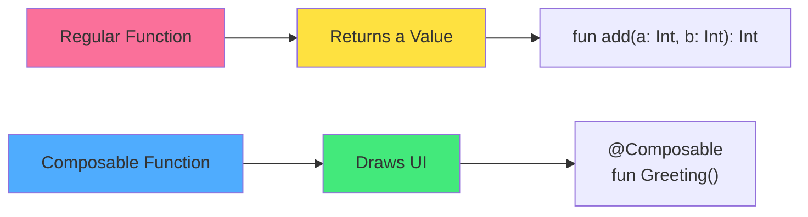

<div align="center">

# 🎭 Chapter 05 · UI Basics


### *Introduction to Jetpack Compose*


</div>

---

> [!NOTE]
> *"Code is the new design. Jetpack Compose makes your UI as elegant as your Kotlin."*

<div align="center">

[](./04-kotlin-collections.md)
[](./06-material-design.md)

</div>

<br>

## 🎯 What We're Learning Today

<div align="center">

By the end of this chapter, you will be able to:

</div>

<br>

<table>
<tr>
<td align="center" width="25%">

🎨  
**Composables**

Functions that  
draw UI

</td>
<td align="center" width="25%">

📐  
**Layouts**

Organize elements  
on screen

</td>
<td align="center" width="25%">

✨  
**Modifiers**

Style and position  
components

</td>
<td align="center" width="25%">

💼  
**Business Card**

Your first beautiful  
UI app

</td>
</tr>
</table>

<br>

> [!IMPORTANT]
> This chapter is a paradigm shift.  
> We're moving from **imperative** ("computer, do steps 1, 2, 3")  
> to **declarative** ("computer, make it look like this").

---

<br>

## 🌟 The Compose Revolution

<div align="center">

### *Why Jetpack Compose Changed Everything*

</div>

<br>

<table>
<tr>
<td width="50%" bgcolor="#ffebee" valign="top">

### ❌ The Old Way (XML + Java/Kotlin)

```xml
<!-- activity_main.xml -->
<LinearLayout
    android:orientation="vertical"
    android:layout_width="match_parent"
    android:layout_height="match_parent">
    
    <TextView
        android:id="@+id/greeting"
        android:layout_width="wrap_content"
        android:layout_height="wrap_content"
        android:text="Hello World"
        android:textSize="24sp"/>
        
    <Button
        android:id="@+id/button"
        android:layout_width="wrap_content"
        android:layout_height="wrap_content"
        android:text="Click me"/>
        
</LinearLayout>
```

```kotlin
// MainActivity.kt
val textView = findViewById<TextView>(R.id.greeting)
val button = findViewById<Button>(R.id.button)
button.setOnClickListener {
    textView.text = "Clicked!"
}
```

**Problems:**
- Two languages (XML + Kotlin)
- Manual wiring with `findViewById`
- Verbose, error-prone
- Hard to preview

</td>
<td width="50%" bgcolor="#e8f5e9" valign="top">

### ✅ The New Way (Jetpack Compose)

```kotlin
@Composable
fun Greeting() {
    var clicked by remember { mutableStateOf(false) }
    
    Column {
        Text(
            text = if (clicked) "Clicked!" else "Hello World",
            fontSize = 24.sp
        )
        
        Button(onClick = { clicked = true }) {
            Text("Click me")
        }
    }
}
```

<br>
<br>
<br>

**Advantages:**
- **One language** — pure Kotlin
- **Declarative** — describe what, not how
- **Reactive** — UI updates automatically
- **Live preview** — see changes instantly
- **Less code** — cleaner, simpler
- **Type-safe** — compiler catches errors

</td>
</tr>
</table>

<br>

> [!TIP]
> **Think of Compose like this:**  
> Instead of building a house brick by brick with instructions,  
> you show a blueprint and it builds itself. 🏗️

---

<br>

## 🎨 Part 1 · Composable Functions

<div align="center">

### *Functions That Draw UI*

A **Composable** is a function marked with `@Composable`.  
It doesn't return a value — it **draws something on screen**.

</div>

<br>

<div align="center">



</div>

---

<br>

### 🧩 Your First Composable

<br>

<details>
<summary><b>📝 The Anatomy of a Composable</b></summary>

<br>

```kotlin
// The simplest Composable — just shows text
@Composable  // ← This annotation is REQUIRED
fun Greeting() {
    Text(text = "Hello, Android!")
}

// With a parameter
@Composable
fun Greeting(name: String) {
    Text(text = "Hello, $name!")
}

// Using it in MainActivity
class MainActivity : ComponentActivity() {
    override fun onCreate(savedInstanceState: Bundle?) {
        super.onCreate(savedInstanceState)
        setContent {
            Greeting(name = "World")  // ← Displays on screen
        }
    }
}
```

**Key rules:**
- Always starts with `@Composable`
- Function name is **UpperCamelCase** (like a class)
- Returns nothing (`Unit` — like `void` in Java)
- Can only be called from another `@Composable` or `setContent`

</details>

---

<br>

### 🧱 Basic Composables

<br>

<details>
<summary><b>📄 Text — Displaying Text</b></summary>

<br>

```kotlin
@Composable
fun TextExamples() {
    // Simple text
    Text("Hello, World!")
    
    // With explicit parameter names (recommended)
    Text(text = "Hello, Android!")
    
    // Styled text
    Text(
        text = "Large Bold Text",
        fontSize = 24.sp,           // Size in scalable pixels
        fontWeight = FontWeight.Bold,
        color = Color.Blue
    )
    
    // Text with multiple styles
    Text(
        text = "Centered Italic Text",
        fontSize = 20.sp,
        fontStyle = FontStyle.Italic,
        textAlign = TextAlign.Center,
        modifier = Modifier.fillMaxWidth()
    )
    
    // String template in text
    val userName = "Alice"
    Text(text = "Welcome, $userName!")
    
    // Multiline text
    Text(
        text = """
            This is line 1
            This is line 2
            This is line 3
        """.trimIndent()
    )
    
    // Text with max lines (ellipsis after)
    Text(
        text = "This is a very long text that will be truncated after two lines...",
        maxLines = 2,
        overflow = TextOverflow.Ellipsis
    )
}
```

**Common Text parameters:**

| Parameter | What it does | Example |
|:---|:---|:---|
| `text` | The content to display | `"Hello"` |
| `fontSize` | Text size | `16.sp`, `24.sp` |
| `fontWeight` | Bold, normal, light | `FontWeight.Bold` |
| `fontStyle` | Normal or italic | `FontStyle.Italic` |
| `color` | Text color | `Color.Red` |
| `textAlign` | Alignment | `TextAlign.Center` |
| `maxLines` | Max lines before ellipsis | `2` |

</details>

<details>
<summary><b>🖼️ Image — Displaying Images</b></summary>

<br>

```kotlin
import androidx.compose.foundation.Image
import androidx.compose.ui.res.painterResource

@Composable
fun ImageExamples() {
    // Display an image from drawable folder
    Image(
        painter = painterResource(id = R.drawable.android_logo),
        contentDescription = "Android Logo"
    )
    
    // Image with size
    Image(
        painter = painterResource(id = R.drawable.profile),
        contentDescription = "Profile Picture",
        modifier = Modifier.size(100.dp)
    )
    
    // Circular image
    Image(
        painter = painterResource(id = R.drawable.profile),
        contentDescription = "Profile",
        modifier = Modifier
            .size(80.dp)
            .clip(CircleShape)  // Makes it circular!
    )
    
    // Image from URL (needs Coil library — Chapter 12)
    // AsyncImage(
    //     model = "https://example.com/image.jpg",
    //     contentDescription = "Remote Image"
    // )
}
```

> [!TIP]
> **Adding images to your project:**
> 1. Right-click on `res` folder
> 2. New → Image Asset (for icons) or put images in `drawable`
> 3. Reference with `R.drawable.your_image_name`

</details>

<details>
<summary><b>🔘 Button — Interactive Elements</b></summary>

<br>

```kotlin
@Composable
fun ButtonExamples() {
    // Basic button
    Button(onClick = { println("Button clicked!") }) {
        Text("Click Me")
    }
    
    // Button with state change
    var count by remember { mutableStateOf(0) }
    
    Button(onClick = { count++ }) {
        Text("Clicked $count times")
    }
    
    // Styled button
    Button(
        onClick = { /* action */ },
        colors = ButtonDefaults.buttonColors(
            containerColor = Color.Red,
            contentColor = Color.White
        )
    ) {
        Text("Red Button")
    }
    
    // Button with icon
    Button(onClick = { /* action */ }) {
        Icon(
            imageVector = Icons.Default.Favorite,
            contentDescription = "Like",
            modifier = Modifier.size(20.dp)
        )
        Spacer(modifier = Modifier.width(8.dp))
        Text("Like")
    }
    
    // Disabled button
    Button(
        onClick = { },
        enabled = false
    ) {
        Text("Disabled")
    }
}
```

</details>

<details>
<summary><b>📝 TextField — User Input</b></summary>

<br>

```kotlin
@Composable
fun TextFieldExamples() {
    // Basic text field
    var text by remember { mutableStateOf("") }
    
    TextField(
        value = text,
        onValueChange = { newText -> text = newText },
        label = { Text("Enter your name") }
    )
    
    // Text field with placeholder
    var email by remember { mutableStateOf("") }
    
    OutlinedTextField(
        value = email,
        onValueChange = { email = it },
        label = { Text("Email") },
        placeholder = { Text("example@email.com") },
        singleLine = true
    )
    
    // Password field
    var password by remember { mutableStateOf("") }
    
    OutlinedTextField(
        value = password,
        onValueChange = { password = it },
        label = { Text("Password") },
        visualTransformation = PasswordVisualTransformation(),
        singleLine = true
    )
    
    // Number input
    var age by remember { mutableStateOf("") }
    
    OutlinedTextField(
        value = age,
        onValueChange = { newValue ->
            // Only allow numbers
            if (newValue.all { it.isDigit() }) {
                age = newValue
            }
        },
        label = { Text("Age") },
        keyboardOptions = KeyboardOptions(keyboardType = KeyboardType.Number)
    )
}
```

</details>

---

<br>

## 📐 Part 2 · Layouts

<div align="center">

### *Organizing Elements on Screen*

Layouts are Composables that arrange other Composables.  
They are the **skeleton** of your UI.

</div>

<br>

<div align="center">

```mermaid
graph TB
    A[Layouts] --> B[Column<br/>Vertical Stack]
    A --> C[Row<br/>Horizontal Stack]
    A --> D[Box<br/>Layered Stack]
    
    B --> B1[Item 1<br/>Item 2<br/>Item 3]
    C --> C1[Item 1 | Item 2 | Item 3]
    D --> D1[Items<br/>on top of<br/>each other]
    
    style A fill:#7F52FF
    style B fill:#4facfe
    style C fill:#43e97b
    style D fill:#fa709a
```

</div>

---

<br>

### 📊 Column — Vertical Stack

<br>

<details>
<summary><b>📊 Complete Column Guide</b></summary>

<br>

```kotlin
@Composable
fun ColumnExample() {
    Column {
        Text("First")
        Text("Second")
        Text("Third")
    }
    
    // Output on screen:
    // First
    // Second
    // Third
}

// With spacing between items
@Composable
fun ColumnWithSpacing() {
    Column(
        verticalArrangement = Arrangement.spacedBy(16.dp)
    ) {
        Text("First")
        Text("Second")
        Text("Third")
    }
}

// Centered column
@Composable
fun CenteredColumn() {
    Column(
        modifier = Modifier.fillMaxSize(),
        horizontalAlignment = Alignment.CenterHorizontally,
        verticalArrangement = Arrangement.Center
    ) {
        Text("I'm centered!")
        Button(onClick = { }) {
            Text("Me too!")
        }
    }
}

// Column arrangement options
Column(verticalArrangement = Arrangement.Top)           // Items at top
Column(verticalArrangement = Arrangement.Bottom)        // Items at bottom
Column(verticalArrangement = Arrangement.Center)        // Items centered
Column(verticalArrangement = Arrangement.SpaceBetween)  // Equal space between
Column(verticalArrangement = Arrangement.SpaceAround)   // Space around each
Column(verticalArrangement = Arrangement.SpaceEvenly)   // Equal space everywhere

// Column alignment options
Column(horizontalAlignment = Alignment.Start)           // Left aligned
Column(horizontalAlignment = Alignment.CenterHorizontally) // Center aligned
Column(horizontalAlignment = Alignment.End)             // Right aligned
```

</details>

---

<br>

### ↔️ Row — Horizontal Stack

<br>

<details>
<summary><b>↔️ Complete Row Guide</b></summary>

<br>

```kotlin
@Composable
fun RowExample() {
    Row {
        Text("First")
        Text("Second")
        Text("Third")
    }
    
    // Output on screen: First Second Third
}

// Row with spacing
@Composable
fun RowWithSpacing() {
    Row(
        horizontalArrangement = Arrangement.spacedBy(16.dp)
    ) {
        Button(onClick = { }) { Text("Button 1") }
        Button(onClick = { }) { Text("Button 2") }
        Button(onClick = { }) { Text("Button 3") }
    }
}

// Vertically centered row
@Composable
fun CenteredRow() {
    Row(
        verticalAlignment = Alignment.CenterVertically,
        horizontalArrangement = Arrangement.Center,
        modifier = Modifier.fillMaxWidth()
    ) {
        Icon(Icons.Default.Star, contentDescription = null)
        Text("Centered with icon")
    }
}

// Row arrangement options (horizontal)
Row(horizontalArrangement = Arrangement.Start)         // Left
Row(horizontalArrangement = Arrangement.End)           // Right
Row(horizontalArrangement = Arrangement.Center)        // Center
Row(horizontalArrangement = Arrangement.SpaceBetween)  // Equal space between
Row(horizontalArrangement = Arrangement.SpaceAround)   // Space around each
Row(horizontalArrangement = Arrangement.SpaceEvenly)   // Equal everywhere

// Row alignment options (vertical)
Row(verticalAlignment = Alignment.Top)                 // Top aligned
Row(verticalAlignment = Alignment.CenterVertically)    // Center aligned
Row(verticalAlignment = Alignment.Bottom)              // Bottom aligned
```

</details>

---

<br>

### 📦 Box — Layered Stack

<br>

<details>
<summary><b>📦 Complete Box Guide</b></summary>

<br>

```kotlin
@Composable
fun BoxExample() {
    // Items stack on top of each other
    Box {
        Text("Behind")
        Text("In front")
    }
}

// Box with alignment
@Composable
fun AlignedBox() {
    Box(
        modifier = Modifier.size(200.dp),
        contentAlignment = Alignment.Center
    ) {
        Text("Centered in Box")
    }
}

// Layered content (common pattern)
@Composable
fun ProfileWithBadge() {
    Box {
        // Background image
        Image(
            painter = painterResource(R.drawable.profile),
            contentDescription = "Profile",
            modifier = Modifier.size(100.dp)
        )
        
        // Badge on top
        Box(
            modifier = Modifier
                .align(Alignment.TopEnd)
                .size(24.dp)
                .background(Color.Red, CircleShape)
        ) {
            Text(
                text = "5",
                color = Color.White,
                fontSize = 12.sp,
                modifier = Modifier.align(Alignment.Center)
            )
        }
    }
}

// Box alignment options
Box(contentAlignment = Alignment.TopStart)      // Top-left
Box(contentAlignment = Alignment.TopCenter)     // Top-center
Box(contentAlignment = Alignment.TopEnd)        // Top-right
Box(contentAlignment = Alignment.CenterStart)   // Middle-left
Box(contentAlignment = Alignment.Center)        // Center
Box(contentAlignment = Alignment.CenterEnd)     // Middle-right
Box(contentAlignment = Alignment.BottomStart)   // Bottom-left
Box(contentAlignment = Alignment.BottomCenter)  // Bottom-center
Box(contentAlignment = Alignment.BottomEnd)     // Bottom-right
```

</details>

---

<br>

### 🎯 Combining Layouts

<br>

<details>
<summary><b>🏗️ Real-World Layout Patterns</b></summary>

<br>

```kotlin
// Profile header (Row inside Column)
@Composable
fun ProfileHeader() {
    Column(
        modifier = Modifier
            .fillMaxWidth()
            .padding(16.dp)
    ) {
        // Name and status in a row
        Row(
            verticalAlignment = Alignment.CenterVertically,
            horizontalArrangement = Arrangement.spacedBy(12.dp)
        ) {
            Image(
                painter = painterResource(R.drawable.profile),
                contentDescription = "Profile",
                modifier = Modifier
                    .size(60.dp)
                    .clip(CircleShape)
            )
            
            Column {
                Text(
                    text = "Alice Johnson",
                    fontSize = 20.sp,
                    fontWeight = FontWeight.Bold
                )
                Text(
                    text = "Online",
                    fontSize = 14.sp,
                    color = Color.Green
                )
            }
        }
        
        // Bio below
        Text(
            text = "Android developer | Kotlin enthusiast | Coffee addict ☕",
            modifier = Modifier.padding(top = 12.dp),
            fontSize = 14.sp,
            color = Color.Gray
        )
    }
}

// Grid layout using multiple Rows
@Composable
fun ButtonGrid() {
    Column(verticalArrangement = Arrangement.spacedBy(8.dp)) {
        Row(horizontalArrangement = Arrangement.spacedBy(8.dp)) {
            Button(onClick = { }, modifier = Modifier.weight(1f)) { Text("1") }
            Button(onClick = { }, modifier = Modifier.weight(1f)) { Text("2") }
            Button(onClick = { }, modifier = Modifier.weight(1f)) { Text("3") }
        }
        Row(horizontalArrangement = Arrangement.spacedBy(8.dp)) {
            Button(onClick = { }, modifier = Modifier.weight(1f)) { Text("4") }
            Button(onClick = { }, modifier = Modifier.weight(1f)) { Text("5") }
            Button(onClick = { }, modifier = Modifier.weight(1f)) { Text("6") }
        }
    }
}
```

</details>

---

<br>

## ✨ Part 3 · Modifiers

<div align="center">

### *The Styling Superpowers*

**Modifiers** style, size, position, and decorate Composables.  
They're your **CSS** but better — type-safe and chainable.

</div>

<br>

> [!TIP]
> Modifiers are chained from left to right.  
> Order matters! `Modifier.padding().background()` ≠ `Modifier.background().padding()`

---

<br>

### 📏 Size & Space Modifiers

<br>

<details>
<summary><b>📐 Size & Dimension Control</b></summary>

<br>

```kotlin
// Fixed size
Text(
    "Fixed Size",
    modifier = Modifier.size(200.dp)  // 200dp × 200dp square
)

Text(
    "Custom Size",
    modifier = Modifier.size(width = 300.dp, height = 100.dp)
)

// Fill parent
Text(
    "Full Width",
    modifier = Modifier.fillMaxWidth()
)

Text(
    "Full Height",
    modifier = Modifier.fillMaxHeight()
)

Text(
    "Fill Everything",
    modifier = Modifier.fillMaxSize()
)

// Fraction of parent
Text(
    "Half Width",
    modifier = Modifier.fillMaxWidth(0.5f)  // 50% of parent width
)

// Min/Max size
Text(
    "Constrained",
    modifier = Modifier
        .widthIn(min = 100.dp, max = 300.dp)
        .heightIn(min = 50.dp)
)

// Weight (in Row or Column — takes remaining space)
Row {
    Text("Left", modifier = Modifier.weight(1f))    // 33%
    Text("Center", modifier = Modifier.weight(1f))  // 33%
    Text("Right", modifier = Modifier.weight(1f))   // 33%
}

Row {
    Text("Small", modifier = Modifier.weight(1f))   // 25%
    Text("Large", modifier = Modifier.weight(3f))   // 75%
}
```

</details>

<details>
<summary><b>🎨 Padding & Margin</b></summary>

<br>

```kotlin
// Padding (space inside)
Text(
    "Padded",
    modifier = Modifier.padding(16.dp)  // All sides
)

Text(
    "Custom Padding",
    modifier = Modifier.padding(
        start = 16.dp,
        top = 8.dp,
        end = 16.dp,
        bottom = 8.dp
    )
)

Text(
    "Horizontal/Vertical",
    modifier = Modifier.padding(horizontal = 16.dp, vertical = 8.dp)
)

// NOTE: There's no "margin" in Compose
// Use Spacer or padding on the parent layout instead

Spacer(modifier = Modifier.height(16.dp))  // Vertical space
Spacer(modifier = Modifier.width(16.dp))   // Horizontal space
```

</details>

---

<br>

### 🎨 Background & Border

<br>

<details>
<summary><b>🖌️ Backgrounds, Borders, Shapes</b></summary>

<br>

```kotlin
// Background color
Text(
    "Red Background",
    modifier = Modifier.background(Color.Red)
)

// Background with padding (order matters!)
Text(
    "Padded Red BG",
    modifier = Modifier
        .background(Color.Red)
        .padding(16.dp)  // Padding AFTER background
)

Text(
    "Different Effect",
    modifier = Modifier
        .padding(16.dp)         // Padding BEFORE background
        .background(Color.Red)
)

// Rounded background
Text(
    "Rounded",
    modifier = Modifier
        .background(
            color = Color.Blue,
            shape = RoundedCornerShape(8.dp)
        )
        .padding(16.dp)
)

// Circular background
Box(
    modifier = Modifier
        .size(100.dp)
        .background(Color.Green, CircleShape)
)

// Border
Text(
    "Bordered",
    modifier = Modifier
        .border(
            width = 2.dp,
            color = Color.Black,
            shape = RoundedCornerShape(4.dp)
        )
        .padding(8.dp)
)

// Shadow (elevation)
Card(
    modifier = Modifier.size(200.dp),
    elevation = CardDefaults.cardElevation(8.dp)
) {
    Text("I have shadow")
}
```

</details>

---

<br>

### 🖱️ Click & Interaction

<br>

<details>
<summary><b>👆 Making Things Clickable</b></summary>

<br>

```kotlin
// Clickable modifier
Text(
    "Tap me!",
    modifier = Modifier.clickable {
        println("Clicked!")
    }
)

// With ripple effect
Text(
    "Tap me!",
    modifier = Modifier
        .clickable(
            onClick = { println("Clicked!") },
            indication = rememberRipple(),
            interactionSource = remember { MutableInteractionSource() }
        )
        .padding(16.dp)
)

// Clickable with state
var count by remember { mutableStateOf(0) }

Text(
    "Clicked $count times",
    modifier = Modifier
        .clickable { count++ }
        .padding(16.dp)
        .background(Color.LightGray, RoundedCornerShape(8.dp))
        .padding(16.dp)
)
```

</details>

---

<br>

### 🔗 Modifier Chaining

<br>

> [!IMPORTANT]
> **Modifier order matters!** Each modifier transforms the one before it.

<br>

<details>
<summary><b>⛓️ Understanding Modifier Order</b></summary>

<br>

```kotlin
// Example 1: Padding THEN background
Text(
    "Hello",
    modifier = Modifier
        .padding(32.dp)           // 1. Add 32dp space around text
        .background(Color.Yellow) // 2. Fill that space with yellow
)
// Result: Yellow square with text in center

// Example 2: Background THEN padding
Text(
    "Hello",
    modifier = Modifier
        .background(Color.Yellow) // 1. Yellow background behind text
        .padding(32.dp)           // 2. Add space OUTSIDE the yellow
)
// Result: Small yellow background, big transparent padding

// Example 3: Complex chain (read top to bottom)
Text(
    "Styled Text",
    modifier = Modifier
        .fillMaxWidth()                      // 1. Take full width
        .padding(16.dp)                      // 2. Outer padding
        .background(Color.Blue)              // 3. Blue background
        .padding(8.dp)                       // 4. Inner padding
        .border(2.dp, Color.White)           // 5. White border
        .padding(8.dp)                       // 6. Space inside border
        .clickable { println("Clicked") }    // 7. Make it clickable
)
```

</details>

---

<br>

## 🎨 Part 4 · Colors & Theme

<br>

<details>
<summary><b>🌈 Working with Colors</b></summary>

<br>

```kotlin
// Predefined colors
Color.Red
Color.Blue
Color.Green
Color.Yellow
Color.Black
Color.White
Color.Gray

// Custom RGB
Color(0xFF6200EE)      // Hex color
Color(red = 255, green = 100, blue = 50)    // RGB
Color(red = 1f, green = 0.5f, blue = 0.2f)  // RGB (0.0-1.0)

// With transparency (alpha)
Color.Red.copy(alpha = 0.5f)    // 50% transparent red
Color(0x80FF0000)               // 50% transparent red (hex)

// Material Theme colors (adapt to dark/light mode)
MaterialTheme.colorScheme.primary
MaterialTheme.colorScheme.secondary
MaterialTheme.colorScheme.background
MaterialTheme.colorScheme.surface
MaterialTheme.colorScheme.error
MaterialTheme.colorScheme.onPrimary     // Text color on primary
MaterialTheme.colorScheme.onBackground  // Text color on background

// Using theme colors
@Composable
fun ThemedButton() {
    Button(
        onClick = { },
        colors = ButtonDefaults.buttonColors(
            containerColor = MaterialTheme.colorScheme.primary,
            contentColor = MaterialTheme.colorScheme.onPrimary
        )
    ) {
        Text("Themed Button")
    }
}
```

</details>

---

<br>

## 💼 Part 5 · Project — Business Card App

<div align="center">

### *Your First Beautiful UI*

Let's build a **digital business card** — clean, professional, and impressive!

</div>

<br>

<table>
<tr>
<td align="center" width="33%">

👤  
**Profile Section**

Photo, name, title

</td>
<td align="center" width="33%">

📞  
**Contact Info**

Phone, email, website

</td>
<td align="center" width="33%">

🎨  
**Polished Design**

Professional layout

</td>
</tr>
</table>

---

<br>

### 🎯 App Preview

<br>

```
┌─────────────────────────┐
│                         │
│      [Your Photo]       │
│                         │
│      Alice Johnson      │
│   Android Developer     │
│                         │
├─────────────────────────┤
│                         │
│  📞 +34 123 456 789     │
│  ✉️  alice@email.com    │
│  🌐 alicejohnson.dev    │
│                         │
└─────────────────────────┘
```

---

<br>

<details>
<summary><b>📱 Complete BusinessCardApp Code</b></summary>

<br>

**Create new project:**
- Name: `BusinessCardApp`
- Package: `com.yourname.businesscard`
- Language: Kotlin · Minimum SDK: API 24

<br>

**MainActivity.kt:**

```kotlin
package com.yourname.businesscard

import android.os.Bundle
import androidx.activity.ComponentActivity
import androidx.activity.compose.setContent
import androidx.compose.foundation.Image
import androidx.compose.foundation.background
import androidx.compose.foundation.layout.*
import androidx.compose.foundation.shape.CircleShape
import androidx.compose.material.icons.Icons
import androidx.compose.material.icons.filled.Email
import androidx.compose.material.icons.filled.Phone
import androidx.compose.material.icons.filled.Share
import androidx.compose.material3.*
import androidx.compose.runtime.Composable
import androidx.compose.ui.Alignment
import androidx.compose.ui.Modifier
import androidx.compose.ui.draw.clip
import androidx.compose.ui.graphics.Color
import androidx.compose.ui.graphics.vector.ImageVector
import androidx.compose.ui.res.painterResource
import androidx.compose.ui.text.font.FontWeight
import androidx.compose.ui.tooling.preview.Preview
import androidx.compose.ui.unit.dp
import androidx.compose.ui.unit.sp

class MainActivity : ComponentActivity() {
    override fun onCreate(savedInstanceState: Bundle?) {
        super.onCreate(savedInstanceState)
        setContent {
            MaterialTheme {
                BusinessCardApp()
            }
        }
    }
}

@Composable
fun BusinessCardApp() {
    Column(
        modifier = Modifier
            .fillMaxSize()
            .background(Color(0xFF1A1A2E)),  // Dark blue background
        horizontalAlignment = Alignment.CenterHorizontally,
        verticalArrangement = Arrangement.Center
    ) {
        // Profile Section (upper half)
        ProfileSection()
        
        Spacer(modifier = Modifier.height(48.dp))
        
        // Contact Info Section (lower half)
        ContactInfoSection()
    }
}

@Composable
fun ProfileSection() {
    Column(
        horizontalAlignment = Alignment.CenterHorizontally,
        verticalArrangement = Arrangement.spacedBy(16.dp)
    ) {
        // Profile Image (replace with your own!)
        Image(
            painter = painterResource(id = R.drawable.android_logo),
            contentDescription = "Profile Picture",
            modifier = Modifier
                .size(120.dp)
                .clip(CircleShape)
                .background(Color.White)
                .padding(8.dp)
        )
        
        // Name
        Text(
            text = "Alice Johnson",
            fontSize = 32.sp,
            fontWeight = FontWeight.Bold,
            color = Color.White
        )
        
        // Job Title
        Text(
            text = "Android Developer",
            fontSize = 18.sp,
            color = Color(0xFF00D9FF),  // Cyan accent
            fontWeight = FontWeight.Medium
        )
    }
}

@Composable
fun ContactInfoSection() {
    Column(
        verticalArrangement = Arrangement.spacedBy(16.dp),
        horizontalAlignment = Alignment.Start
    ) {
        ContactInfoItem(
            icon = Icons.Default.Phone,
            info = "+34 123 456 789"
        )
        
        ContactInfoItem(
            icon = Icons.Default.Email,
            info = "alice@email.com"
        )
        
        ContactInfoItem(
            icon = Icons.Default.Share,
            info = "alicejohnson.dev"
        )
    }
}

@Composable
fun ContactInfoItem(icon: ImageVector, info: String) {
    Row(
        verticalAlignment = Alignment.CenterVertically,
        horizontalArrangement = Arrangement.spacedBy(16.dp)
    ) {
        Icon(
            imageVector = icon,
            contentDescription = null,
            tint = Color(0xFF00D9FF),  // Cyan icons
            modifier = Modifier.size(24.dp)
        )
        
        Text(
            text = info,
            fontSize = 16.sp,
            color = Color.White
        )
    }
}

@Preview(showBackground = true, showSystemUi = true)
@Composable
fun BusinessCardPreview() {
    MaterialTheme {
        BusinessCardApp()
    }
}
```

</details>

---

<br>

### 🎨 Customization Ideas

<br>

<details>
<summary><b>✨ Make It Yours!</b></summary>

<br>

**1. Change colors:**
```kotlin
// Pick your brand colors
val backgroundColor = Color(0xFF2C3E50)  // Dark gray-blue
val accentColor = Color(0xFFE74C3C)      // Red
val textColor = Color.White
```

**2. Add your photo:**
```
1. Right-click on res → New → Image Asset
2. Choose "Image" asset type
3. Select your photo
4. Name it "profile_picture"
5. Update: R.drawable.profile_picture
```

**3. Add social media:**
```kotlin
ContactInfoItem(
    icon = Icons.Default.Star,  // Or custom icon
    info = "@alice_codes"
)
```

**4. Add a card background:**
```kotlin
Column(
    modifier = Modifier
        .padding(32.dp)
        .background(
            color = Color.White.copy(alpha = 0.1f),
            shape = RoundedCornerShape(16.dp)
        )
        .padding(24.dp)
) {
    // Your content
}
```

**5. Add gradient background:**
```kotlin
import androidx.compose.ui.graphics.Brush

Box(
    modifier = Modifier
        .fillMaxSize()
        .background(
            brush = Brush.verticalGradient(
                colors = listOf(
                    Color(0xFF667eea),
                    Color(0xFF764ba2)
                )
            )
        )
)
```

</details>

---

<br>

## 🎯 Mission · Chapter 05

<div align="center">

### 💻 Build Beautiful UIs!

</div>

<br>

### Core Tasks:

- [ ] 🎨 **Create Composables** — Text, Button, Image in the preview
- [ ] 📊 **Use Column** — Stack 3 text elements vertically
- [ ] ↔️ **Use Row** — Place 3 buttons horizontally
- [ ] 📦 **Use Box** — Layer an icon over an image
- [ ] ✨ **Apply modifiers** — Size, padding, background on one element
- [ ] 💼 **Build Business Card** — Complete app with your info

<br>

<details>
<summary><b>⭐ Bonus Challenges</b></summary>

<br>

- [ ] 🌈 Create a **color scheme** that matches your personal brand
- [ ] 📸 Add your **real photo** instead of the Android logo
- [ ] 🔗 Add **clickable links** (phone, email, website)
- [ ] 🎭 Create a **second screen** (AboutMe page)
- [ ] 🌙 Add **dark/light mode** toggle
- [ ] ✨ Add **animations** when the card appears (we'll learn this later!)
- [ ] 🎨 Recreate a business card you saw online using Compose

</details>

---

<br>

<div align="center">

## 🏆 Achievement Unlocked

### **The UI Designer** 🎭

<br>

**You now understand:**

- Composable functions — the building blocks of Compose
- Text, Image, Button — basic UI elements
- Column, Row, Box — layout foundations
- Modifiers — styling, sizing, spacing, interaction
- Color and theming basics
- How to build a complete, polished UI

<br>

*You built a digital business card*  
*with professional design and layout.*  
**That's UI work that looks portfolio-ready.**

<br>


</div>

---

<br>

<div align="center">

### 🎓 Remember This

> *"Jetpack Compose is not just a UI framework.*  
> *It's a new way of thinking — where your UI*  
> *is a pure function of your state.*  
> *Master this, and you'll build interfaces*  
> *faster and cleaner than ever before."*

</div>

---

<br>

<div align="center">

### 🔜 What's Next?

In **Chapter 06**, we dive into **Material Design** —  
Google's design language with buttons, cards, dialogs, and more.  
You'll build a **Tip Calculator App** with beautiful Material components!

</div>

<br>

<div align="center">

[](./06-material-design.md)

</div>

<br>
