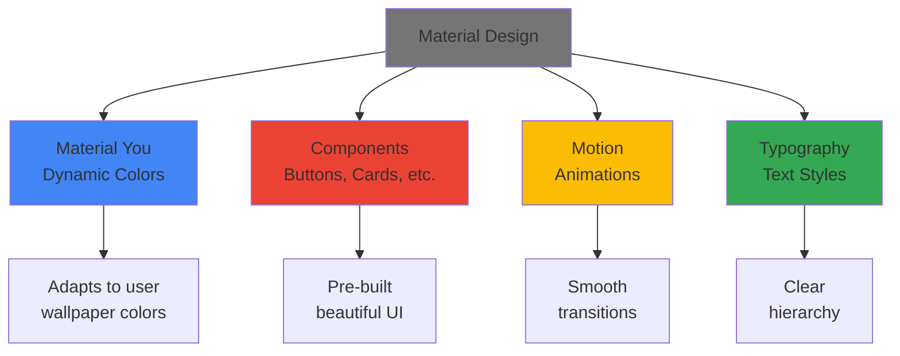
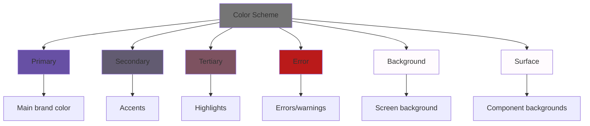

<div align="center">

# 🎨 Chapter 06 · Material Design


### *Beautiful UI Components*


</div>

---

> [!NOTE]
> *"Good design is invisible. Material Design makes your apps feel like they belong on Android."*

<div align="center">

[](./05-ui-basics.md)
[](./07-state-management.md)

</div>

<br>

## 🎯 What We're Learning Today

<div align="center">

By the end of this chapter, you will be able to:

</div>

<br>

<table>
<tr>
<td align="center" width="25%">

🔘  
**Components**

Buttons, cards,  
chips & more

</td>
<td align="center" width="25%">

🌈  
**Color System**

Material You  
theming

</td>
<td align="center" width="25%">

📝  
**Typography**

Text styles  
& hierarchy

</td>
<td align="center" width="25%">

💰  
**Tip Calculator**

Professional  
Material Design app

</td>
</tr>
</table>

<br>

> [!IMPORTANT]
> Material Design is Google's design language.  
> Used by billions of people daily across Android, Web, and iOS.  
> **Learn it once, design beautifully forever.**

---

<br>

## 🌟 What Is Material Design?

<div align="center">

### *Google's Design Philosophy Made Code*

</div>

<br>

<div align="center">



</div>

<br>

<table>
<tr>
<td width="50%" bgcolor="#e8f5e9" valign="top">

### ✅ Material Design Principles:

- **Tactile surfaces** — UI feels like paper
- **Bold & intentional** — Clear visual hierarchy
- **Motion with meaning** — Animations guide users
- **Adaptive design** — Works on all screen sizes
- **Accessible by default** — Built-in accessibility

</td>
<td width="50%" bgcolor="#e3f2fd" valign="top">

### 🎨 Material You (3.0):

- **Dynamic color** — Adapts to user's wallpaper
- **Personal** — Feels like "my" phone
- **Expressive** — More personality
- **Adaptive** — Scales beautifully
- **Accessible** — High contrast by default

</td>
</tr>
</table>

<br>

> [!TIP]
> Material Design components in Jetpack Compose are in the `androidx.compose.material3` package.  
> Always use **Material 3** (not Material 2) for new apps!

---

<br>

## 🔘 Part 1 · Material Components

<div align="center">

### *The Building Blocks of Beautiful Apps*

</div>

---

<br>

### 🔲 Buttons — All Varieties

<br>

<details>
<summary><b>🔘 Complete Button Guide</b></summary>

<br>

```kotlin
import androidx.compose.material3.*
import androidx.compose.material.icons.Icons
import androidx.compose.material.icons.filled.*

@Composable
fun ButtonShowcase() {
    Column(
        modifier = Modifier
            .fillMaxSize()
            .padding(16.dp),
        verticalArrangement = Arrangement.spacedBy(16.dp)
    ) {
        
        // ── FILLED BUTTON (Primary action) ──────
        Button(onClick = { /* action */ }) {
            Text("Filled Button")
        }
        
        // ── OUTLINED BUTTON (Secondary action) ──
        OutlinedButton(onClick = { /* action */ }) {
            Text("Outlined Button")
        }
        
        // ── TEXT BUTTON (Tertiary action) ───────
        TextButton(onClick = { /* action */ }) {
            Text("Text Button")
        }
        
        // ── ELEVATED BUTTON (With shadow) ───────
        ElevatedButton(onClick = { /* action */ }) {
            Text("Elevated Button")
        }
        
        // ── FILLED TONAL BUTTON ─────────────────
        FilledTonalButton(onClick = { /* action */ }) {
            Text("Filled Tonal Button")
        }
        
        // ── BUTTON WITH ICON ────────────────────
        Button(onClick = { /* action */ }) {
            Icon(
                imageVector = Icons.Default.Favorite,
                contentDescription = null,
                modifier = Modifier.size(18.dp)
            )
            Spacer(modifier = Modifier.width(8.dp))
            Text("Like")
        }
        
        // ── ICON BUTTON ─────────────────────────
        IconButton(onClick = { /* action */ }) {
            Icon(
                imageVector = Icons.Default.Favorite,
                contentDescription = "Like"
            )
        }
        
        // ── FILLED ICON BUTTON ──────────────────
        FilledIconButton(onClick = { /* action */ }) {
            Icon(
                imageVector = Icons.Default.Add,
                contentDescription = "Add"
            )
        }
        
        // ── CUSTOM COLORS ───────────────────────
        Button(
            onClick = { /* action */ },
            colors = ButtonDefaults.buttonColors(
                containerColor = Color(0xFFE91E63),  // Pink
                contentColor = Color.White
            )
        ) {
            Text("Custom Color")
        }
        
        // ── DISABLED STATE ──────────────────────
        Button(
            onClick = { /* action */ },
            enabled = false
        ) {
            Text("Disabled Button")
        }
        
        // ── FULL WIDTH BUTTON ───────────────────
        Button(
            onClick = { /* action */ },
            modifier = Modifier.fillMaxWidth()
        ) {
            Text("Full Width")
        }
        
        // ── LOADING BUTTON ──────────────────────
        var isLoading by remember { mutableStateOf(false) }
        
        Button(
            onClick = {
                isLoading = true
                // Simulate network call
            },
            enabled = !isLoading
        ) {
            if (isLoading) {
                CircularProgressIndicator(
                    modifier = Modifier.size(20.dp),
                    color = MaterialTheme.colorScheme.onPrimary,
                    strokeWidth = 2.dp
                )
                Spacer(modifier = Modifier.width(8.dp))
            }
            Text(if (isLoading) "Loading..." else "Submit")
        }
    }
}
```

**Button hierarchy:**
```
Primary action    → Button() (filled)
Secondary action  → OutlinedButton()
Tertiary action   → TextButton()
```

</details>

---

<br>

### 🃏 Cards — Surface Containers

<br>

<details>
<summary><b>🃏 Complete Card Guide</b></summary>

<br>

```kotlin
@Composable
fun CardShowcase() {
    Column(
        modifier = Modifier
            .fillMaxSize()
            .padding(16.dp),
        verticalArrangement = Arrangement.spacedBy(16.dp)
    ) {
        
        // ── BASIC CARD ──────────────────────────
        Card(
            modifier = Modifier.fillMaxWidth()
        ) {
            Text(
                text = "Basic Card",
                modifier = Modifier.padding(16.dp)
            )
        }
        
        // ── ELEVATED CARD (with shadow) ─────────
        Card(
            modifier = Modifier.fillMaxWidth(),
            elevation = CardDefaults.cardElevation(
                defaultElevation = 8.dp
            )
        ) {
            Text(
                text = "Elevated Card",
                modifier = Modifier.padding(16.dp)
            )
        }
        
        // ── OUTLINED CARD ───────────────────────
        OutlinedCard(
            modifier = Modifier.fillMaxWidth()
        ) {
            Text(
                text = "Outlined Card",
                modifier = Modifier.padding(16.dp)
            )
        }
        
        // ── CLICKABLE CARD ──────────────────────
        Card(
            onClick = { println("Card clicked!") },
            modifier = Modifier.fillMaxWidth()
        ) {
            Text(
                text = "Tap me!",
                modifier = Modifier.padding(16.dp)
            )
        }
        
        // ── COMPLEX CARD (common pattern) ───────
        Card(
            modifier = Modifier.fillMaxWidth(),
            elevation = CardDefaults.cardElevation(4.dp)
        ) {
            Column(
                modifier = Modifier.padding(16.dp)
            ) {
                // Header
                Row(
                    modifier = Modifier.fillMaxWidth(),
                    horizontalArrangement = Arrangement.SpaceBetween,
                    verticalAlignment = Alignment.CenterVertically
                ) {
                    Text(
                        text = "Card Title",
                        style = MaterialTheme.typography.titleLarge,
                        fontWeight = FontWeight.Bold
                    )
                    Icon(
                        imageVector = Icons.Default.MoreVert,
                        contentDescription = "More options"
                    )
                }
                
                Spacer(modifier = Modifier.height(8.dp))
                
                // Subtitle
                Text(
                    text = "Card subtitle",
                    style = MaterialTheme.typography.bodyMedium,
                    color = MaterialTheme.colorScheme.onSurfaceVariant
                )
                
                Spacer(modifier = Modifier.height(16.dp))
                
                // Content
                Text(
                    text = "This is the card content. It can be as long as needed and will wrap naturally within the card boundaries.",
                    style = MaterialTheme.typography.bodySmall
                )
                
                Spacer(modifier = Modifier.height(16.dp))
                
                // Actions
                Row(
                    modifier = Modifier.fillMaxWidth(),
                    horizontalArrangement = Arrangement.End
                ) {
                    TextButton(onClick = { }) {
                        Text("Cancel")
                    }
                    Spacer(modifier = Modifier.width(8.dp))
                    Button(onClick = { }) {
                        Text("Action")
                    }
                }
            }
        }
        
        // ── CARD WITH IMAGE ─────────────────────
        Card(
            modifier = Modifier.fillMaxWidth()
        ) {
            Column {
                // Image header
                Box(
                    modifier = Modifier
                        .fillMaxWidth()
                        .height(180.dp)
                        .background(Color.LightGray)
                ) {
                    // Replace with actual image
                    Icon(
                        imageVector = Icons.Default.Image,
                        contentDescription = null,
                        modifier = Modifier
                            .align(Alignment.Center)
                            .size(64.dp),
                        tint = Color.Gray
                    )
                }
                
                // Content
                Column(modifier = Modifier.padding(16.dp)) {
                    Text(
                        text = "Image Card",
                        style = MaterialTheme.typography.titleMedium
                    )
                    Spacer(modifier = Modifier.height(4.dp))
                    Text(
                        text = "With header image",
                        style = MaterialTheme.typography.bodySmall
                    )
                }
            }
        }
        
        // ── CUSTOM COLORED CARD ─────────────────
        Card(
            modifier = Modifier.fillMaxWidth(),
            colors = CardDefaults.cardColors(
                containerColor = MaterialTheme.colorScheme.primaryContainer,
                contentColor = MaterialTheme.colorScheme.onPrimaryContainer
            )
        ) {
            Text(
                text = "Custom Color Card",
                modifier = Modifier.padding(16.dp)
            )
        }
    }
}
```

</details>

---

<br>

### 🏷️ Chips — Compact Elements

<br>

<details>
<summary><b>🏷️ Complete Chip Guide</b></summary>

<br>

```kotlin
import androidx.compose.material3.*

@Composable
fun ChipShowcase() {
    Column(
        modifier = Modifier
            .fillMaxSize()
            .padding(16.dp),
        verticalArrangement = Arrangement.spacedBy(16.dp)
    ) {
        
        // ── ASSIST CHIP ─────────────────────────
        AssistChip(
            onClick = { /* action */ },
            label = { Text("Assist Chip") }
        )
        
        // ── ASSIST CHIP WITH ICON ───────────────
        AssistChip(
            onClick = { /* action */ },
            label = { Text("With Icon") },
            leadingIcon = {
                Icon(
                    imageVector = Icons.Default.Add,
                    contentDescription = null,
                    modifier = Modifier.size(18.dp)
                )
            }
        )
        
        // ── FILTER CHIP (toggleable) ────────────
        var selected by remember { mutableStateOf(false) }
        
        FilterChip(
            selected = selected,
            onClick = { selected = !selected },
            label = { Text("Filter Chip") },
            leadingIcon = if (selected) {
                {
                    Icon(
                        imageVector = Icons.Default.Check,
                        contentDescription = null,
                        modifier = Modifier.size(18.dp)
                    )
                }
            } else null
        )
        
        // ── INPUT CHIP (with dismiss) ───────────
        var visible by remember { mutableStateOf(true) }
        
        if (visible) {
            InputChip(
                selected = false,
                onClick = { },
                label = { Text("Input Chip") },
                trailingIcon = {
                    IconButton(
                        onClick = { visible = false },
                        modifier = Modifier.size(18.dp)
                    ) {
                        Icon(
                            imageVector = Icons.Default.Close,
                            contentDescription = "Remove",
                            modifier = Modifier.size(18.dp)
                        )
                    }
                }
            )
        }
        
        // ── SUGGESTION CHIP ─────────────────────
        SuggestionChip(
            onClick = { /* action */ },
            label = { Text("Suggestion") }
        )
        
        // ── CHIP ROW (common pattern) ───────────
        Text("Filter by category:")
        
        val categories = listOf("Food", "Travel", "Tech", "Health", "Sports")
        var selectedCategory by remember { mutableStateOf<String?>(null) }
        
        Row(
            modifier = Modifier.fillMaxWidth(),
            horizontalArrangement = Arrangement.spacedBy(8.dp)
        ) {
            categories.forEach { category ->
                FilterChip(
                    selected = selectedCategory == category,
                    onClick = {
                        selectedCategory = if (selectedCategory == category) null else category
                    },
                    label = { Text(category) }
                )
            }
        }
    }
}
```

</details>

---

<br>

### 📝 Text Fields — Input Components

<br>

<details>
<summary><b>📝 Complete TextField Guide</b></summary>

<br>

```kotlin
@Composable
fun TextFieldShowcase() {
    var text1 by remember { mutableStateOf("") }
    var text2 by remember { mutableStateOf("") }
    var text3 by remember { mutableStateOf("") }
    var text4 by remember { mutableStateOf("") }
    var password by remember { mutableStateOf("") }
    
    Column(
        modifier = Modifier
            .fillMaxSize()
            .padding(16.dp)
            .verticalScroll(rememberScrollState()),
        verticalArrangement = Arrangement.spacedBy(16.dp)
    ) {
        
        // ── FILLED TEXT FIELD ───────────────────
        TextField(
            value = text1,
            onValueChange = { text1 = it },
            label = { Text("Filled TextField") },
            modifier = Modifier.fillMaxWidth()
        )
        
        // ── OUTLINED TEXT FIELD (Recommended) ───
        OutlinedTextField(
            value = text2,
            onValueChange = { text2 = it },
            label = { Text("Outlined TextField") },
            modifier = Modifier.fillMaxWidth()
        )
        
        // ── WITH PLACEHOLDER ────────────────────
        OutlinedTextField(
            value = text3,
            onValueChange = { text3 = it },
            label = { Text("Email") },
            placeholder = { Text("you@example.com") },
            modifier = Modifier.fillMaxWidth()
        )
        
        // ── WITH LEADING ICON ───────────────────
        OutlinedTextField(
            value = text4,
            onValueChange = { text4 = it },
            label = { Text("Search") },
            leadingIcon = {
                Icon(
                    imageVector = Icons.Default.Search,
                    contentDescription = null
                )
            },
            modifier = Modifier.fillMaxWidth()
        )
        
        // ── PASSWORD FIELD ──────────────────────
        var passwordVisible by remember { mutableStateOf(false) }
        
        OutlinedTextField(
            value = password,
            onValueChange = { password = it },
            label = { Text("Password") },
            visualTransformation = if (passwordVisible)
                VisualTransformation.None
            else
                PasswordVisualTransformation(),
            trailingIcon = {
                IconButton(onClick = { passwordVisible = !passwordVisible }) {
                    Icon(
                        imageVector = if (passwordVisible)
                            Icons.Default.Visibility
                        else
                            Icons.Default.VisibilityOff,
                        contentDescription = if (passwordVisible) "Hide" else "Show"
                    )
                }
            },
            modifier = Modifier.fillMaxWidth()
        )
        
        // ── WITH ERROR STATE ────────────────────
        var email by remember { mutableStateOf("") }
        val isError = email.isNotEmpty() && !email.contains("@")
        
        OutlinedTextField(
            value = email,
            onValueChange = { email = it },
            label = { Text("Email") },
            isError = isError,
            supportingText = {
                if (isError) {
                    Text("Please enter a valid email")
                }
            },
            modifier = Modifier.fillMaxWidth()
        )
        
        // ── MULTILINE TEXT FIELD ────────────────
        var bio by remember { mutableStateOf("") }
        
        OutlinedTextField(
            value = bio,
            onValueChange = { bio = it },
            label = { Text("Bio") },
            placeholder = { Text("Tell us about yourself...") },
            minLines = 3,
            maxLines = 5,
            modifier = Modifier.fillMaxWidth()
        )
        
        // ── NUMBER INPUT ────────────────────────
        var age by remember { mutableStateOf("") }
        
        OutlinedTextField(
            value = age,
            onValueChange = { newValue ->
                if (newValue.all { it.isDigit() }) {
                    age = newValue
                }
            },
            label = { Text("Age") },
            keyboardOptions = KeyboardOptions(
                keyboardType = KeyboardType.Number
            ),
            modifier = Modifier.fillMaxWidth()
        )
    }
}
```

</details>

---

<br>

### ☑️ Checkboxes, Switches & Radio Buttons

<br>

<details>
<summary><b>☑️ Selection Controls Guide</b></summary>

<br>

```kotlin
@Composable
fun SelectionControlsShowcase() {
    var checked by remember { mutableStateOf(false) }
    var switched by remember { mutableStateOf(false) }
    var selectedOption by remember { mutableStateOf("Option 1") }
    
    Column(
        modifier = Modifier
            .fillMaxSize()
            .padding(16.dp),
        verticalArrangement = Arrangement.spacedBy(16.dp)
    ) {
        
        // ── CHECKBOX ────────────────────────────
        Row(
            verticalAlignment = Alignment.CenterVertically
        ) {
            Checkbox(
                checked = checked,
                onCheckedChange = { checked = it }
            )
            Text("Checkbox")
        }
        
        // ── TRISTATE CHECKBOX ───────────────────
        var triState by remember { mutableStateOf(ToggleableState.Indeterminate) }
        
        Row(
            verticalAlignment = Alignment.CenterVertically
        ) {
            TriStateCheckbox(
                state = triState,
                onClick = {
                    triState = when (triState) {
                        ToggleableState.On -> ToggleableState.Off
                        ToggleableState.Off -> ToggleableState.Indeterminate
                        ToggleableState.Indeterminate -> ToggleableState.On
                    }
                }
            )
            Text("Tristate: ${triState.name}")
        }
        
        // ── SWITCH ──────────────────────────────
        Row(
            verticalAlignment = Alignment.CenterVertically,
            horizontalArrangement = Arrangement.SpaceBetween,
            modifier = Modifier.fillMaxWidth()
        ) {
            Text("Enable notifications")
            Switch(
                checked = switched,
                onCheckedChange = { switched = it }
            )
        }
        
        // ── RADIO BUTTONS ───────────────────────
        Text("Select an option:")
        
        val options = listOf("Option 1", "Option 2", "Option 3")
        
        options.forEach { option ->
            Row(
                verticalAlignment = Alignment.CenterVertically
            ) {
                RadioButton(
                    selected = (option == selectedOption),
                    onClick = { selectedOption = option }
                )
                Text(text = option)
            }
        }
        
        // ── LABELED CHECKBOX (common pattern) ───
        val items = remember {
            mutableStateListOf(
                "Item 1" to false,
                "Item 2" to false,
                "Item 3" to false
            )
        }
        
        Text("Select items:")
        
        items.forEachIndexed { index, (label, checked) ->
            Row(
                modifier = Modifier
                    .fillMaxWidth()
                    .clickable {
                        items[index] = label to !checked
                    }
                    .padding(vertical = 8.dp),
                verticalAlignment = Alignment.CenterVertically
            ) {
                Checkbox(
                    checked = checked,
                    onCheckedChange = { items[index] = label to it }
                )
                Spacer(modifier = Modifier.width(8.dp))
                Text(label)
            }
        }
    }
}
```

</details>

---

<br>

## 🌈 Part 2 · Color System

<div align="center">

### *Material You Dynamic Colors*

Material 3 has a sophisticated color system that adapts to user preferences.

</div>

<br>

<div align="center">



</div>

---

<br>

<details>
<summary><b>🎨 Complete Color Guide</b></summary>

<br>

```kotlin
@Composable
fun ColorShowcase() {
    val colorScheme = MaterialTheme.colorScheme
    
    Column(
        modifier = Modifier
            .fillMaxSize()
            .padding(16.dp)
            .verticalScroll(rememberScrollState()),
        verticalArrangement = Arrangement.spacedBy(8.dp)
    ) {
        
        // Display all color roles
        ColorSwatch("Primary", colorScheme.primary, colorScheme.onPrimary)
        ColorSwatch("On Primary", colorScheme.onPrimary, colorScheme.primary)
        ColorSwatch("Primary Container", colorScheme.primaryContainer, colorScheme.onPrimaryContainer)
        ColorSwatch("On Primary Container", colorScheme.onPrimaryContainer, colorScheme.primaryContainer)
        
        Divider(modifier = Modifier.padding(vertical = 8.dp))
        
        ColorSwatch("Secondary", colorScheme.secondary, colorScheme.onSecondary)
        ColorSwatch("On Secondary", colorScheme.onSecondary, colorScheme.secondary)
        ColorSwatch("Secondary Container", colorScheme.secondaryContainer, colorScheme.onSecondaryContainer)
        
        Divider(modifier = Modifier.padding(vertical = 8.dp))
        
        ColorSwatch("Tertiary", colorScheme.tertiary, colorScheme.onTertiary)
        ColorSwatch("Tertiary Container", colorScheme.tertiaryContainer, colorScheme.onTertiaryContainer)
        
        Divider(modifier = Modifier.padding(vertical = 8.dp))
        
        ColorSwatch("Error", colorScheme.error, colorScheme.onError)
        ColorSwatch("Error Container", colorScheme.errorContainer, colorScheme.onErrorContainer)
        
        Divider(modifier = Modifier.padding(vertical = 8.dp))
        
        ColorSwatch("Background", colorScheme.background, colorScheme.onBackground)
        ColorSwatch("Surface", colorScheme.surface, colorScheme.onSurface)
        ColorSwatch("Surface Variant", colorScheme.surfaceVariant, colorScheme.onSurfaceVariant)
    }
}

@Composable
fun ColorSwatch(name: String, backgroundColor: Color, textColor: Color) {
    Surface(
        modifier = Modifier
            .fillMaxWidth()
            .height(56.dp),
        color = backgroundColor
    ) {
        Box(
            modifier = Modifier.fillMaxSize(),
            contentAlignment = Alignment.Center
        ) {
            Text(
                text = name,
                color = textColor,
                fontWeight = FontWeight.Medium
            )
        }
    }
}

// Creating a custom theme
private val LightColorScheme = lightColorScheme(
    primary = Color(0xFF6750A4),
    onPrimary = Color.White,
    primaryContainer = Color(0xFFEADDFF),
    onPrimaryContainer = Color(0xFF21005E),
    secondary = Color(0xFF625B71),
    onSecondary = Color.White,
    // ... more colors
)

private val DarkColorScheme = darkColorScheme(
    primary = Color(0xFFD0BCFF),
    onPrimary = Color(0xFF381E72),
    primaryContainer = Color(0xFF4F378B),
    onPrimaryContainer = Color(0xFFEADDFF),
    secondary = Color(0xFFCCC2DC),
    onSecondary = Color(0xFF332D41),
    // ... more colors
)

@Composable
fun MyAppTheme(
    darkTheme: Boolean = isSystemInDarkTheme(),
    content: @Composable () -> Unit
) {
    val colorScheme = if (darkTheme) DarkColorScheme else LightColorScheme
    
    MaterialTheme(
        colorScheme = colorScheme,
        typography = Typography,
        content = content
    )
}
```

**Using theme colors:**
```kotlin
// ✅ Always use theme colors (adapts to light/dark mode)
Text(
    text = "Themed Text",
    color = MaterialTheme.colorScheme.primary
)

Button(
    onClick = { },
    colors = ButtonDefaults.buttonColors(
        containerColor = MaterialTheme.colorScheme.secondary
    )
) {
    Text("Themed Button")
}

// ❌ Don't hardcode colors (won't adapt to theme)
Text(
    text = "Hardcoded",
    color = Color.Blue  // This won't change in dark mode!
)
```

</details>

---

<br>

## 📝 Part 3 · Typography

<div align="center">

### *Text Hierarchy & Styles*

Material Design has predefined text styles for clear visual hierarchy.

</div>

<br>

<details>
<summary><b>📝 Complete Typography Guide</b></summary>

<br>

```kotlin
@Composable
fun TypographyShowcase() {
    val typography = MaterialTheme.typography
    
    Column(
        modifier = Modifier
            .fillMaxSize()
            .padding(16.dp)
            .verticalScroll(rememberScrollState()),
        verticalArrangement = Arrangement.spacedBy(16.dp)
    ) {
        
        // Display styles
        Text("Display Large", style = typography.displayLarge)
        Text("Display Medium", style = typography.displayMedium)
        Text("Display Small", style = typography.displaySmall)
        
        Divider()
        
        Text("Headline Large", style = typography.headlineLarge)
        Text("Headline Medium", style = typography.headlineMedium)
        Text("Headline Small", style = typography.headlineSmall)
        
        Divider()
        
        Text("Title Large", style = typography.titleLarge)
        Text("Title Medium", style = typography.titleMedium)
        Text("Title Small", style = typography.titleSmall)
        
        Divider()
        
        Text("Body Large", style = typography.bodyLarge)
        Text("Body Medium", style = typography.bodyMedium)
        Text("Body Small", style = typography.bodySmall)
        
        Divider()
        
        Text("Label Large", style = typography.labelLarge)
        Text("Label Medium", style = typography.labelMedium)
        Text("Label Small", style = typography.labelSmall)
    }
}

// When to use each style:
/*
displayLarge/Medium/Small  → Hero text, very large headings
headlineLarge/Medium/Small → Section headings, page titles
titleLarge/Medium/Small    → Card titles, dialog titles
bodyLarge/Medium/Small     → Regular text content
labelLarge/Medium/Small    → Button text, chips, labels
*/

// Example usage in a Card:
@Composable
fun StyledCard() {
    Card(modifier = Modifier.fillMaxWidth()) {
        Column(modifier = Modifier.padding(16.dp)) {
            Text(
                "Article Title",
                style = MaterialTheme.typography.titleLarge
            )
            Spacer(modifier = Modifier.height(4.dp))
            Text(
                "By Author Name",
                style = MaterialTheme.typography.labelMedium,
                color = MaterialTheme.colorScheme.onSurfaceVariant
            )
            Spacer(modifier = Modifier.height(12.dp))
            Text(
                "This is the article content. It uses bodyMedium style for optimal readability.",
                style = MaterialTheme.typography.bodyMedium
            )
        }
    }
}
```

</details>

---

<br>

## 💰 Part 4 · Project — Tip Calculator App

<div align="center">

### *Professional Material Design in Action*

Let's build a beautiful, functional **Tip Calculator** using everything we've learned!

</div>

<br>

<table>
<tr>
<td align="center" width="33%">

💵  
**Bill Amount**

Input field for total

</td>
<td align="center" width="33%">

📊  
**Tip Percentage**

Slider or buttons

</td>
<td align="center" width="33%">

🧮  
**Real-Time Calc**

Instant results

</td>
</tr>
</table>

---

<br>

### 🎯 App Preview

<br>

```
┌──────────────────────────┐
│   💰 Tip Calculator      │
├──────────────────────────┤
│                          │
│  Bill Amount             │
│  ┌────────────────────┐  │
│  │  $45.50           │  │
│  └────────────────────┘  │
│                          │
│  Tip Percentage: 18%     │
│  ○────●────────────○     │
│  10%       20%      25%  │
│                          │
│  ┌────────────────────┐  │
│  │  Tip: $8.19       │  │
│  │  Total: $53.69    │  │
│  └────────────────────┘  │
│                          │
│  [Split Bill]  [Reset]   │
│                          │
└──────────────────────────┘
```

---

<br>

<details>
<summary><b>💰 Complete Tip Calculator Code</b></summary>

<br>

**Create new project:**
- Name: `TipCalculatorApp`
- Package: `com.yourname.tipcalculator`
- Language: Kotlin · Minimum SDK: API 24

<br>

**MainActivity.kt:**

```kotlin
package com.yourname.tipcalculator

import android.os.Bundle
import androidx.activity.ComponentActivity
import androidx.activity.compose.setContent
import androidx.compose.foundation.layout.*
import androidx.compose.foundation.text.KeyboardOptions
import androidx.compose.material3.*
import androidx.compose.runtime.*
import androidx.compose.ui.Alignment
import androidx.compose.ui.Modifier
import androidx.compose.ui.text.font.FontWeight
import androidx.compose.ui.text.input.KeyboardType
import androidx.compose.ui.text.style.TextAlign
import androidx.compose.ui.tooling.preview.Preview
import androidx.compose.ui.unit.dp
import androidx.compose.ui.unit.sp
import kotlin.math.roundToInt

class MainActivity : ComponentActivity() {
    override fun onCreate(savedInstanceState: Bundle?) {
        super.onCreate(savedInstanceState)
        setContent {
            MaterialTheme {
                Surface(
                    modifier = Modifier.fillMaxSize(),
                    color = MaterialTheme.colorScheme.background
                ) {
                    TipCalculatorApp()
                }
            }
        }
    }
}

@Composable
fun TipCalculatorApp() {
    var billAmount by remember { mutableStateOf("") }
    var tipPercentage by remember { mutableStateOf(18f) }
    var splitBetween by remember { mutableStateOf(1) }
    
    val bill = billAmount.toDoubleOrNull() ?: 0.0
    val tipAmount = bill * (tipPercentage / 100)
    val totalAmount = bill + tipAmount
    val perPerson = if (splitBetween > 0) totalAmount / splitBetween else 0.0
    
    Column(
        modifier = Modifier
            .fillMaxSize()
            .padding(24.dp),
        horizontalAlignment = Alignment.CenterHorizontally,
        verticalArrangement = Arrangement.spacedBy(20.dp)
    ) {
        // ── HEADER ──────────────────────────────
        Text(
            text = "💰 Tip Calculator",
            style = MaterialTheme.typography.headlineLarge,
            fontWeight = FontWeight.Bold,
            color = MaterialTheme.colorScheme.primary
        )
        
        Spacer(modifier = Modifier.height(8.dp))
        
        // ── BILL AMOUNT INPUT ───────────────────
        Card(
            modifier = Modifier.fillMaxWidth(),
            elevation = CardDefaults.cardElevation(4.dp)
        ) {
            Column(
                modifier = Modifier.padding(16.dp)
            ) {
                Text(
                    "Bill Amount",
                    style = MaterialTheme.typography.titleMedium,
                    fontWeight = FontWeight.Medium
                )
                
                Spacer(modifier = Modifier.height(8.dp))
                
                OutlinedTextField(
                    value = billAmount,
                    onValueChange = { newValue ->
                        // Allow only numbers and one decimal point
                        if (newValue.isEmpty() || newValue.matches(Regex("^\\d*\\.?\\d*$"))) {
                            billAmount = newValue
                        }
                    },
                    label = { Text("Enter amount") },
                    leadingIcon = { Text("$", fontSize = 20.sp) },
                    keyboardOptions = KeyboardOptions(
                        keyboardType = KeyboardType.Decimal
                    ),
                    singleLine = true,
                    modifier = Modifier.fillMaxWidth()
                )
            }
        }
        
        // ── TIP PERCENTAGE SLIDER ───────────────
        Card(
            modifier = Modifier.fillMaxWidth(),
            elevation = CardDefaults.cardElevation(4.dp)
        ) {
            Column(
                modifier = Modifier.padding(16.dp)
            ) {
                Row(
                    modifier = Modifier.fillMaxWidth(),
                    horizontalArrangement = Arrangement.SpaceBetween,
                    verticalAlignment = Alignment.CenterVertically
                ) {
                    Text(
                        "Tip Percentage",
                        style = MaterialTheme.typography.titleMedium,
                        fontWeight = FontWeight.Medium
                    )
                    
                    Text(
                        "${tipPercentage.roundToInt()}%",
                        style = MaterialTheme.typography.titleLarge,
                        color = MaterialTheme.colorScheme.primary,
                        fontWeight = FontWeight.Bold
                    )
                }
                
                Spacer(modifier = Modifier.height(8.dp))
                
                Slider(
                    value = tipPercentage,
                    onValueChange = { tipPercentage = it },
                    valueRange = 0f..30f,
                    steps = 29,  // 0, 1, 2, ..., 30
                    modifier = Modifier.fillMaxWidth()
                )
                
                Row(
                    modifier = Modifier.fillMaxWidth(),
                    horizontalArrangement = Arrangement.SpaceBetween
                ) {
                    Text("0%", style = MaterialTheme.typography.bodySmall)
                    Text("15%", style = MaterialTheme.typography.bodySmall)
                    Text("30%", style = MaterialTheme.typography.bodySmall)
                }
                
                Spacer(modifier = Modifier.height(12.dp))
                
                // Quick tip buttons
                Row(
                    modifier = Modifier.fillMaxWidth(),
                    horizontalArrangement = Arrangement.spacedBy(8.dp)
                ) {
                    listOf(10, 15, 18, 20, 25).forEach { percent ->
                        FilterChip(
                            selected = tipPercentage.roundToInt() == percent,
                            onClick = { tipPercentage = percent.toFloat() },
                            label = { Text("$percent%") },
                            modifier = Modifier.weight(1f)
                        )
                    }
                }
            }
        }
        
        // ── SPLIT BILL ──────────────────────────
        Card(
            modifier = Modifier.fillMaxWidth(),
            elevation = CardDefaults.cardElevation(4.dp)
        ) {
            Column(
                modifier = Modifier.padding(16.dp)
            ) {
                Row(
                    modifier = Modifier.fillMaxWidth(),
                    horizontalArrangement = Arrangement.SpaceBetween,
                    verticalAlignment = Alignment.CenterVertically
                ) {
                    Text(
                        "Split Between",
                        style = MaterialTheme.typography.titleMedium,
                        fontWeight = FontWeight.Medium
                    )
                    
                    Row(
                        verticalAlignment = Alignment.CenterVertically,
                        horizontalArrangement = Arrangement.spacedBy(12.dp)
                    ) {
                        FilledIconButton(
                            onClick = { if (splitBetween > 1) splitBetween-- },
                            enabled = splitBetween > 1
                        ) {
                            Text("−", fontSize = 20.sp)
                        }
                        
                        Text(
                            "$splitBetween",
                            style = MaterialTheme.typography.headlineSmall,
                            fontWeight = FontWeight.Bold
                        )
                        
                        FilledIconButton(
                            onClick = { splitBetween++ }
                        ) {
                            Text("+", fontSize = 20.sp)
                        }
                    }
                }
            }
        }
        
        // ── RESULTS CARD ────────────────────────
        Card(
            modifier = Modifier.fillMaxWidth(),
            colors = CardDefaults.cardColors(
                containerColor = MaterialTheme.colorScheme.primaryContainer
            ),
            elevation = CardDefaults.cardElevation(8.dp)
        ) {
            Column(
                modifier = Modifier.padding(20.dp),
                verticalArrangement = Arrangement.spacedBy(12.dp)
            ) {
                ResultRow("Tip Amount", tipAmount)
                Divider()
                ResultRow("Total Amount", totalAmount)
                
                if (splitBetween > 1) {
                    Divider()
                    ResultRow("Per Person", perPerson)
                }
            }
        }
        
        // ── RESET BUTTON ────────────────────────
        OutlinedButton(
            onClick = {
                billAmount = ""
                tipPercentage = 18f
                splitBetween = 1
            },
            modifier = Modifier.fillMaxWidth()
        ) {
            Text("Reset")
        }
    }
}

@Composable
fun ResultRow(label: String, amount: Double) {
    Row(
        modifier = Modifier.fillMaxWidth(),
        horizontalArrangement = Arrangement.SpaceBetween,
        verticalAlignment = Alignment.CenterVertically
    ) {
        Text(
            text = label,
            style = MaterialTheme.typography.titleMedium
        )
        
        Text(
            text = "$${String.format("%.2f", amount)}",
            style = MaterialTheme.typography.headlineSmall,
            fontWeight = FontWeight.Bold,
            color = MaterialTheme.colorScheme.primary
        )
    }
}

@Preview(showBackground = true, showSystemUi = true)
@Composable
fun TipCalculatorPreview() {
    MaterialTheme {
        TipCalculatorApp()
    }
}
```

</details>

---

<br>

### 🎨 Features Breakdown

<br>

<details>
<summary><b>✨ What Makes This App Great</b></summary>

<br>

**1. Input Validation:**
```kotlin
// Only allows valid decimal numbers
onValueChange = { newValue ->
    if (newValue.isEmpty() || newValue.matches(Regex("^\\d*\\.?\\d*$"))) {
        billAmount = newValue
    }
}
```

**2. Real-Time Calculation:**
```kotlin
// Calculations update automatically when inputs change
val bill = billAmount.toDoubleOrNull() ?: 0.0
val tipAmount = bill * (tipPercentage / 100)
val totalAmount = bill + tipAmount
```

**3. Quick Tip Buttons:**
```kotlin
// Common tip percentages for fast selection
listOf(10, 15, 18, 20, 25).forEach { percent ->
    FilterChip(
        selected = tipPercentage.roundToInt() == percent,
        onClick = { tipPercentage = percent.toFloat() },
        label = { Text("$percent%") }
    )
}
```

**4. Bill Splitting:**
```kotlin
// Divide total by number of people
val perPerson = if (splitBetween > 0) totalAmount / splitBetween else 0.0
```

**5. Polished UI:**
- Cards with elevation for depth
- Theme colors throughout
- Clear visual hierarchy
- Responsive layout

</details>

---

<br>

### 🚀 Enhancements

<br>

<details>
<summary><b>⭐ Level Up Your Tip Calculator</b></summary>

<br>

**Challenge 1 — Round Up Option:**
```kotlin
var roundUp by remember { mutableStateOf(false) }

// In your UI:
Row(
    verticalAlignment = Alignment.CenterVertically
) {
    Switch(
        checked = roundUp,
        onCheckedChange = { roundUp = it }
    )
    Spacer(modifier = Modifier.width(8.dp))
    Text("Round up to nearest dollar")
}

// In calculation:
val finalTotal = if (roundUp) {
    kotlin.math.ceil(totalAmount).toInt().toDouble()
} else {
    totalAmount
}
```

**Challenge 2 — Dark Mode Toggle:**
```kotlin
var darkMode by remember { mutableStateOf(false) }

MaterialTheme(
    colorScheme = if (darkMode) darkColorScheme() else lightColorScheme()
) {
    // Your app
}
```

**Challenge 3 — Save to History:**
```kotlin
data class TipEntry(
    val bill: Double,
    val tipPercent: Int,
    val tipAmount: Double,
    val total: Double,
    val timestamp: Long = System.currentTimeMillis()
)

val history = remember { mutableStateListOf<TipEntry>() }

Button(onClick = {
    history.add(0, TipEntry(bill, tipPercentage.roundToInt(), tipAmount, totalAmount))
}) {
    Text("Save to History")
}
```

**Challenge 4 — Currency Selector:**
```kotlin
var currency by remember { mutableStateOf("$") }

val currencies = listOf("$", "€", "£", "¥")

// Add dropdown or chips to select currency
```

</details>

---

<br>

## 🎯 Mission · Chapter 06

<div align="center">

### 💻 Build Beautiful Material Apps!

</div>

<br>

### Core Tasks:

- [ ] 🔘 **Use all button types** — Filled, Outlined, Text, Elevated
- [ ] 🃏 **Create a Card** — With title, content, and action buttons
- [ ] 🏷️ **Add Chips** — At least 3 filter chips
- [ ] 📝 **Use TextField** — With label, placeholder, and icon
- [ ] 🌈 **Apply theme colors** — Use MaterialTheme.colorScheme
- [ ] 💰 **Build Tip Calculator** — Complete app with all features

<br>

<details>
<summary><b>⭐ Bonus Challenges</b></summary>

<br>

- [ ] 🌙 Add **dark mode** toggle to Tip Calculator
- [ ] 💾 Add **history** feature to save calculations
- [ ] 🌍 Add **currency** selector (USD, EUR, GBP, etc.)
- [ ] 🎨 Create a **custom color theme**
- [ ] ↕️ Add **landscape layout** support
- [ ] 🔄 Add **round up** to nearest dollar option
- [ ] 📊 Add **visual breakdown** of tip vs. bill (pie chart)

</details>

---

<br>

<div align="center">

## 🏆 Achievement Unlocked

### **The Material Designer** 🎨

<br>

**You now understand:**

- All Material 3 components (Buttons, Cards, Chips, TextFields)
- Material color system and theming
- Typography hierarchy
- Component states (enabled, disabled, error)
- Building professional, polished UIs
- Real-time reactive calculations

<br>

*You built a Tip Calculator*  
*that looks like it belongs on Google Play.*  
**That's production-quality Material Design.**

<br>


</div>

---

<br>

<div align="center">

### 🎓 Remember This

> *"Material Design is not about making apps look 'Google-y'.*  
> *It's about creating interfaces that are intuitive,*  
> *accessible, and beautiful by default.*  
> *Master these components, and users will*  
> *instantly feel at home in your app."*

</div>

---

<br>

<div align="center">

### 🔜 What's Next?

In **Chapter 07**, we explore **State Management** —  
how to make your app truly interactive and reactive.  
You'll build a **Dice Roller App** with animations!

</div>

<br>

<div align="center">

[](./07-state-management.md)

</div>

<br>
