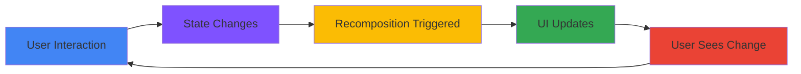
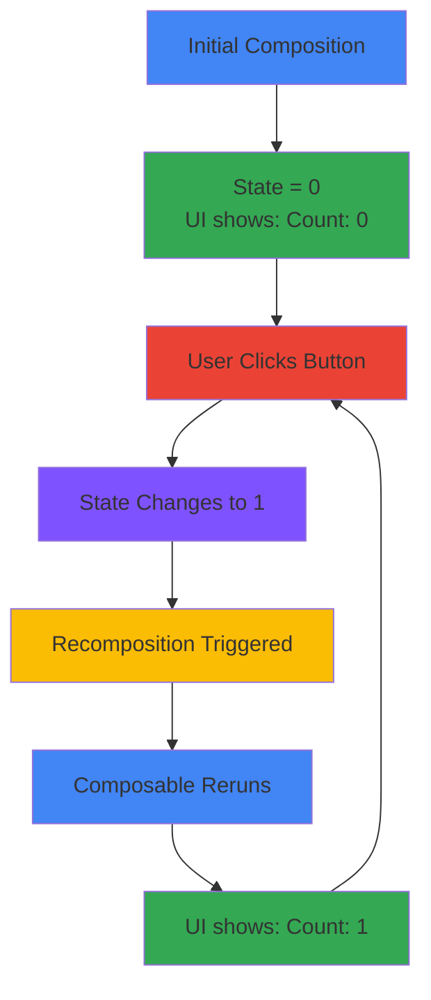

<div align="center">

# 🔄 Chapter 07 · State Management


### *Making Apps Interactive*


</div>

---

> [!NOTE]
> *"An app without state is a painting. An app with state is a conversation."*

<div align="center">

[](./06-material-design.md)
[](./08-lists-and-grids.md)

</div>

<br>

## 🎯 What We're Learning Today

<div align="center">

By the end of this chapter, you will be able to:

</div>

<br>

<table>
<tr>
<td align="center" width="25%">

🎭  
**State**

Data that  
changes over time

</td>
<td align="center" width="25%">

🔄  
**Recomposition**

UI updates  
automatically

</td>
<td align="center" width="25%">

👆  
**Interaction**

Responding to  
user input

</td>
<td align="center" width="25%">

🎲  
**Dice Roller**

Your first truly  
interactive app

</td>
</tr>
</table>

<br>

> [!IMPORTANT]
> **This is the most important chapter so far.**  
> State management is the difference between a static UI  
> and a living, breathing, interactive app.

---

<br>

## 🌟 What Is State?

<div align="center">

### *The Soul of Your App*

**State** is any data that can change over time and affects what the UI displays.

</div>

<br>

<div align="center">



</div>

<br>

<table>
<tr>
<td width="50%" bgcolor="#e3f2fd" valign="top">

### 📊 Examples of State:

- **Counter value** — starts at 0, increases on click
- **Text input** — changes as user types
- **Toggle state** — switch on/off
- **List items** — items added/removed
- **Loading status** — loading, success, error
- **Selected tab** — which tab is active
- **Form data** — all field values

</td>
<td width="50%" bgcolor="#fff9c4" valign="top">

### 🎯 Not State:

- **Fixed text** — "Welcome to my app"
- **App name** — never changes
- **Icon resources** — static assets
- **Hardcoded colors** — `Color.Red`
- **Constants** — `val PI = 3.14159`

**Rule of thumb:**  
If it changes → State  
If it's fixed → Not state

</td>
</tr>
</table>

---

<br>

## 🎭 Part 1 · Understanding State

<div align="center">

### *From Static to Dynamic*

</div>

---

<br>

### ❌ Without State — Dead UI

<br>

<details>
<summary><b>💀 The Problem: UI That Never Changes</b></summary>

<br>

```kotlin
// ❌ This DOES NOT WORK as expected
@Composable
fun BrokenCounter() {
    var count = 0  // Regular variable — NOT state!
    
    Column {
        Text("Count: $count")
        
        Button(onClick = {
            count++  // This changes the variable...
            println("Count is now: $count")  // Prints correctly!
        }) {
            Text("Increment")
        }
    }
}

/*
What happens:
1. User clicks button
2. count variable increases (we can see it in logs!)
3. UI does NOT update — Text still shows "Count: 0"
4. User clicks again — same problem

Why?
- Regular variables don't tell Compose to redraw the UI
- Compose doesn't know the value changed
- The UI stays frozen
*/
```

**Console output when clicking 5 times:**
```
Count is now: 1
Count is now: 2
Count is now: 3
Count is now: 4
Count is now: 5

But screen still shows: Count: 0 ❌
```

</details>

---

<br>

### ✅ With State — Living UI

<br>

<details>
<summary><b>✨ The Solution: remember + mutableStateOf</b></summary>

<br>

```kotlin
// ✅ This WORKS perfectly!
@Composable
fun WorkingCounter() {
    var count by remember { mutableStateOf(0) }  // State!
    
    Column {
        Text("Count: $count")
        
        Button(onClick = {
            count++  // This triggers recomposition!
        }) {
            Text("Increment")
        }
    }
}

/*
What happens:
1. User clicks button
2. count state increases
3. Compose detects state change
4. Compose recomposes (redraws) the UI
5. Text updates to show new count ✅

The magic words:
- remember → Keeps the value across recompositions
- mutableStateOf → Makes Compose watch this value
- by → Kotlin delegation (lets you use it like a regular variable)
*/
```

**Screen after clicking 5 times:**
```
Count: 5 ✅
[Button: Increment]
```

</details>

---

<br>

### 🔍 Breaking Down the Syntax

<br>

<details>
<summary><b>🧩 Understanding Each Piece</b></summary>

<br>

```kotlin
var count by remember { mutableStateOf(0) }
│   │     │  │         │              │
│   │     │  │         │              └─ Initial value (0)
│   │     │  │         └──────────────── Creates observable state
│   │     │  └────────────────────────── Survives recomposition
│   │     └───────────────────────────── Kotlin delegation
│   └─────────────────────────────────── Can be reassigned
└─────────────────────────────────────── Variable name
```

<br>

**Alternative syntax (without `by`):**
```kotlin
val count = remember { mutableStateOf(0) }

// Now you access it differently:
Text("Count: ${count.value}")  // ← Need .value

Button(onClick = {
    count.value++  // ← Need .value to modify
}) {
    Text("Increment")
}
```

**With `by` (recommended):**
```kotlin
var count by remember { mutableStateOf(0) }

// Cleaner access:
Text("Count: $count")  // ← No .value needed

Button(onClick = {
    count++  // ← No .value needed
}) {
    Text("Increment")
}
```

> [!TIP]
> **Always use `by` delegation** — it makes your code cleaner and more readable.  
> Add this import: `import androidx.compose.runtime.getValue`  
> And: `import androidx.compose.runtime.setValue`

</details>

---

<br>

## 🔄 Part 2 · Recomposition

<div align="center">

### *The Automatic Redraw Cycle*

**Recomposition** is when Compose reruns a Composable function  
to update the UI based on new state.

</div>

<br>

<div align="center">



</div>

---

<br>

<details>
<summary><b>🔄 How Recomposition Works</b></summary>

<br>

```kotlin
@Composable
fun RecompositionDemo() {
    var clickCount by remember { mutableStateOf(0) }
    
    // This ENTIRE function reruns every time clickCount changes
    println("🔄 Recomposing! clickCount = $clickCount")
    
    Column {
        Text("Clicked: $clickCount times")
        
        Button(onClick = { clickCount++ }) {
            Text("Click me")
        }
    }
}

/*
Console output when user clicks 3 times:
🔄 Recomposing! clickCount = 0  ← Initial composition
🔄 Recomposing! clickCount = 1  ← After first click
🔄 Recomposing! clickCount = 2  ← After second click
🔄 Recomposing! clickCount = 3  ← After third click

Each click → state change → recomposition → UI update
*/
```

**Key insights:**
1. The **entire function** reruns (but Compose is smart — only changed parts actually redraw)
2. Happens **automatically** — you don't call it manually
3. Happens **instantly** — users see immediate feedback
4. **`remember`** ensures values survive across recompositions

</details>

---

<br>

### ⚡ Recomposition Scope

<br>

<details>
<summary><b>🎯 What Gets Recomposed?</b></summary>

<br>

```kotlin
@Composable
fun SmartRecomposition() {
    println("🟢 Parent composing")
    
    var parentCount by remember { mutableStateOf(0) }
    
    Column {
        Text("Parent count: $parentCount")
        
        Button(onClick = { parentCount++ }) {
            Text("Parent +1")
        }
        
        // This child has its own state
        ChildComposable()
    }
}

@Composable
fun ChildComposable() {
    println("🔵 Child composing")
    
    var childCount by remember { mutableStateOf(0) }
    
    Column {
        Text("Child count: $childCount")
        
        Button(onClick = { childCount++ }) {
            Text("Child +1")
        }
    }
}

/*
When user clicks "Parent +1":
🟢 Parent composing
(Child does NOT recompose — its state didn't change)

When user clicks "Child +1":
🔵 Child composing
(Parent does NOT recompose — its state didn't change)

Compose is SMART:
- Only recomposes the parts that need updating
- This keeps your app fast even with complex UIs
*/
```

</details>

---

<br>

## 👆 Part 3 · User Interaction

<div align="center">

### *Making Apps Respond*

</div>

---

<br>

### 🔘 Button Clicks

<br>

<details>
<summary><b>🔘 Complete Click Handling</b></summary>

<br>

```kotlin
@Composable
fun ClickExamples() {
    var message by remember { mutableStateOf("Tap a button") }
    
    Column(
        modifier = Modifier
            .fillMaxSize()
            .padding(16.dp),
        verticalArrangement = Arrangement.spacedBy(16.dp)
    ) {
        Text(
            text = message,
            style = MaterialTheme.typography.headlineSmall
        )
        
        // Simple click
        Button(onClick = {
            message = "Button clicked!"
        }) {
            Text("Click me")
        }
        
        // Click with multiple actions
        Button(onClick = {
            message = "Processing..."
            // Simulate work
            Thread.sleep(1000)
            message = "Done! ✅"
        }) {
            Text("Do work")
        }
        
        // Toggle between states
        var isOn by remember { mutableStateOf(false) }
        
        Button(onClick = {
            isOn = !isOn
            message = if (isOn) "ON 🟢" else "OFF 🔴"
        }) {
            Text(if (isOn) "Turn OFF" else "Turn ON")
        }
        
        // Counter
        var count by remember { mutableStateOf(0) }
        
        Row(horizontalArrangement = Arrangement.spacedBy(8.dp)) {
            Button(onClick = { count--; message = "Count: $count" }) {
                Text("−")
            }
            Text("$count", style = MaterialTheme.typography.headlineMedium)
            Button(onClick = { count++; message = "Count: $count" }) {
                Text("+")
            }
        }
    }
}
```

</details>

---

<br>

### 📝 Text Input

<br>

<details>
<summary><b>⌨️ Handling User Text Input</b></summary>

<br>

```kotlin
@Composable
fun TextInputExamples() {
    var name by remember { mutableStateOf("") }
    var email by remember { mutableStateOf("") }
    var bio by remember { mutableStateOf("") }
    
    Column(
        modifier = Modifier
            .fillMaxSize()
            .padding(16.dp),
        verticalArrangement = Arrangement.spacedBy(16.dp)
    ) {
        // Basic text input
        OutlinedTextField(
            value = name,
            onValueChange = { newValue ->
                name = newValue  // State updates on every keystroke
            },
            label = { Text("Name") },
            modifier = Modifier.fillMaxWidth()
        )
        
        // Display what user typed
        if (name.isNotEmpty()) {
            Text("Hello, $name!")
        }
        
        // Email with validation
        OutlinedTextField(
            value = email,
            onValueChange = { email = it },
            label = { Text("Email") },
            isError = email.isNotEmpty() && !email.contains("@"),
            supportingText = {
                if (email.isNotEmpty() && !email.contains("@")) {
                    Text("Invalid email")
                }
            },
            modifier = Modifier.fillMaxWidth()
        )
        
        // Character counter
        OutlinedTextField(
            value = bio,
            onValueChange = { newValue ->
                if (newValue.length <= 100) {  // Limit to 100 chars
                    bio = newValue
                }
            },
            label = { Text("Bio") },
            supportingText = { Text("${bio.length}/100") },
            minLines = 3,
            modifier = Modifier.fillMaxWidth()
        )
        
        // Submit button (enabled only when valid)
        Button(
            onClick = { /* Submit */ },
            enabled = name.isNotEmpty() && email.contains("@") && bio.isNotEmpty(),
            modifier = Modifier.fillMaxWidth()
        ) {
            Text("Submit")
        }
    }
}
```

</details>

---

<br>

### ☑️ Toggles & Switches

<br>

<details>
<summary><b>🔘 Toggle State Management</b></summary>

<br>

```kotlin
@Composable
fun ToggleExamples() {
    var notificationsEnabled by remember { mutableStateOf(true) }
    var darkMode by remember { mutableStateOf(false) }
    var selectedOption by remember { mutableStateOf("Option 1") }
    
    Column(
        modifier = Modifier
            .fillMaxSize()
            .padding(16.dp),
        verticalArrangement = Arrangement.spacedBy(16.dp)
    ) {
        // Checkbox
        var agreed by remember { mutableStateOf(false) }
        
        Row(
            verticalAlignment = Alignment.CenterVertically,
            modifier = Modifier.clickable { agreed = !agreed }
        ) {
            Checkbox(
                checked = agreed,
                onCheckedChange = { agreed = it }
            )
            Text("I agree to the terms")
        }
        
        // Switch
        Row(
            modifier = Modifier.fillMaxWidth(),
            horizontalArrangement = Arrangement.SpaceBetween,
            verticalAlignment = Alignment.CenterVertically
        ) {
            Text("Enable notifications")
            Switch(
                checked = notificationsEnabled,
                onCheckedChange = { notificationsEnabled = it }
            )
        }
        
        if (notificationsEnabled) {
            Text("📬 You'll receive notifications", color = Color.Green)
        } else {
            Text("🔕 Notifications are off", color = Color.Gray)
        }
        
        // Radio buttons
        Text("Choose an option:")
        
        val options = listOf("Option 1", "Option 2", "Option 3")
        
        options.forEach { option ->
            Row(
                verticalAlignment = Alignment.CenterVertically,
                modifier = Modifier.clickable { selectedOption = option }
            ) {
                RadioButton(
                    selected = (option == selectedOption),
                    onClick = { selectedOption = option }
                )
                Text(option)
            }
        }
        
        Text("Selected: $selectedOption", fontWeight = FontWeight.Bold)
    }
}
```

</details>

---

<br>

## 🎲 Part 4 · Advanced State Patterns

<br>

### 🎨 Multiple States Working Together

<br>

<details>
<summary><b>🔗 Coordinated State Example</b></summary>

<br>

```kotlin
@Composable
fun CoordinatedStates() {
    var quantity by remember { mutableStateOf(1) }
    var price by remember { mutableStateOf(9.99) }
    
    // Derived state — calculated from other states
    val total = quantity * price
    
    Column(
        modifier = Modifier
            .fillMaxSize()
            .padding(16.dp),
        verticalArrangement = Arrangement.spacedBy(16.dp)
    ) {
        Text("Shopping Cart", style = MaterialTheme.typography.headlineMedium)
        
        // Quantity controls
        Row(
            horizontalArrangement = Arrangement.SpaceBetween,
            verticalAlignment = Alignment.CenterVertically,
            modifier = Modifier.fillMaxWidth()
        ) {
            Text("Quantity:")
            
            Row(
                horizontalArrangement = Arrangement.spacedBy(8.dp),
                verticalAlignment = Alignment.CenterVertically
            ) {
                IconButton(
                    onClick = { if (quantity > 1) quantity-- }
                ) {
                    Text("−", fontSize = 20.sp)
                }
                
                Text("$quantity", fontSize = 20.sp)
                
                IconButton(onClick = { quantity++ }) {
                    Text("+", fontSize = 20.sp)
                }
            }
        }
        
        // Price
        Text("Price per item: $${String.format("%.2f", price)}")
        
        Divider()
        
        // Total (automatically updates when quantity or price changes!)
        Text(
            "Total: $${String.format("%.2f", total)}",
            style = MaterialTheme.typography.headlineLarge,
            color = MaterialTheme.colorScheme.primary
        )
        
        // Discount applied when buying 5+
        if (quantity >= 5) {
            val discount = total * 0.1
            val finalPrice = total - discount
            
            Card(
                colors = CardDefaults.cardColors(
                    containerColor = MaterialTheme.colorScheme.tertiaryContainer
                )
            ) {
                Column(modifier = Modifier.padding(16.dp)) {
                    Text("🎉 Bulk discount applied!")
                    Text("Save: $${String.format("%.2f", discount)}")
                    Text(
                        "Final: $${String.format("%.2f", finalPrice)}",
                        fontWeight = FontWeight.Bold
                    )
                }
            }
        }
    }
}
```

</details>

---

<br>

### 📋 Lists of State

<br>

<details>
<summary><b>📋 Managing Dynamic Lists</b></summary>

<br>

```kotlin
@Composable
fun TodoList() {
    // mutableStateListOf — like mutableListOf but observable
    val todos = remember { mutableStateListOf<String>() }
    var newTodo by remember { mutableStateOf("") }
    
    Column(
        modifier = Modifier
            .fillMaxSize()
            .padding(16.dp)
    ) {
        Text("My Todo List", style = MaterialTheme.typography.headlineMedium)
        
        Spacer(modifier = Modifier.height(16.dp))
        
        // Add new todo
        Row(
            modifier = Modifier.fillMaxWidth(),
            horizontalArrangement = Arrangement.spacedBy(8.dp)
        ) {
            OutlinedTextField(
                value = newTodo,
                onValueChange = { newTodo = it },
                label = { Text("New task") },
                modifier = Modifier.weight(1f)
            )
            
            Button(
                onClick = {
                    if (newTodo.isNotBlank()) {
                        todos.add(newTodo)
                        newTodo = ""  // Clear input
                    }
                }
            ) {
                Text("Add")
            }
        }
        
        Spacer(modifier = Modifier.height(16.dp))
        
        // Show todos
        if (todos.isEmpty()) {
            Text("No tasks yet. Add one above! ✨")
        } else {
            todos.forEachIndexed { index, todo ->
                Card(
                    modifier = Modifier
                        .fillMaxWidth()
                        .padding(vertical = 4.dp)
                ) {
                    Row(
                        modifier = Modifier
                            .fillMaxWidth()
                            .padding(16.dp),
                        horizontalArrangement = Arrangement.SpaceBetween,
                        verticalAlignment = Alignment.CenterVertically
                    ) {
                        Text(todo, modifier = Modifier.weight(1f))
                        
                        IconButton(onClick = { todos.removeAt(index) }) {
                            Icon(Icons.Default.Delete, "Delete")
                        }
                    }
                }
            }
        }
    }
}
```

</details>

---

<br>

## 🎲 Part 5 · Project — Dice Roller App

<div align="center">

### *Your First Truly Interactive App*

Let's build a beautiful **Dice Roller** with animations, multiple dice, and reset!

</div>

<br>

<table>
<tr>
<td align="center" width="33%">

🎲  
**Roll Dice**

Tap to roll

</td>
<td align="center" width="33%">

🎨  
**Visual Dice**

Show current number

</td>
<td align="center" width="33%">

🔄  
**Multiple Dice**

Roll 1, 2, or 3 dice

</td>
</tr>
</table>

---

<br>

### 🎯 App Preview

<br>

```
┌──────────────────────────┐
│    🎲 Dice Roller        │
├──────────────────────────┤
│                          │
│   ╔═════════╗            │
│   ║  •   •  ║  ← Roll: 5 │
│   ║    •    ║            │
│   ║  •   •  ║            │
│   ╚═════════╝            │
│                          │
│   [  Roll Dice  ]        │
│                          │
│   Number of dice: 1      │
│   [−]  ●  [+]            │
│                          │
│   Total: 5               │
│   [Reset]                │
│                          │
└──────────────────────────┘
```

---

<br>

<details>
<summary><b>🎲 Complete Dice Roller Code</b></summary>

<br>

**Create new project:**
- Name: `DiceRollerApp`
- Package: `com.yourname.diceroller`
- Language: Kotlin · Minimum SDK: API 24

<br>

**MainActivity.kt:**

```kotlin
package com.yourname.diceroller

import android.os.Bundle
import androidx.activity.ComponentActivity
import androidx.activity.compose.setContent
import androidx.compose.animation.core.*
import androidx.compose.foundation.Image
import androidx.compose.foundation.layout.*
import androidx.compose.material3.*
import androidx.compose.runtime.*
import androidx.compose.ui.Alignment
import androidx.compose.ui.Modifier
import androidx.compose.ui.draw.rotate
import androidx.compose.ui.res.painterResource
import androidx.compose.ui.text.font.FontWeight
import androidx.compose.ui.tooling.preview.Preview
import androidx.compose.ui.unit.dp
import androidx.compose.ui.unit.sp
import kotlin.random.Random

class MainActivity : ComponentActivity() {
    override fun onCreate(savedInstanceState: Bundle?) {
        super.onCreate(savedInstanceState)
        setContent {
            MaterialTheme {
                Surface(
                    modifier = Modifier.fillMaxSize(),
                    color = MaterialTheme.colorScheme.background
                ) {
                    DiceRollerApp()
                }
            }
        }
    }
}

@Composable
fun DiceRollerApp() {
    var numberOfDice by remember { mutableStateOf(1) }
    var diceValues by remember { mutableStateOf(List(1) { 1 }) }
    var isRolling by remember { mutableStateOf(false) }
    
    // Animation for dice rotation
    val rotation by animateFloatAsState(
        targetValue = if (isRolling) 360f else 0f,
        animationSpec = tween(durationMillis = 500),
        finishedListener = { isRolling = false }
    )
    
    // Roll function
    fun rollDice() {
        isRolling = true
        diceValues = List(numberOfDice) { Random.nextInt(1, 7) }
    }
    
    Column(
        modifier = Modifier
            .fillMaxSize()
            .padding(24.dp),
        horizontalAlignment = Alignment.CenterHorizontally,
        verticalArrangement = Arrangement.spacedBy(24.dp)
    ) {
        // ── HEADER ──────────────────────────────
        Text(
            text = "🎲 Dice Roller",
            style = MaterialTheme.typography.headlineLarge,
            fontWeight = FontWeight.Bold,
            color = MaterialTheme.colorScheme.primary
        )
        
        Spacer(modifier = Modifier.height(16.dp))
        
        // ── DICE DISPLAY ────────────────────────
        Card(
            modifier = Modifier.fillMaxWidth(),
            elevation = CardDefaults.cardElevation(8.dp)
        ) {
            Column(
                modifier = Modifier
                    .fillMaxWidth()
                    .padding(32.dp),
                horizontalAlignment = Alignment.CenterHorizontally
            ) {
                // Show all dice
                Row(
                    horizontalArrangement = Arrangement.spacedBy(16.dp),
                    verticalAlignment = Alignment.CenterVertically
                ) {
                    diceValues.forEach { value ->
                        DiceImage(
                            value = value,
                            modifier = Modifier
                                .size(100.dp)
                                .rotate(if (isRolling) rotation else 0f)
                        )
                    }
                }
                
                Spacer(modifier = Modifier.height(16.dp))
                
                // Show individual values if multiple dice
                if (numberOfDice > 1) {
                    Text(
                        "Rolls: ${diceValues.joinToString(" + ")}",
                        style = MaterialTheme.typography.bodyLarge
                    )
                }
            }
        }
        
        // ── ROLL BUTTON ─────────────────────────
        Button(
            onClick = { rollDice() },
            modifier = Modifier
                .fillMaxWidth()
                .height(56.dp),
            enabled = !isRolling
        ) {
            Text(
                if (isRolling) "Rolling..." else "Roll Dice",
                fontSize = 18.sp
            )
        }
        
        // ── NUMBER OF DICE SELECTOR ─────────────
        Card(
            modifier = Modifier.fillMaxWidth()
        ) {
            Column(
                modifier = Modifier.padding(16.dp),
                horizontalAlignment = Alignment.CenterHorizontally
            ) {
                Text(
                    "Number of Dice",
                    style = MaterialTheme.typography.titleMedium,
                    fontWeight = FontWeight.Medium
                )
                
                Spacer(modifier = Modifier.height(12.dp))
                
                Row(
                    horizontalArrangement = Arrangement.spacedBy(16.dp),
                    verticalAlignment = Alignment.CenterVertically
                ) {
                    FilledIconButton(
                        onClick = {
                            if (numberOfDice > 1) {
                                numberOfDice--
                                diceValues = List(numberOfDice) { 1 }
                            }
                        },
                        enabled = numberOfDice > 1
                    ) {
                        Text("−", fontSize = 24.sp)
                    }
                    
                    Text(
                        "$numberOfDice",
                        fontSize = 32.sp,
                        fontWeight = FontWeight.Bold
                    )
                    
                    FilledIconButton(
                        onClick = {
                            if (numberOfDice < 3) {
                                numberOfDice++
                                diceValues = List(numberOfDice) { 1 }
                            }
                        },
                        enabled = numberOfDice < 3
                    ) {
                        Text("+", fontSize = 24.sp)
                    }
                }
            }
        }
        
        // ── TOTAL DISPLAY ───────────────────────
        Card(
            modifier = Modifier.fillMaxWidth(),
            colors = CardDefaults.cardColors(
                containerColor = MaterialTheme.colorScheme.primaryContainer
            )
        ) {
            Row(
                modifier = Modifier
                    .fillMaxWidth()
                    .padding(20.dp),
                horizontalArrangement = Arrangement.SpaceBetween,
                verticalAlignment = Alignment.CenterVertically
            ) {
                Text(
                    "Total:",
                    style = MaterialTheme.typography.titleLarge
                )
                
                Text(
                    "${diceValues.sum()}",
                    style = MaterialTheme.typography.displaySmall,
                    fontWeight = FontWeight.Bold,
                    color = MaterialTheme.colorScheme.primary
                )
            }
        }
        
        // ── RESET BUTTON ────────────────────────
        OutlinedButton(
            onClick = {
                numberOfDice = 1
                diceValues = listOf(1)
            },
            modifier = Modifier.fillMaxWidth()
        ) {
            Text("Reset")
        }
        
        // ── STATS ───────────────────────────────
        if (numberOfDice > 1) {
            Card(
                modifier = Modifier.fillMaxWidth()
            ) {
                Column(
                    modifier = Modifier.padding(16.dp)
                ) {
                    Text(
                        "Statistics",
                        style = MaterialTheme.typography.titleMedium,
                        fontWeight = FontWeight.Medium
                    )
                    Spacer(modifier = Modifier.height(8.dp))
                    Row(
                        modifier = Modifier.fillMaxWidth(),
                        horizontalArrangement = Arrangement.SpaceBetween
                    ) {
                        Text("Highest: ${diceValues.maxOrNull() ?: 0}")
                        Text("Lowest: ${diceValues.minOrNull() ?: 0}")
                        Text("Average: ${"%.1f".format(diceValues.average())}")
                    }
                }
            }
        }
    }
}

@Composable
fun DiceImage(value: Int, modifier: Modifier = Modifier) {
    // In a real app, you'd have actual dice images
    // For now, we'll use a visual representation
    Card(
        modifier = modifier,
        colors = CardDefaults.cardColors(
            containerColor = MaterialTheme.colorScheme.surface
        ),
        elevation = CardDefaults.cardElevation(4.dp)
    ) {
        Box(
            modifier = Modifier.fillMaxSize(),
            contentAlignment = Alignment.Center
        ) {
            Text(
                text = when (value) {
                    1 -> "⚀"
                    2 -> "⚁"
                    3 -> "⚂"
                    4 -> "⚃"
                    5 -> "⚄"
                    6 -> "⚅"
                    else -> "?"
                },
                fontSize = 64.sp
            )
        }
    }
}

@Preview(showBackground = true, showSystemUi = true)
@Composable
fun DiceRollerPreview() {
    MaterialTheme {
        DiceRollerApp()
    }
}
```

</details>

---

<br>

### 🎨 Features Breakdown

<br>

<details>
<summary><b>✨ What Makes This App Special</b></summary>

<br>

**1. Multiple State Variables:**
```kotlin
var numberOfDice by remember { mutableStateOf(1) }      // How many dice
var diceValues by remember { mutableStateOf(List(1) { 1 }) }  // Results
var isRolling by remember { mutableStateOf(false) }     // Animation state
```

**2. State-Driven Animation:**
```kotlin
val rotation by animateFloatAsState(
    targetValue = if (isRolling) 360f else 0f,
    finishedListener = { isRolling = false }  // Reset after animation
)
```

**3. Coordinated State Updates:**
```kotlin
fun rollDice() {
    isRolling = true  // Triggers animation
    diceValues = List(numberOfDice) { Random.nextInt(1, 7) }  // New rolls
}
```

**4. Derived State:**
```kotlin
val total = diceValues.sum()  // Calculated from diceValues
val average = diceValues.average()  // Another derived value
```

**5. Conditional UI:**
```kotlin
if (numberOfDice > 1) {
    // Show stats only for multiple dice
}
```

</details>

---

<br>

### 🚀 Enhancements

<br>

<details>
<summary><b>⭐ Level Up Your Dice Roller</b></summary>

<br>

**Challenge 1 — Roll History:**
```kotlin
data class Roll(val values: List<Int>, val timestamp: Long = System.currentTimeMillis())

val history = remember { mutableStateListOf<Roll>() }

fun rollDice() {
    val newRoll = List(numberOfDice) { Random.nextInt(1, 7) }
    diceValues = newRoll
    history.add(0, Roll(newRoll))  // Add to history
}
```

**Challenge 2 — Dice Color Customization:**
```kotlin
var diceColor by remember { mutableStateOf(Color.Red) }

// Add color picker
Row {
    listOf(Color.Red, Color.Blue, Color.Green).forEach { color ->
        Box(
            modifier = Modifier
                .size(40.dp)
                .background(color, CircleShape)
                .clickable { diceColor = color }
        )
    }
}
```

**Challenge 3 — Shake to Roll:**
```kotlin
// Detect device shake using SensorManager
// When shake detected → rollDice()
```

**Challenge 4 — Sound Effects:**
```kotlin
// Play dice roll sound when rolling
MediaPlayer.create(context, R.raw.dice_roll).start()
```

</details>

---

<br>

## 🎯 Mission · Chapter 07

<div align="center">

### 💻 Master State Management!

</div>

<br>

### Core Tasks:

- [ ] 🔄 **Create counter** — Simple button that increases a number
- [ ] 📝 **Text input state** — TextField that displays what you type
- [ ] ☑️ **Toggle state** — Switch that changes text when toggled
- [ ] 📋 **List state** — Add and remove items from a list
- [ ] 🎲 **Build Dice Roller** — Complete app with all features
- [ ] 🧪 **Test recomposition** — Add println() to see when Composables rerun

<br>

<details>
<summary><b>⭐ Bonus Challenges</b></summary>

<br>

- [ ] 📜 Add **roll history** to track past rolls
- [ ] 🎨 Add **dice color customization**
- [ ] 📊 Add **statistics** (most common roll, lucky streak)
- [ ] 🔊 Add **sound effects** for rolling
- [ ] 📳 Add **vibration** when dice land
- [ ] 🎯 Add **target number** game mode
- [ ] 🏆 Add **achievements** (roll 100 times, get triple 6s, etc.)

</details>

---

<br>

<div align="center">

## 🏆 Achievement Unlocked

### **The State Master** 🔄

<br>

**You now understand:**

- What state is and why it matters
- `remember` and `mutableStateOf`
- How recomposition works
- User interaction patterns (clicks, input, toggles)
- Multiple coordinated states
- List state management
- Animation-driven state

<br>

*You built a Dice Roller*  
*that responds instantly to every interaction,*  
*with smooth animations and real-time updates.*  
**You've mastered the heart of Compose.**

<br>


</div>

---

<br>

<div align="center">

### 🎓 Remember This

> *"State is the difference between a picture and an app.*  
> *Master state, and you can build anything—*  
> *from a simple counter to a full social network.*  
> *Every interaction, every animation, every 'smart' feature*  
> *comes down to managing state correctly."*

</div>

---

<br>

<div align="center">

### 🔜 What's Next?

In **Chapter 08**, we explore **Lists & Grids** —  
displaying collections of data with `LazyColumn` and `LazyGrid`.  
You'll build an **Affirmations App** with scrollable content!

</div>

<br>

<div align="center">

[](./08-lists-and-grids.md)

</div>

<br>
