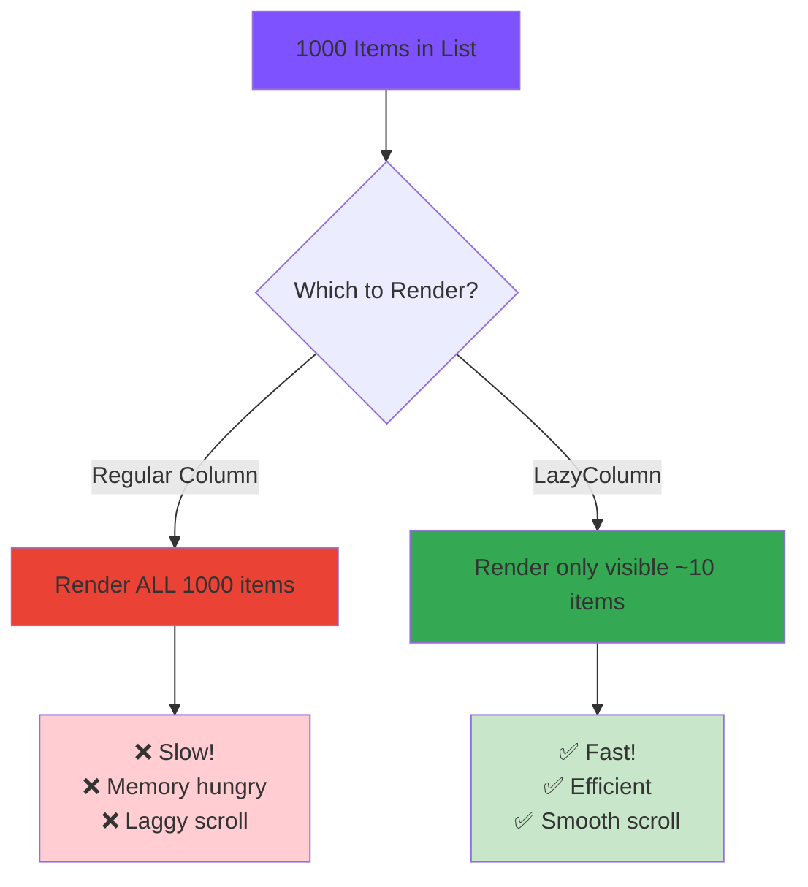

<div align="center">

# 📋 Chapter 08 · Lists & Grids


### *Displaying Collections*


</div>

---

> [!NOTE]
> *"A list of one thousand items should scroll as smoothly as a list of ten. That's the Lazy magic."*

<div align="center">

[](./07-state-management.md)
[](./09-navigation.md)

</div>

<br>

## 🎯 What We're Learning Today

<div align="center">

By the end of this chapter, you will be able to:

</div>

<br>

<table>
<tr>
<td align="center" width="25%">

📜  
**LazyColumn**

Vertical scrolling  
lists

</td>
<td align="center" width="25%">

🎯  
**LazyGrid**

Grid layouts  
efficient rendering

</td>
<td align="center" width="25%">

🔄  
**Performance**

Thousands of items  
no lag

</td>
<td align="center" width="25%">

💬  
**Affirmations**

Scrollable  
inspiration app

</td>
</tr>
</table>

<br>

> [!IMPORTANT]
> **This is how real apps display data.**  
> Instagram feed? LazyColumn.  
> Photo gallery? LazyGrid.  
> Chat messages? LazyColumn.  
> **Learn this, and you can build any content-heavy app.**

---

<br>

## 🌟 Why "Lazy"?

<div align="center">

### *The Performance Revolution*

"Lazy" doesn't mean slow — it means **smart**.

</div>

<br>

<div align="center">



</div>

<br>

<table>
<tr>
<td width="50%" bgcolor="#ffebee" valign="top">

### ❌ Regular Column:

```kotlin
Column {  // Don't do this for long lists!
    items.forEach { item ->
        ItemCard(item)  // Renders ALL items
    }
}
```

**Problems:**
- Renders everything at once
- Slow initial load
- Memory issues with 100+ items
- Laggy scrolling
- Bad user experience

</td>
<td width="50%" bgcolor="#e8f5e9" valign="top">

### ✅ LazyColumn:

```kotlin
LazyColumn {  // Do this instead!
    items(items) { item ->
        ItemCard(item)  // Only renders visible
    }
}
```

**Advantages:**
- Renders only visible items
- Instant load
- Handles millions of items
- Buttery smooth scrolling
- Professional performance

</td>
</tr>
</table>

<br>

> [!TIP]
> **Rule of thumb:**  
> - List of 1-10 items? Either works, but LazyColumn is still better.  
> - List of 10+ items? **Always use LazyColumn.**  
> - List of 100+ items? LazyColumn is **essential**.

---

<br>

## 📜 Part 1 · LazyColumn

<div align="center">

### *Vertical Scrolling Lists*

The most common layout in mobile apps.

</div>

---

<br>

### 🎨 Basic LazyColumn

<br>

<details>
<summary><b>📝 Your First Scrollable List</b></summary>

<br>

```kotlin
@Composable
fun SimpleLazyColumn() {
    // Sample data
    val items = (1..100).toList()  // 100 items!
    
    LazyColumn(
        modifier = Modifier.fillMaxSize(),
        contentPadding = PaddingValues(16.dp),
        verticalArrangement = Arrangement.spacedBy(8.dp)
    ) {
        items(items) { number ->
            Card(
                modifier = Modifier.fillMaxWidth()
            ) {
                Text(
                    text = "Item #$number",
                    modifier = Modifier.padding(16.dp)
                )
            }
        }
    }
}

/*
What happens:
1. LazyColumn creates a scrollable container
2. items() function loops through the list
3. Only ~10 items are rendered (what you can see on screen)
4. As you scroll, old items are recycled and new ones appear
5. Smooth 60fps scrolling even with 100 items!
*/
```

</details>

---

<br>

### 🔧 LazyColumn Components

<br>

<details>
<summary><b>🧩 All the Building Blocks</b></summary>

<br>

```kotlin
@Composable
fun CompleteLazyColumn() {
    val items = listOf("Apple", "Banana", "Cherry", "Date", "Elderberry")
    
    LazyColumn(
        modifier = Modifier.fillMaxSize(),
        contentPadding = PaddingValues(16.dp),      // Padding around content
        verticalArrangement = Arrangement.spacedBy(8.dp),  // Space between items
        horizontalAlignment = Alignment.CenterHorizontally  // Center items
    ) {
        
        // ── SINGLE ITEM ─────────────────────────
        item {
            Text(
                "Header",
                style = MaterialTheme.typography.headlineMedium,
                modifier = Modifier.padding(vertical = 16.dp)
            )
        }
        
        // ── LIST OF ITEMS ───────────────────────
        items(items) { fruit ->
            Card(
                modifier = Modifier.fillMaxWidth()
            ) {
                Text(
                    text = fruit,
                    modifier = Modifier.padding(16.dp)
                )
            }
        }
        
        // ── INDEXED ITEMS ───────────────────────
        itemsIndexed(items) { index, fruit ->
            Text("${index + 1}. $fruit")
        }
        
        // ── ANOTHER SINGLE ITEM ─────────────────
        item {
            Text(
                "Footer",
                style = MaterialTheme.typography.bodySmall,
                modifier = Modifier.padding(vertical = 16.dp)
            )
        }
    }
}

/*
LazyColumn DSL functions:
- item { } → Single item
- items(list) { } → List of items
- itemsIndexed(list) { index, item -> } → With index
- items(count) { index -> } → Fixed count
*/
```

</details>

---

<br>

### 🎨 Real-World List Examples

<br>

<details>
<summary><b>📱 Complete List Patterns</b></summary>

<br>

```kotlin
// ══════════════════════════════════════════════
// PATTERN 1: Contact List
// ══════════════════════════════════════════════
data class Contact(
    val name: String,
    val phone: String,
    val email: String
)

@Composable
fun ContactList() {
    val contacts = remember {
        List(50) { index ->
            Contact(
                name = "Person ${index + 1}",
                phone = "+1 555-${(1000..9999).random()}",
                email = "person${index + 1}@email.com"
            )
        }
    }
    
    LazyColumn(
        modifier = Modifier.fillMaxSize(),
        contentPadding = PaddingValues(16.dp),
        verticalArrangement = Arrangement.spacedBy(8.dp)
    ) {
        items(contacts) { contact ->
            ContactCard(contact)
        }
    }
}

@Composable
fun ContactCard(contact: Contact) {
    Card(
        modifier = Modifier.fillMaxWidth(),
        onClick = { /* Navigate to details */ }
    ) {
        Row(
            modifier = Modifier
                .fillMaxWidth()
                .padding(16.dp),
            verticalAlignment = Alignment.CenterVertically
        ) {
            // Avatar
            Surface(
                modifier = Modifier.size(48.dp),
                shape = CircleShape,
                color = MaterialTheme.colorScheme.primaryContainer
            ) {
                Box(contentAlignment = Alignment.Center) {
                    Text(
                        text = contact.name.first().toString(),
                        style = MaterialTheme.typography.titleLarge,
                        color = MaterialTheme.colorScheme.onPrimaryContainer
                    )
                }
            }
            
            Spacer(modifier = Modifier.width(16.dp))
            
            // Info
            Column {
                Text(
                    text = contact.name,
                    style = MaterialTheme.typography.titleMedium,
                    fontWeight = FontWeight.Bold
                )
                Text(
                    text = contact.phone,
                    style = MaterialTheme.typography.bodyMedium,
                    color = MaterialTheme.colorScheme.onSurfaceVariant
                )
            }
        }
    }
}

// ══════════════════════════════════════════════
// PATTERN 2: Message Thread
// ══════════════════════════════════════════════
data class Message(
    val text: String,
    val isFromMe: Boolean,
    val timestamp: String
)

@Composable
fun MessageThread() {
    val messages = remember {
        listOf(
            Message("Hey! How are you?", false, "10:30 AM"),
            Message("I'm good, thanks! How about you?", true, "10:31 AM"),
            Message("Great! Want to grab coffee?", false, "10:32 AM"),
            Message("Sure! When?", true, "10:33 AM"),
            Message("How about 3pm?", false, "10:34 AM"),
            Message("Perfect! See you then 😊", true, "10:35 AM")
        )
    }
    
    LazyColumn(
        modifier = Modifier.fillMaxSize(),
        contentPadding = PaddingValues(16.dp),
        verticalArrangement = Arrangement.spacedBy(8.dp),
        reverseLayout = true  // New messages at bottom
    ) {
        items(messages.reversed()) { message ->
            MessageBubble(message)
        }
    }
}

@Composable
fun MessageBubble(message: Message) {
    Column(
        modifier = Modifier.fillMaxWidth(),
        horizontalAlignment = if (message.isFromMe) 
            Alignment.End else Alignment.Start
    ) {
        Card(
            colors = CardDefaults.cardColors(
                containerColor = if (message.isFromMe)
                    MaterialTheme.colorScheme.primaryContainer
                else
                    MaterialTheme.colorScheme.surfaceVariant
            ),
            modifier = Modifier.widthIn(max = 280.dp)
        ) {
            Column(modifier = Modifier.padding(12.dp)) {
                Text(
                    text = message.text,
                    style = MaterialTheme.typography.bodyMedium
                )
                Text(
                    text = message.timestamp,
                    style = MaterialTheme.typography.labelSmall,
                    color = MaterialTheme.colorScheme.onSurfaceVariant,
                    modifier = Modifier.padding(top = 4.dp)
                )
            }
        }
    }
}

// ══════════════════════════════════════════════
// PATTERN 3: Settings List with Sections
// ══════════════════════════════════════════════
@Composable
fun SettingsList() {
    LazyColumn(
        modifier = Modifier.fillMaxSize()
    ) {
        // Section 1: Account
        item {
            Text(
                "Account",
                style = MaterialTheme.typography.titleSmall,
                color = MaterialTheme.colorScheme.primary,
                modifier = Modifier.padding(16.dp)
            )
        }
        
        item { SettingItem("Profile", "Edit your profile") }
        item { SettingItem("Password", "Change password") }
        item { Divider() }
        
        // Section 2: Preferences
        item {
            Text(
                "Preferences",
                style = MaterialTheme.typography.titleSmall,
                color = MaterialTheme.colorScheme.primary,
                modifier = Modifier.padding(16.dp)
            )
        }
        
        item { SettingItem("Notifications", "Manage notifications") }
        item { SettingItem("Theme", "Dark/Light mode") }
        item { SettingItem("Language", "App language") }
        item { Divider() }
        
        // Section 3: About
        item {
            Text(
                "About",
                style = MaterialTheme.typography.titleSmall,
                color = MaterialTheme.colorScheme.primary,
                modifier = Modifier.padding(16.dp)
            )
        }
        
        item { SettingItem("Version", "1.0.0") }
        item { SettingItem("Privacy Policy", "") }
        item { SettingItem("Terms of Service", "") }
    }
}

@Composable
fun SettingItem(title: String, subtitle: String) {
    Row(
        modifier = Modifier
            .fillMaxWidth()
            .clickable { }
            .padding(horizontal = 16.dp, vertical = 12.dp),
        horizontalArrangement = Arrangement.SpaceBetween,
        verticalAlignment = Alignment.CenterVertically
    ) {
        Column {
            Text(
                text = title,
                style = MaterialTheme.typography.bodyLarge
            )
            if (subtitle.isNotEmpty()) {
                Text(
                    text = subtitle,
                    style = MaterialTheme.typography.bodySmall,
                    color = MaterialTheme.colorScheme.onSurfaceVariant
                )
            }
        }
        Icon(
            imageVector = Icons.Default.ChevronRight,
            contentDescription = null,
            tint = MaterialTheme.colorScheme.onSurfaceVariant
        )
    }
}
```

</details>

---

<br>

### 🎨 LazyColumn Modifiers & Options

<br>

<details>
<summary><b>⚙️ Customizing Your Lists</b></summary>

<br>

```kotlin
@Composable
fun CustomizedLazyColumn() {
    val items = (1..50).toList()
    
    LazyColumn(
        // ── SIZE ────────────────────────────────
        modifier = Modifier
            .fillMaxSize()           // Full screen
            // .height(400.dp)       // Fixed height
            // .fillMaxHeight(0.5f)  // Half screen
        
        // ── PADDING ─────────────────────────────
        contentPadding = PaddingValues(
            start = 16.dp,
            top = 16.dp,
            end = 16.dp,
            bottom = 16.dp
        ),
        // Or: PaddingValues(horizontal = 16.dp, vertical = 8.dp)
        // Or: PaddingValues(16.dp)  // All sides
        
        // ── SPACING ─────────────────────────────
        verticalArrangement = Arrangement.spacedBy(8.dp),  // Space between items
        // Or: Arrangement.Top              // Items at top
        // Or: Arrangement.Bottom           // Items at bottom
        // Or: Arrangement.Center           // Items centered
        // Or: Arrangement.SpaceBetween     // Space between
        
        // ── ALIGNMENT ───────────────────────────
        horizontalAlignment = Alignment.CenterHorizontally,
        // Or: Alignment.Start  // Left aligned
        // Or: Alignment.End    // Right aligned
        
        // ── SCROLL ──────────────────────────────
        reverseLayout = false,  // false = top to bottom, true = bottom to top
        
        // ── STATE ───────────────────────────────
        state = rememberLazyListState()  // For programmatic scrolling
    ) {
        items(items) { item ->
            Text("Item $item")
        }
    }
}

// Programmatic scrolling example
@Composable
fun ScrollableList() {
    val listState = rememberLazyListState()
    val coroutineScope = rememberCoroutineScope()
    val items = (1..100).toList()
    
    Column {
        Button(onClick = {
            coroutineScope.launch {
                // Scroll to top
                listState.animateScrollToItem(0)
            }
        }) {
            Text("Scroll to Top")
        }
        
        Button(onClick = {
            coroutineScope.launch {
                // Scroll to item 50
                listState.animateScrollToItem(50)
            }
        }) {
            Text("Scroll to Middle")
        }
        
        LazyColumn(state = listState) {
            items(items) { item ->
                Text("Item $item", modifier = Modifier.padding(16.dp))
            }
        }
    }
}
```

</details>

---

<br>

## 🎯 Part 2 · LazyRow

<div align="center">

### *Horizontal Scrolling Lists*

Perfect for categories, stories, or image galleries.

</div>

<br>

<details>
<summary><b>↔️ Horizontal Scrolling</b></summary>

<br>

```kotlin
@Composable
fun HorizontalList() {
    val items = listOf("🍎", "🍌", "🍒", "🍇", "🍊", "🍓", "🥝", "🍑", "🍍")
    
    LazyRow(
        modifier = Modifier.fillMaxWidth(),
        contentPadding = PaddingValues(horizontal = 16.dp),
        horizontalArrangement = Arrangement.spacedBy(12.dp)
    ) {
        items(items) { emoji ->
            Card(
                modifier = Modifier.size(100.dp)
            ) {
                Box(
                    modifier = Modifier.fillMaxSize(),
                    contentAlignment = Alignment.Center
                ) {
                    Text(emoji, fontSize = 48.sp)
                }
            }
        }
    }
}

// Real-world example: Story circles (like Instagram)
@Composable
fun StoryCircles() {
    val users = List(15) { "User ${it + 1}" }
    
    LazyRow(
        contentPadding = PaddingValues(16.dp),
        horizontalArrangement = Arrangement.spacedBy(12.dp)
    ) {
        items(users) { user ->
            Column(
                horizontalAlignment = Alignment.CenterHorizontally
            ) {
                Surface(
                    modifier = Modifier.size(72.dp),
                    shape = CircleShape,
                    border = BorderStroke(2.dp, MaterialTheme.colorScheme.primary)
                ) {
                    Box(
                        modifier = Modifier.fillMaxSize(),
                        contentAlignment = Alignment.Center
                    ) {
                        Text(
                            text = user.first().toString(),
                            fontSize = 24.sp
                        )
                    }
                }
                Spacer(modifier = Modifier.height(4.dp))
                Text(
                    text = user,
                    style = MaterialTheme.typography.labelSmall
                )
            }
        }
    }
}

// Category chips
@Composable
fun CategoryChips() {
    val categories = listOf("All", "Food", "Travel", "Tech", "Health", "Sports")
    var selected by remember { mutableStateOf("All") }
    
    LazyRow(
        contentPadding = PaddingValues(horizontal = 16.dp),
        horizontalArrangement = Arrangement.spacedBy(8.dp)
    ) {
        items(categories) { category ->
            FilterChip(
                selected = category == selected,
                onClick = { selected = category },
                label = { Text(category) }
            )
        }
    }
}
```

</details>

---

<br>

## 🎯 Part 3 · LazyVerticalGrid

<div align="center">

### *Grid Layouts*

Photo galleries, product catalogs, app launchers.

</div>

<br>

<details>
<summary><b>🎯 Complete Grid Guide</b></summary>

<br>

```kotlin
import androidx.compose.foundation.lazy.grid.*

// ══════════════════════════════════════════════
// FIXED COLUMNS GRID
// ══════════════════════════════════════════════
@Composable
fun PhotoGrid() {
    val photos = (1..30).toList()
    
    LazyVerticalGrid(
        columns = GridCells.Fixed(3),  // 3 columns
        modifier = Modifier.fillMaxSize(),
        contentPadding = PaddingValues(8.dp),
        horizontalArrangement = Arrangement.spacedBy(8.dp),
        verticalArrangement = Arrangement.spacedBy(8.dp)
    ) {
        items(photos) { number ->
            Card(
                modifier = Modifier.aspectRatio(1f)  // Square
            ) {
                Box(
                    modifier = Modifier.fillMaxSize(),
                    contentAlignment = Alignment.Center
                ) {
                    Text("Photo $number")
                }
            }
        }
    }
}

// ══════════════════════════════════════════════
// ADAPTIVE COLUMNS (responsive)
// ══════════════════════════════════════════════
@Composable
fun AdaptiveGrid() {
    val items = (1..50).toList()
    
    LazyVerticalGrid(
        columns = GridCells.Adaptive(minSize = 120.dp),  // Auto-fit columns
        modifier = Modifier.fillMaxSize(),
        contentPadding = PaddingValues(16.dp),
        horizontalArrangement = Arrangement.spacedBy(16.dp),
        verticalArrangement = Arrangement.spacedBy(16.dp)
    ) {
        items(items) { number ->
            Card(
                modifier = Modifier
                    .fillMaxWidth()
                    .height(150.dp)
            ) {
                Box(
                    modifier = Modifier.fillMaxSize(),
                    contentAlignment = Alignment.Center
                ) {
                    Column(horizontalAlignment = Alignment.CenterHorizontally) {
                        Icon(
                            imageVector = Icons.Default.Image,
                            contentDescription = null,
                            modifier = Modifier.size(48.dp)
                        )
                        Text("Item $number")
                    }
                }
            }
        }
    }
}

// ══════════════════════════════════════════════
// PRODUCT CATALOG
// ══════════════════════════════════════════════
data class Product(
    val id: Int,
    val name: String,
    val price: Double,
    val rating: Double
)

@Composable
fun ProductCatalog() {
    val products = remember {
        List(20) { index ->
            Product(
                id = index,
                name = "Product ${index + 1}",
                price = (10..100).random().toDouble(),
                rating = (3.0..5.0).random()
            )
        }
    }
    
    LazyVerticalGrid(
        columns = GridCells.Fixed(2),
        modifier = Modifier.fillMaxSize(),
        contentPadding = PaddingValues(12.dp),
        horizontalArrangement = Arrangement.spacedBy(12.dp),
        verticalArrangement = Arrangement.spacedBy(12.dp)
    ) {
        items(products) { product ->
            ProductCard(product)
        }
    }
}

@Composable
fun ProductCard(product: Product) {
    Card(
        modifier = Modifier.fillMaxWidth(),
        onClick = { /* Navigate to product details */ }
    ) {
        Column(modifier = Modifier.padding(12.dp)) {
            // Product image placeholder
            Surface(
                modifier = Modifier
                    .fillMaxWidth()
                    .aspectRatio(1f),
                color = MaterialTheme.colorScheme.surfaceVariant
            ) {
                Box(contentAlignment = Alignment.Center) {
                    Icon(
                        imageVector = Icons.Default.ShoppingCart,
                        contentDescription = null,
                        modifier = Modifier.size(48.dp),
                        tint = MaterialTheme.colorScheme.onSurfaceVariant
                    )
                }
            }
            
            Spacer(modifier = Modifier.height(8.dp))
            
            // Product info
            Text(
                text = product.name,
                style = MaterialTheme.typography.titleSmall,
                maxLines = 2,
                overflow = TextOverflow.Ellipsis
            )
            
            Spacer(modifier = Modifier.height(4.dp))
            
            Row(
                modifier = Modifier.fillMaxWidth(),
                horizontalArrangement = Arrangement.SpaceBetween,
                verticalAlignment = Alignment.CenterVertically
            ) {
                Text(
                    text = "$${product.price}",
                    style = MaterialTheme.typography.titleMedium,
                    fontWeight = FontWeight.Bold,
                    color = MaterialTheme.colorScheme.primary
                )
                
                Row(verticalAlignment = Alignment.CenterVertically) {
                    Icon(
                        imageVector = Icons.Default.Star,
                        contentDescription = null,
                        tint = Color(0xFFFFD700),
                        modifier = Modifier.size(16.dp)
                    )
                    Text(
                        text = "%.1f".format(product.rating),
                        style = MaterialTheme.typography.labelSmall
                    )
                }
            }
        }
    }
}

// ══════════════════════════════════════════════
// STAGGERED GRID (Pinterest style)
// ══════════════════════════════════════════════
// Note: For true staggered grid, use LazyVerticalStaggeredGrid
// from androidx.compose.foundation.lazy.staggeredgrid
```

</details>

---

<br>

## 💬 Part 4 · Project — Affirmations App

<div align="center">

### *Your Daily Dose of Positivity*

Let's build a beautiful **Affirmations App** with scrollable quotes!

</div>

<br>

<table>
<tr>
<td align="center" width="33%">

💬  
**Affirmations**

Positive daily  
messages

</td>
<td align="center" width="33%">

🎨  
**Beautiful Cards**

Material Design  
styling

</td>
<td align="center" width="33%">

📜  
**Smooth Scroll**

Lazy loading  
performance

</td>
</tr>
</table>

---

<br>

### 🎯 App Preview

<br>

```
┌──────────────────────────┐
│  💬 Daily Affirmations   │
├──────────────────────────┤
│                          │
│  ┌────────────────────┐  │
│  │ "I am capable of  │  │
│  │  amazing things"   │  │
│  └────────────────────┘  │
│                          │
│  ┌────────────────────┐  │
│  │ "Today is full of │  │
│  │  possibilities"    │  │
│  └────────────────────┘  │
│                          │
│  ┌────────────────────┐  │
│  │ "I choose joy and │  │
│  │  happiness"        │  │
│  └────────────────────┘  │
│        ↓ Scroll ↓        │
└──────────────────────────┘
```

---

<br>

<details>
<summary><b>💬 Complete Affirmations App Code</b></summary>

<br>

**Create new project:**
- Name: `AffirmationsApp`
- Package: `com.yourname.affirmations`
- Language: Kotlin · Minimum SDK: API 24

<br>

**Step 1: Create the data model**

Create file: `Affirmation.kt`

```kotlin
package com.yourname.affirmations

data class Affirmation(
    val id: Int,
    val text: String,
    val category: String = "General"
)
```

**Step 2: Create the data source**

Create file: `Datasource.kt`

```kotlin
package com.yourname.affirmations

object Datasource {
    fun loadAffirmations(): List<Affirmation> {
        return listOf(
            Affirmation(1, "I am capable of amazing things", "Confidence"),
            Affirmation(2, "Today is full of possibilities", "Optimism"),
            Affirmation(3, "I choose joy and happiness", "Happiness"),
            Affirmation(4, "I am worthy of love and respect", "Self-Love"),
            Affirmation(5, "My potential is limitless", "Growth"),
            Affirmation(6, "I embrace challenges as opportunities", "Resilience"),
            Affirmation(7, "I am grateful for this moment", "Gratitude"),
            Affirmation(8, "I trust the journey I'm on", "Faith"),
            Affirmation(9, "I radiate positivity and kindness", "Kindness"),
            Affirmation(10, "I am exactly where I need to be", "Presence"),
            Affirmation(11, "My dreams are within reach", "Ambition"),
            Affirmation(12, "I choose to see the good in everything", "Positivity"),
            Affirmation(13, "I am strong, brave, and capable", "Strength"),
            Affirmation(14, "I deserve success and abundance", "Prosperity"),
            Affirmation(15, "I am enough, just as I am", "Self-Acceptance"),
            Affirmation(16, "Today, I choose peace over worry", "Peace"),
            Affirmation(17, "I am the author of my own story", "Empowerment"),
            Affirmation(18, "I attract positive energy", "Energy"),
            Affirmation(19, "I am proud of how far I've come", "Progress"),
            Affirmation(20, "I am open to new experiences", "Growth"),
            Affirmation(21, "I believe in my abilities", "Confidence"),
            Affirmation(22, "I am a work in progress, and that's okay", "Patience"),
            Affirmation(23, "I choose to let go of what I can't control", "Serenity"),
            Affirmation(24, "I am surrounded by love and support", "Connection"),
            Affirmation(25, "Every day is a fresh start", "Renewal")
        )
    }
}
```

**Step 3: MainActivity.kt**

```kotlin
package com.yourname.affirmations

import android.os.Bundle
import androidx.activity.ComponentActivity
import androidx.activity.compose.setContent
import androidx.compose.foundation.layout.*
import androidx.compose.foundation.lazy.LazyColumn
import androidx.compose.foundation.lazy.items
import androidx.compose.material.icons.Icons
import androidx.compose.material.icons.filled.Favorite
import androidx.compose.material.icons.filled.Share
import androidx.compose.material3.*
import androidx.compose.runtime.*
import androidx.compose.ui.Alignment
import androidx.compose.ui.Modifier
import androidx.compose.ui.text.font.FontWeight
import androidx.compose.ui.text.style.TextAlign
import androidx.compose.ui.tooling.preview.Preview
import androidx.compose.ui.unit.dp

class MainActivity : ComponentActivity() {
    override fun onCreate(savedInstanceState: Bundle?) {
        super.onCreate(savedInstanceState)
        setContent {
            MaterialTheme {
                Surface(
                    modifier = Modifier.fillMaxSize(),
                    color = MaterialTheme.colorScheme.background
                ) {
                    AffirmationsApp()
                }
            }
        }
    }
}

@Composable
fun AffirmationsApp() {
    val affirmations = remember { Datasource.loadAffirmations() }
    var selectedCategory by remember { mutableStateOf("All") }
    
    val categories = remember {
        listOf("All") + affirmations.map { it.category }.distinct().sorted()
    }
    
    val filteredAffirmations = if (selectedCategory == "All") {
        affirmations
    } else {
        affirmations.filter { it.category == selectedCategory }
    }
    
    Column(
        modifier = Modifier.fillMaxSize()
    ) {
        // ── HEADER ──────────────────────────────
        Surface(
            modifier = Modifier.fillMaxWidth(),
            color = MaterialTheme.colorScheme.primaryContainer,
            tonalElevation = 3.dp
        ) {
            Column(
                modifier = Modifier.padding(24.dp),
                horizontalAlignment = Alignment.CenterHorizontally
            ) {
                Text(
                    text = "💬",
                    style = MaterialTheme.typography.displayMedium
                )
                Text(
                    text = "Daily Affirmations",
                    style = MaterialTheme.typography.headlineMedium,
                    fontWeight = FontWeight.Bold,
                    color = MaterialTheme.colorScheme.onPrimaryContainer
                )
                Text(
                    text = "Start your day with positivity",
                    style = MaterialTheme.typography.bodyMedium,
                    color = MaterialTheme.colorScheme.onPrimaryContainer.copy(alpha = 0.7f)
                )
            }
        }
        
        // ── CATEGORY FILTER ─────────────────────
        LazyRow(
            modifier = Modifier.fillMaxWidth(),
            contentPadding = PaddingValues(horizontal = 16.dp, vertical = 12.dp),
            horizontalArrangement = Arrangement.spacedBy(8.dp)
        ) {
            items(categories) { category ->
                FilterChip(
                    selected = category == selectedCategory,
                    onClick = { selectedCategory = category },
                    label = { Text(category) }
                )
            }
        }
        
        // ── AFFIRMATIONS LIST ───────────────────
        LazyColumn(
            modifier = Modifier.fillMaxSize(),
            contentPadding = PaddingValues(16.dp),
            verticalArrangement = Arrangement.spacedBy(12.dp)
        ) {
            items(filteredAffirmations, key = { it.id }) { affirmation ->
                AffirmationCard(affirmation)
            }
            
            // Footer
            item {
                Text(
                    text = "You've seen all ${filteredAffirmations.size} affirmations ✨",
                    modifier = Modifier
                        .fillMaxWidth()
                        .padding(vertical = 24.dp),
                    textAlign = TextAlign.Center,
                    style = MaterialTheme.typography.bodySmall,
                    color = MaterialTheme.colorScheme.onSurfaceVariant
                )
            }
        }
    }
}

@Composable
fun AffirmationCard(affirmation: Affirmation) {
    var isFavorite by remember { mutableStateOf(false) }
    
    Card(
        modifier = Modifier.fillMaxWidth(),
        elevation = CardDefaults.cardElevation(
            defaultElevation = 2.dp,
            pressedElevation = 8.dp
        )
    ) {
        Column(
            modifier = Modifier.padding(20.dp)
        ) {
            // Category badge
            Surface(
                color = MaterialTheme.colorScheme.secondaryContainer,
                shape = MaterialTheme.shapes.small
            ) {
                Text(
                    text = affirmation.category,
                    modifier = Modifier.padding(horizontal = 8.dp, vertical = 4.dp),
                    style = MaterialTheme.typography.labelSmall,
                    color = MaterialTheme.colorScheme.onSecondaryContainer
                )
            }
            
            Spacer(modifier = Modifier.height(12.dp))
            
            // Affirmation text
            Text(
                text = "\"${affirmation.text}\"",
                style = MaterialTheme.typography.titleLarge,
                fontWeight = FontWeight.Medium,
                textAlign = TextAlign.Center,
                modifier = Modifier.fillMaxWidth()
            )
            
            Spacer(modifier = Modifier.height(16.dp))
            
            // Action buttons
            Row(
                modifier = Modifier.fillMaxWidth(),
                horizontalArrangement = Arrangement.End,
                verticalAlignment = Alignment.CenterVertically
            ) {
                IconButton(onClick = { isFavorite = !isFavorite }) {
                    Icon(
                        imageVector = Icons.Default.Favorite,
                        contentDescription = "Favorite",
                        tint = if (isFavorite)
                            MaterialTheme.colorScheme.error
                        else
                            MaterialTheme.colorScheme.onSurfaceVariant
                    )
                }
                
                IconButton(onClick = { /* Share */ }) {
                    Icon(
                        imageVector = Icons.Default.Share,
                        contentDescription = "Share",
                        tint = MaterialTheme.colorScheme.onSurfaceVariant
                    )
                }
            }
        }
    }
}

@Preview(showBackground = true, showSystemUi = true)
@Composable
fun AffirmationsPreview() {
    MaterialTheme {
        AffirmationsApp()
    }
}
```

</details>

---

<br>

### 🎨 Features Breakdown

<br>

<details>
<summary><b>✨ What Makes This App Great</b></summary>

<br>

**1. Data Separation:**
```kotlin
// Clean architecture pattern
object Datasource { }  // Data layer
data class Affirmation { }  // Model layer
@Composable fun AffirmationCard { }  // UI layer
```

**2. Lazy Loading:**
```kotlin
LazyColumn {  // Only renders visible items
    items(affirmations, key = { it.id }) { affirmation ->
        AffirmationCard(affirmation)
    }
}
// key = { it.id } helps Compose track items for better performance
```

**3. Category Filtering:**
```kotlin
val filteredAffirmations = if (selectedCategory == "All") {
    affirmations
} else {
    affirmations.filter { it.category == selectedCategory }
}
```

**4. Horizontal Category Chips:**
```kotlin
LazyRow {  // Horizontal scrolling
    items(categories) { category ->
        FilterChip(
            selected = category == selectedCategory,
            onClick = { selectedCategory = category }
        )
    }
}
```

**5. Individual Card State:**
```kotlin
var isFavorite by remember { mutableStateOf(false) }
// Each card has its own favorite state!
```

</details>

---

<br>

### 🚀 Enhancements

<br>

<details>
<summary><b>⭐ Level Up Your Affirmations App</b></summary>

<br>

**Challenge 1 — Daily Affirmation:**
```kotlin
// Show one random affirmation prominently at the top
val dailyAffirmation = remember {
    affirmations.random()
}

Card(
    modifier = Modifier.fillMaxWidth(),
    colors = CardDefaults.cardColors(
        containerColor = MaterialTheme.colorScheme.primaryContainer
    )
) {
    Column(modifier = Modifier.padding(24.dp)) {
        Text("✨ Affirmation of the Day")
        Spacer(modifier = Modifier.height(8.dp))
        Text(
            text = "\"${dailyAffirmation.text}\"",
            style = MaterialTheme.typography.headlineSmall
        )
    }
}
```

**Challenge 2 — Search Functionality:**
```kotlin
var searchQuery by remember { mutableStateOf("") }

OutlinedTextField(
    value = searchQuery,
    onValueChange = { searchQuery = it },
    label = { Text("Search affirmations") },
    leadingIcon = { Icon(Icons.Default.Search, null) },
    modifier = Modifier.fillMaxWidth()
)

val filteredBySearch = affirmations.filter {
    it.text.contains(searchQuery, ignoreCase = true)
}
```

**Challenge 3 — Favorites Tab:**
```kotlin
var showOnlyFavorites by remember { mutableStateOf(false) }

val favorites = remember { mutableStateListOf<Int>() }

// Toggle
Row {
    Text("Show favorites only")
    Switch(
        checked = showOnlyFavorites,
        onCheckedChange = { showOnlyFavorites = it }
    )
}

// Filter
val displayedAffirmations = if (showOnlyFavorites) {
    affirmations.filter { it.id in favorites }
} else {
    affirmations
}
```

**Challenge 4 — Add Your Own:**
```kotlin
var showDialog by remember { mutableStateOf(false) }
var newAffirmationText by remember { mutableStateOf("") }

val customAffirmations = remember { mutableStateListOf<Affirmation>() }

if (showDialog) {
    AlertDialog(
        onDismissRequest = { showDialog = false },
        title = { Text("Add Affirmation") },
        text = {
            OutlinedTextField(
                value = newAffirmationText,
                onValueChange = { newAffirmationText = it },
                label = { Text("Your affirmation") }
            )
        },
        confirmButton = {
            Button(onClick = {
                customAffirmations.add(
                    Affirmation(
                        id = customAffirmations.size + 1000,
                        text = newAffirmationText,
                        category = "Custom"
                    )
                )
                newAffirmationText = ""
                showDialog = false
            }) {
                Text("Add")
            }
        }
    )
}
```

</details>

---

<br>

## 🎯 Mission · Chapter 08

<div align="center">

### 💻 Master Lists & Grids!

</div>

<br>

### Core Tasks:

- [ ] 📜 **Create LazyColumn** — List of 50 items scrolling smoothly
- [ ] ↔️ **Create LazyRow** — Horizontal scrolling categories
- [ ] 🎯 **Create LazyGrid** — Photo grid with 3 columns
- [ ] 💬 **Build Affirmations App** — Complete app with all features
- [ ] 🎨 **Add filtering** — Category filter chips
- [ ] ⭐ **Add favorites** — Favorite button on each card

<br>

<details>
<summary><b>⭐ Bonus Challenges</b></summary>

<br>

- [ ] 🔍 Add **search functionality** to filter affirmations
- [ ] 📅 Add **daily affirmation** featured section
- [ ] 💾 **Persist favorites** using DataStore (we'll learn this later!)
- [ ] ➕ Add **"Create your own"** affirmation feature
- [ ] 🎨 Add **color themes** for different categories
- [ ] 📊 Add **statistics** (total read, favorites count)
- [ ] 🔀 Add **shuffle** button for random order

</details>

---

<br>

<div align="center">

## 🏆 Achievement Unlocked

### **The List Master** 📋

<br>

**You now understand:**

- Why "Lazy" components are essential
- LazyColumn for vertical scrolling
- LazyRow for horizontal scrolling
- LazyVerticalGrid for grid layouts
- Efficient rendering (only visible items)
- List state management
- Category filtering
- Card-based UI patterns

<br>

*You built an Affirmations App*  
*that handles 25+ items smoothly,*  
*with filtering, favorites, and beautiful cards.*  
**That's how every content app is built.**

<br>


</div>

---

<br>

<div align="center">

### 🎓 Remember This

> *"LazyColumn isn't just for long lists.*  
> *It's the professional way to display ANY collection.*  
> *Instagram feed? LazyColumn.*  
> *YouTube home? LazyColumn.*  
> *Your shopping cart? LazyColumn.*  
> *Master this, and you can build any content-driven app."*

</div>

---

<br>

<div align="center">

### 🔜 What's Next?

In **Chapter 09**, we explore **Navigation** —  
moving between screens and building multi-page apps.  
You'll build a **Cupcake Order App** with a complete flow!

</div>

<br>

<div align="center">

[](./09-navigation.md)

</div>

<br>
