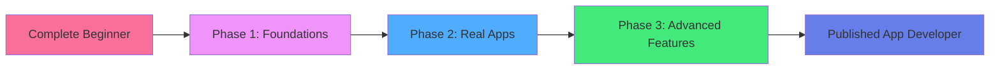
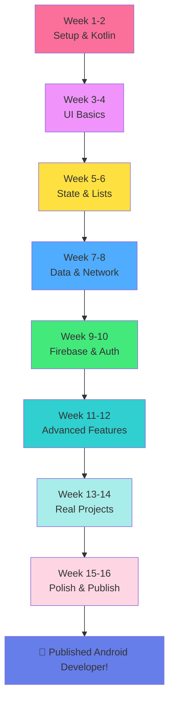

<div align="center">

# 📱 Zero to Android Hero


### *From Zero to Publishing Your First App on Google Play*


<br>

**A comprehensive, hands-on journey from "What is Android?" to building real-world apps with Kotlin**

<br>

[](https://opensource.org/licenses/MIT)
[](http://makeapullrequest.com)
[]()

<br>

[📱 Start Learning](#-roadmap--curriculum) • [🎯 Who Is This For?](#-who-is-this-course-for) • [🤝 Contributing](#-contributing) • [💬 Community](#-community--support)

</div>

---

<br>

## 🌟 Why This Course?

<br>

<div align="center">



</div>

<br>

<table>
<tr>
<td align="center" width="25%">

### 🎯 **Practical**

Build real apps from day one

</td>
<td align="center" width="25%">

### 🧠 **Beginner-Friendly**

No prior coding needed

</td>
<td align="center" width="25%">

### 🚀 **Modern Stack**

Latest Kotlin & Jetpack Compose

</td>
<td align="center" width="25%">

### 📱 **Portfolio-Ready**

Apps for Google Play Store

</td>
</tr>
</table>

<br>

> [!NOTE]
> **This course assumes ZERO programming knowledge.** If you can use a smartphone, you can learn Android development!

---

<br>

## 📖 What You'll Learn

<br>

<div align="center">

By the end of this course, you will:

</div>

<br>

- ✅ **Build Android Apps** from scratch with Kotlin
- ✅ **Master Jetpack Compose** for modern UI design
- ✅ **Work with APIs** and fetch real-time data
- ✅ **Store Data** locally with Room Database
- ✅ **Implement Navigation** between screens
- ✅ **Handle User Input** with forms and validation
- ✅ **Add Firebase** for authentication and cloud storage
- ✅ **Publish to Google Play Store** and reach millions
- ✅ **Use Android Studio** like a professional developer
- ✅ **Debug and Test** your applications effectively

---

<br>

## 👥 Who Is This Course For?

<br>

<table>
<tr>
<td width="50%" bgcolor="#e8f5e9" valign="top">

### ✅ Perfect For You If:

- 📱 You use Android and want to build apps
- 🎓 Complete beginner to programming
- 💡 Have an app idea you want to create
- 🔄 Coming from other platforms (iOS, Web)
- 💼 Want to become an Android developer
- 🚀 Ready to commit 30 minutes daily

</td>
<td width="50%" bgcolor="#fff3e0" valign="top">

### 🎯 Not Required:

- ❌ Programming experience
- ❌ Computer science degree
- ❌ Expensive equipment
- ❌ Prior Kotlin knowledge
- ❌ Math expertise
- ❌ Design skills

</td>
</tr>
</table>

<br>

> [!IMPORTANT]
> **All you need:** A computer (Windows/Mac/Linux) and dedication to learn!

---

<br>

## 🛠️ The Tech Stack

<br>

<div align="center">

Throughout this journey, you'll master these industry-standard technologies:

</div>

<br>

<div align="center">


</div>

<br>

### 🔧 Core Technologies

<br>

| Technology | Purpose | Why It Matters |
|:---|:---|:---|
| **Kotlin** | Programming Language | Modern, concise, official Android language |
| **Android Studio** | IDE | Industry-standard development environment |
| **Jetpack Compose** | UI Framework | Modern declarative UI (the future of Android) |
| **Material Design** | Design System | Professional, beautiful user interfaces |
| **Firebase** | Backend Services | Authentication, database, cloud storage |
| **Retrofit** | Networking | Fetch data from APIs |
| **Room** | Local Database | Store data on device |
| **Coroutines** | Async Programming | Handle background tasks smoothly |

---

<br>

## 🗺️ Roadmap & Curriculum

<br>

<div align="center">

This course is structured progressively. Each chapter includes:

📝 **Theory** • 💻 **Code Examples** • 🎯 **Hands-On Projects** • 🧪 **Exercises** • 📚 **Resources**

</div>

<br>

### 📱 Phase 1: Android Foundations (Weeks 1-4)

<br>

<table>
<tr>
<th width="10%">Chapter</th>
<th width="30%">Topic</th>
<th width="40%">What You'll Build</th>
<th width="20%">Status</th>
</tr>

<tr>
<td align="center"><b><a href="01-getting-started.md">01</a></b></td>
<td><b>🏁 <a href="01-getting-started.md">Getting Started</a></b><br><i>Your Android Journey Begins</i></td>
<td>
• Developer mindset<br>
• Learning strategy<br>
• Study environment setup
</td>
<td align="center">✅ Ready</td>
</tr>

<tr>
<td align="center"><b>02</b></td>
<td><b>🛠️ Development Setup</b><br><i>Android Studio & Emulator</i></td>
<td>
• Install Android Studio<br>
• Create first project<br>
• Run on emulator/device
</td>
<td align="center">⏳ In progress</td>
</tr>

<tr>
<td align="center"><b>03</b></td>
<td><b>🎨 Kotlin Basics</b><br><i>Your First Programming Language</i></td>
<td>
• Variables & data types<br>
• Functions & logic<br>
• Simple calculator app
</td>
<td align="center">⏳ In progress</td>
</tr>

<tr>
<td align="center"><b>04</b></td>
<td><b>📦 Kotlin Collections</b><br><i>Lists, Sets, Maps</i></td>
<td>
• Working with data<br>
• Loops & iteration<br>
• Shopping list app
</td>
<td align="center">⏳ In progress</td>
</tr>

<tr>
<td align="center"><b>05</b></td>
<td><b>🎭 UI Basics</b><br><i>Introduction to Jetpack Compose</i></td>
<td>
• Composable functions<br>
• Layouts & modifiers<br>
• Business card app
</td>
<td align="center">⏳ In progress</td>
</tr>

<tr>
<td align="center"><b>06</b></td>
<td><b>🎨 Material Design</b><br><i>Beautiful UI Components</i></td>
<td>
• Buttons, cards, text<br>
• Colors & themes<br>
• Tip calculator app
</td>
<td align="center">⏳ In progress</td>
</tr>

</table>

<br>

### 🏗️ Phase 2: Building Real Apps (Weeks 5-8)

<br>

<table>
<tr>
<th width="10%">Chapter</th>
<th width="30%">Topic</th>
<th width="40%">What You'll Build</th>
<th width="20%">Status</th>
</tr>

<tr>
<td align="center"><b>07</b></td>
<td><b>🔄 State Management</b><br><i>Making Apps Interactive</i></td>
<td>
• State & recomposition<br>
• User interaction<br>
• Dice roller app
</td>
<td align="center">⏳ In progress</td>
</tr>

<tr>
<td align="center"><b>08</b></td>
<td><b>📋 Lists & Grids</b><br><i>Displaying Collections</i></td>
<td>
• LazyColumn & LazyGrid<br>
• Scrollable lists<br>
• Affirmations app
</td>
<td align="center">⏳ In progress</td>
</tr>

<tr>
<td align="center"><b>09</b></td>
<td><b>🧭 Navigation</b><br><i>Multi-Screen Apps</i></td>
<td>
• Navigation component<br>
• Passing data<br>
• Cupcake order app
</td>
<td align="center">⏳ In progress</td>
</tr>

<tr>
<td align="center"><b>10</b></td>
<td><b>🗄️ Data Persistence</b><br><i>Room Database</i></td>
<td>
• Local data storage<br>
• CRUD operations<br>
• Task manager app
</td>
<td align="center">⏳ In progress</td>
</tr>

<tr>
<td align="center"><b>11</b></td>
<td><b>🌐 Networking</b><br><i>REST APIs with Retrofit</i></td>
<td>
• Fetch online data<br>
• JSON parsing<br>
• Weather app
</td>
<td align="center">⏳ In progress</td>
</tr>

<tr>
<td align="center"><b>12</b></td>
<td><b>🖼️ Images & Media</b><br><i>Working with Images</i></td>
<td>
• Loading images<br>
• Coil library<br>
• Photo gallery app
</td>
<td align="center">⏳ In progress</td>
</tr>

</table>

<br>

### 🚀 Phase 3: Advanced Features (Weeks 9-12)

<br>

<table>
<tr>
<th width="10%">Chapter</th>
<th width="30%">Topic</th>
<th width="40%">What You'll Build</th>
<th width="20%">Status</th>
</tr>

<tr>
<td align="center"><b>13</b></td>
<td><b>🔐 Firebase Auth</b><br><i>User Authentication</i></td>
<td>
• Email/password login<br>
• Google Sign-In<br>
• User profiles app
</td>
<td align="center">⏳ In progress</td>
</tr>

<tr>
<td align="center"><b>14</b></td>
<td><b>☁️ Cloud Firestore</b><br><i>Cloud Database</i></td>
<td>
• Real-time sync<br>
• Multi-user apps<br>
• Chat app
</td>
<td align="center">⏳ In progress</td>
</tr>

<tr>
<td align="center"><b>15</b></td>
<td><b>📸 Camera & Storage</b><br><i>Device Features</i></td>
<td>
• Take photos<br>
• File storage<br>
• Selfie app
</td>
<td align="center">⏳ In progress</td>
</tr>

<tr>
<td align="center"><b>16</b></td>
<td><b>🔔 Notifications</b><br><i>Push & Local Notifications</i></td>
<td>
• Alert users<br>
• Firebase Cloud Messaging<br>
• Reminder app
</td>
<td align="center">⏳ In progress</td>
</tr>

<tr>
<td align="center"><b>17</b></td>
<td><b>🧪 Testing</b><br><i>Unit & UI Testing</i></td>
<td>
• Write tests<br>
• Test automation<br>
• Robust apps
</td>
<td align="center">⏳ In progress</td>
</tr>

<tr>
<td align="center"><b>18</b></td>
<td><b>📦 Publishing</b><br><i>Google Play Store</i></td>
<td>
• Sign APK<br>
• Store listing<br>
• Your published app! 🎉
</td>
<td align="center">⏳ In progress</td>
</tr>

</table>

<br>

### 🎯 Phase 4: Real-World Projects (Weeks 13-16)

<br>

<table>
<tr>
<th width="10%">Chapter</th>
<th width="30%">Topic</th>
<th width="40%">What You'll Build</th>
<th width="20%">Status</th>
</tr>

<tr>
<td align="center"><b>19</b></td>
<td><b>📱 Project 1</b><br><i>Note-Taking App</i></td>
<td>
• Full CRUD operations<br>
• Search & filter<br>
• Categories & tags
</td>
<td align="center">⏳ In progress</td>
</tr>

<tr>
<td align="center"><b>20</b></td>
<td><b>🎵 Project 2</b><br><i>Music Player</i></td>
<td>
• Media playback<br>
• Playlists<br>
• Notification controls
</td>
<td align="center">⏳ In progress</td>
</tr>

<tr>
<td align="center"><b>21</b></td>
<td><b>🛒 Project 3</b><br><i>E-Commerce App</i></td>
<td>
• Product catalog<br>
• Shopping cart<br>
• Payment integration
</td>
<td align="center">⏳ In progress</td>
</tr>

<tr>
<td align="center"><b>22</b></td>
<td><b>💪 Best Practices</b><br><i>Clean Architecture</i></td>
<td>
• MVVM pattern<br>
• Dependency injection<br>
• Scalable code
</td>
<td align="center">⏳ In progress</td>
</tr>

<tr>
<td align="center"><b>23</b></td>
<td><b>🎨 Portfolio</b><br><i>Showcase Your Work</i></td>
<td>
• GitHub profile<br>
• Play Store presence<br>
• Developer resume
</td>
<td align="center">⏳ In progress</td>
</tr>

<tr>
<td align="center"><b>24</b></td>
<td><b>🚀 Career Launch</b><br><i>Get Your First Job</i></td>
<td>
• Job search strategy<br>
• Interview prep<br>
• Freelancing tips
</td>
<td align="center">⏳ In progress</td>
</tr>

</table>

---

<br>

## 📚 What Makes This Course Different?

<br>

<table>
<tr>
<td align="center" width="33%">

### 🎯 **Project-Based**

Every chapter = working app

Not just theory

</td>
<td align="center" width="33%">

### 📱 **Modern Stack**

Jetpack Compose

Latest best practices

</td>
<td align="center" width="33%">

### 🎓 **Complete Path**

Zero to published app

Nothing skipped

</td>
</tr>
<tr>
<td align="center" width="33%">

### 💡 **Beginner-Friendly**

Plain language

Step-by-step

</td>
<td align="center" width="33%">

### 🔄 **Updated Regularly**

Latest Android versions

Active maintenance

</td>
<td align="center" width="33%">

### 🤝 **Community Support**

Ask questions

Get help

</td>
</tr>
</table>

---

<br>

## 🎯 Learning Path

<br>

<div align="center">



</div>

---

<br>

## 💻 System Requirements

<br>

<table>
<tr>
<td width="50%" valign="top">

### ✅ Minimum Requirements:

**Operating System:**
- Windows 10 (64-bit)
- macOS 10.14 or later
- Linux (64-bit, tested on Ubuntu)

**Hardware:**
- 8 GB RAM (16 GB recommended)
- 8 GB available disk space
- 1280 x 800 minimum screen resolution

</td>
<td width="50%" valign="top">

### 🚀 Recommended Setup:

**For Best Experience:**
- 16 GB RAM or more
- SSD for faster builds
- Dual monitor (helpful but optional)

**Android Device (Optional):**
- Any Android phone/tablet
- Or use the emulator

</td>
</tr>
</table>

<br>

> [!TIP]
> Don't have a powerful computer? Start with the emulator and upgrade later!

---

<br>

## 🚀 Quick Start Guide

<br>

<details>
<summary><b>📥 Step 1: Install Android Studio</b></summary>

<br>

1. Go to [developer.android.com/studio](https://developer.android.com/studio)
2. Download for your OS
3. Run installer
4. Follow setup wizard
5. Install Android SDK

**Installation time:** 30-60 minutes (depending on internet speed)

</details>

<details>
<summary><b>🎯 Step 2: Start Chapter 01</b></summary>

<br>

1. Read [Chapter 01: Getting Started](./chapters/01-getting-started.md)
2. Set up your learning environment
3. Join the community
4. Commit to daily practice

**Time:** 30 minutes

</details>

<details>
<summary><b>💪 Step 3: Daily Practice</b></summary>

<br>

**Your daily routine:**
```
1. Read one section (10-15 min)
2. Code along (15-20 min)
3. Complete exercise (10-15 min)
4. Review & reflect (5 min)

Total: 30-45 minutes/day
```

</details>

---

<br>

## 🏆 What You'll Build

<br>

<div align="center">

### Portfolio Apps You'll Create:

</div>

<br>

| App | Description | Skills |
|:---|:---|:---|
| 🎲 **Dice Roller** | Interactive dice game | State, UI basics |
| 💰 **Tip Calculator** | Calculate tips & split bills | Forms, math logic |
| ☁️ **Weather App** | Real-time weather data | API, networking |
| ✅ **Task Manager** | Todo list with database | Room, CRUD |
| 💬 **Chat App** | Real-time messaging | Firebase, auth |
| 📸 **Photo Gallery** | Image viewer with camera | Media, storage |
| 🎵 **Music Player** | Full media player | Services, notifications |
| 🛒 **Shopping App** | E-commerce platform | Full-stack, payments |

<br>

> [!NOTE]
> Each app is **portfolio-ready** and can be published to Google Play Store!

---

<br>

## 🤝 Contributing

<br>

<div align="center">

We love contributions! Help make this course better for everyone.

</div>

<br>

### 🌟 How to Contribute:

<br>

1. **🐛 Report Issues**
   - Found a bug or typo?
   - Open an issue with details

2. **💡 Suggest Improvements**
   - Better explanations?
   - Additional examples?
   - Share your ideas!

3. **📝 Submit Code**
   - Fork the repo
   - Create your branch
   - Make improvements
   - Submit pull request

4. **🌍 Translate**
   - Help make this accessible globally
   - Translate to your language

<br>

<details>
<summary><b>📋 Contribution Guidelines</b></summary>

<br>

```bash
# Fork and clone
git clone https://github.com/YOUR-USERNAME/zero-to-android-hero.git

# Create branch
git checkout -b feature/your-feature-name

# Make changes
# ...

# Commit
git commit -m "Add: your feature description"

# Push
git push origin feature/your-feature-name

# Open Pull Request on GitHub
```

**Code Style:**
- Follow Kotlin coding conventions
- Add comments for complex logic
- Keep examples simple and clear

</details>

---

<br>

## 📚 Additional Resources

<br>

### 🔗 Official Documentation

- [Android Developers](https://developer.android.com/)
- [Kotlin Language](https://kotlinlang.org/)
- [Jetpack Compose](https://developer.android.com/jetpack/compose)
- [Firebase](https://firebase.google.com/)

### 📖 Recommended Books

- *"Kotlin Programming: The Big Nerd Ranch Guide"*
- *"Head First Android Development"*
- *"Android Programming with Kotlin for Beginners"*

### 🎥 Video Resources

- [Android Developers YouTube](https://www.youtube.com/c/AndroidDevelopers)
- [Philipp Lackner](https://www.youtube.com/c/PhilippLackner)
- [Coding in Flow](https://www.youtube.com/c/CodinginFlow)

### 💬 Communities

- [r/androiddev](https://reddit.com/r/androiddev)
- [Kotlin Slack](https://kotlinlang.slack.com/)
- [Android Discord](https://discord.gg/android)

---

<br>

## 🌟 Success Stories

<br>

> *"I went from zero coding knowledge to publishing my first app in 3 months! This course changed my career."*  
> — **Maria S., Published Developer**

<br>

> *"Clear, practical, and fun. Every chapter built my confidence. Now I'm a junior Android developer!"*  
> — **James K., Android Developer**

<br>

> *"The step-by-step approach made complex topics easy. My app has 10,000+ downloads now!"*  
> — **Priya M., Indie Developer**

---

<br>

## 💬 Community & Support

<br>

<table>
<tr>
<td align="center" width="25%">

### 💬 **Discord**

Ask questions  
Share progress  
[Join Server](#)

</td>
<td align="center" width="25%">

### 🐦 **Twitter**

Daily tips  
Updates  
[@AndroidHero](#)

</td>
<td align="center" width="25%">

### 📧 **Newsletter**

Weekly lessons  
Free resources  
[Subscribe](#)

</td>
<td align="center" width="25%">

### 📺 **YouTube**

Video tutorials  
Live coding  
[Subscribe](#)

</td>
</tr>
</table>

---

<br>

## ⚡ Quick Links

<br>

<div align="center">

| Resource | Link |
|:---|:---:|
| 📱 **Start Learning** | [Chapter 01](./chapters/01-getting-started.md) |
| 🎯 **Sample Apps** | [Projects Repo](#) |
| 📚 **Exercises** | [Practice Problems](#) |
| 🐛 **Report Issue** | [GitHub Issues](#) |
| 💡 **Suggest Feature** | [Discussions](#) |
| 🌟 **Show Support** | [Star this repo](../../) |

</div>

---

<br>

## 📊 Course Stats

<br>

<div align="center">


<br>

**24 Chapters** • **16 Weeks** • **40+ Apps** • **100% Free**

</div>

---

<br>

## 📄 License

<br>

This project is licensed under the MIT License - see the [LICENSE](LICENSE) file for details.

**TL;DR:** Free to use, modify, and share. Just give attribution!

---

<br>

## 🎓 Learning Philosophy

<br>

<div align="center">

> *"Tell me and I forget. Teach me and I remember. Involve me and I learn."*  
> — **Benjamin Franklin**

</div>

<br>

<table>
<tr>
<td width="50%" align="center" bgcolor="#e8f5e9">

### ✅ We Believe In:

- Learn by **building**
- Practice over theory
- Consistency over intensity
- Community over competition
- Progress over perfection

</td>
<td width="50%" align="center" bgcolor="#e3f2fd">

### 🎯 Our Promise:

- **Clear** explanations
- **Practical** examples
- **Real** projects
- **Active** support
- **Regular** updates

</td>
</tr>
</table>

---

<br>

<div align="center">

## 🚀 Ready to Start?

<br>

Your Android development journey begins with a single step.

<br>

[](./chapters/01-getting-started.md)

<br>

**⭐ Star this repo to bookmark your journey!**

<br>

---

<br>

### Made with ❤️ for aspiring Android developers worldwide

<br>


<br>

**Happy Coding! 📱✨**

</div>

<br>
